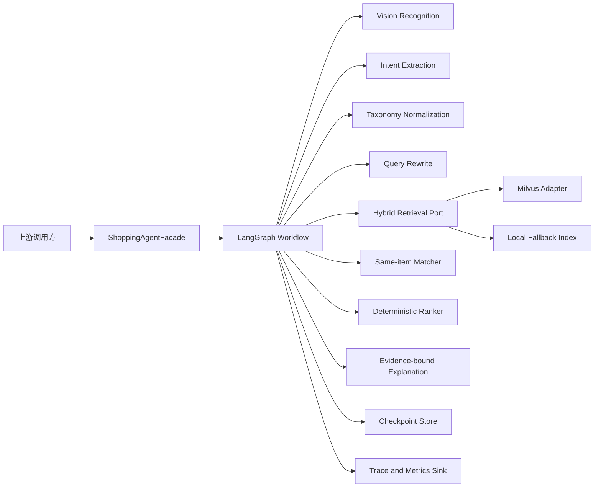
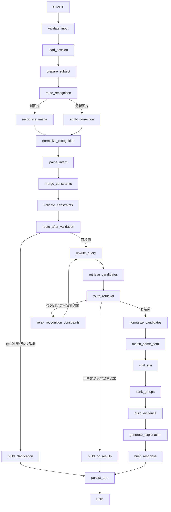

# 识价镜 Agent 完整实现方案

## 0. 文档定位

- 文档版本：1.0
- 编写日期：2026-08-13
- 交付对象：后续负责落地代码的实现 Agent
- 交付范围：仅设计识价镜的 Agent 模块，不实现任何代码
- 项目目标：完成“图片/文本输入 → 商品识别 → 意图理解 → 混合召回 → 同款匹配 → SKU 拆分 → 比价排序 → 多轮筛选”的可恢复 Workflow Agent

本文是实现规格，不是概念介绍。后续实现必须以本文定义的边界、字段、节点、路由、降级规则、评测口径和验收条件为准。未在本文中给出的外部字段、模型标识符、数据库地址和平台数据格式不得猜测，必须通过配置或上游接口显式提供。

---

## 1. 建设目标

识价镜面向“用户看到商品，但缺少品牌、型号等可检索信息”的购物场景。Agent 接收商品图片、自然语言需求和用户修正，通过受控工作流完成以下任务：

1. 从图片中识别标准品类、品牌、型号和可见属性。
2. 从自然语言中提取预算、颜色、平台、评分、排序方式和购物偏好。
3. 将图片识别结果、当前文本和历史会话状态合并为带来源的结构化约束。
4. 将结构化约束改写为检索查询，在 Milvus 中执行向量、关键词和元数据混合召回。
5. 对跨平台候选商品完成属性标准化、同款判定、SPU 聚类和 SKU 拆分。
6. 在完全相同的 SKU 内聚合平台报价，计算最低价、均价和价格区间。
7. 使用确定性代码完成过滤和排序，使用受事实约束的模型生成面向用户的解释文本。
8. 支持用户修正识别属性和多轮追加筛选，并且只重跑受影响的下游节点。
9. 保存工作流状态、节点事件和失败原因，支持恢复、重放、离线评测和问题定位。

### 1.1 核心质量目标

- 不猜测：图片证据不足时字段必须为空，并向用户澄清。
- 不误比价：无法确认同一 SKU 的商品不得放入同一个比价组。
- 不静默放宽：用户明确设置的硬条件不得被系统自动取消。
- 不让 LLM 计算业务事实：价格、过滤、聚类和排序由确定性代码完成。
- 可恢复：同一个会话在进程重启后能够继续多轮筛选。
- 可评测：识别、意图、召回、同款匹配、排序和端到端链路分别具有独立指标。

---

## 2. 范围边界

### 2.1 本次 Agent 范围

- LangGraph Workflow 编排。
- Agent 输入、输出、状态和事件协议。
- VLM 商品识别适配器。
- 文本意图抽取与规则降级。
- 品类 taxonomy 和属性标准化。
- 查询改写。
- Milvus 混合检索适配器。
- 本地检索降级适配器。
- 同款匹配、SPU 聚类和 SKU 拆分。
- 多阶段过滤与排序。
- 事实约束的结果解释。
- 多轮会话合并、用户修正和节点失效控制。
- Checkpoint、幂等、并发控制、事件追踪和离线评测。
- Fake Provider、固定测试数据和 Agent 层测试。

### 2.2 明确不在本次范围内

- FastAPI、Spring Boot 或其他 HTTP 服务。
- 登录、鉴权、用户、聊天历史 API、收藏和价格提醒。
- 图片上传、对象存储和 CDN。
- Flutter 或其他客户端页面。
- 淘宝、京东等平台的抓取、开放平台接入和反爬处理。
- 商品主数据清洗平台和人工标注平台。
- 支付、订单、库存和售后。
- Milvus 集群运维。
- 模型账号申请、Endpoint 创建和密钥管理平台。

这些能力只通过 Agent Port 接入。Agent 不得直接依赖具体 Web 框架、数据库表或客户端模型。

### 2.3 外部必须提供的真实输入

以下内容在当前空仓库中不存在，后续实现不得自行猜测：

- Ark 的真实 `base_url`、API Key、视觉模型标识符和文本模型标识符。
- Milvus 的真实 URI、Token、Collection 名称和 Embedding 模型标识符。
- 商品源记录的真实字段映射、价格含义、更新时间和平台商品唯一键。
- 图片引用的访问协议、大小限制和生命周期。
- 生产 Checkpoint 存储地址。
- 人工标注的识别、检索、同款和排序评测集。

实现时必须使用配置项或适配器构造参数接收这些值；配置缺失时应明确报错，不得填入虚构默认值。

---

## 3. 技术决策

本项目按全新 Python Agent 工程设计，不继承旧项目的 Java/Spring/Flutter 技术栈，也不复用旧项目的依赖版本。生产基线使用 Python 3.12；CI 同时验证 Python 3.12 和 3.13。依赖在实施当天解析兼容版本并提交 `uv.lock`，部署只能使用锁文件中的精确版本。

| 维度 | 选型 | 决策理由 |
|---|---|---|
| 语言与并发 | Python 3.12 + `asyncio` | Agent 以模型、检索和存储 I/O 为主，异步接口减少等待阻塞 |
| 包管理 | `uv` + `pyproject.toml` + `uv.lock` | 统一虚拟环境、依赖解析、脚本入口和可重复安装 |
| 编排 | LangGraph `StateGraph` | 工作流节点固定、条件分流清晰，适合 Checkpoint 和多轮状态恢复 |
| 数据协议 | Pydantic v2 | 严格校验模型输出、节点输入输出和外部适配器数据 |
| 模型客户端 | `openai.AsyncOpenAI` 兼容接口 | Ark 与其他 OpenAI-compatible Provider 共用异步适配层 |
| HTTP | `httpx.AsyncClient` | 图片读取、健康检查和非 SDK 接口统一使用异步连接池 |
| 重试 | `tenacity` | 只对本文指定的临时错误执行带抖动的指数退避 |
| JSON | 标准库 `json` 为协议基准，`orjson` 仅用于内部序列化优化 | 不把第三方序列化差异带入外部协议 |
| 视觉模型 | 通过 `VisionModelPort` 注入 | 模型标识符由部署配置提供，领域层不写死 |
| 文本模型 | 通过 `TextModelPort` 注入 | 意图、查询改写和文案改写使用独立配置 |
| 文本向量 | `TextEmbeddingPort` + 可配置中文/多语言 Embedding Provider | 索引维度由实际模型契约决定，不复用旧项目的伪向量方案 |
| 图像向量 | `ImageEmbeddingPort` + 可配置多模态 Embedding Provider | 图像相似度使用独立向量字段，不用 VLM 文本描述代替图像特征 |
| 检索 | PyMilvus `AsyncMilvusClient`，dense + sparse/BM25 + metadata filter | 直接使用 Milvus 能力，避免检索核心被 LangChain 包装层绑定 |
| 本地降级 | 只读本地 BM25 索引 | Milvus 不可用时保持演示和排障能力，并显式标记降级 |
| 状态持久化 | `langgraph-checkpoint-sqlite`（开发）/ `langgraph-checkpoint-postgres`（生产） | 按 `session_id` 保存每个 super-step 的状态快照 |
| 日志与链路 | `structlog` + OpenTelemetry | 结构化记录节点、模型、检索、恢复和降级事件 |
| 指标 | `prometheus-client` | 输出成功率、延迟、fallback 和硬约束违规指标 |
| 测试 | pytest + `pytest-asyncio` + Hypothesis + Testcontainers | 同时覆盖异步流程、属性测试和真实依赖集成测试 |
| 代码质量 | Ruff + Pyright | 统一格式、Lint 和严格类型检查 |
| 评测 | 独立 Python CLI | 分节点评测，避免只看端到端主观效果 |

### 3.1 依赖版本策略

- 方案文档只规定兼容代际，不写死实施时尚未验证的补丁版本。
- 实现 Agent 使用 `uv lock` 生成精确锁文件，并把 `uv.lock` 提交到仓库。
- CI 使用锁文件执行测试，不允许在流水线中临时升级依赖。
- LangGraph、Pydantic、PyMilvus 或模型 SDK 的主版本升级必须单独提交，并重新执行 Contract、Workflow、恢复和冻结评测。
- Python 3.13 只有在全部依赖安装、静态检查、自动化测试和离线评测通过后才能成为生产运行时；第一版生产环境固定为 Python 3.12。

Agent 使用领域 Workflow，而不是自由式 ReAct Agent。模型没有任意工具调用权，不能执行代码、访问文件系统或自行决定外部接口。所有可执行路径都由 `StateGraph` 的节点和条件边限定。

---

## 4. 总体架构



### 4.1 组件职责

#### `ShoppingAgentFacade`

- 对外以异步和异步流式接口为主；同步入口只作为本地示例包装，不进入生产调用链。
- 校验 `AgentRequest`。
- 将 `session_id` 映射为 LangGraph `thread_id`。
- 对同一会话串行化请求。
- 处理幂等键和最终异常映射。
- 不包含识别、检索或排序业务逻辑。

#### `ShoppingWorkflow`

- 定义所有节点、条件边和终止条件。
- 只通过 Port 调用模型、检索、Checkpoint 和事件存储。
- 使用 `dirty_flags` 决定局部重算范围。

#### `Domain Services`

- `ConstraintMerger`：合并多来源约束。
- `TaxonomyNormalizer`：品类、品牌、型号、单位和属性标准化。
- `SameItemMatcher`：同款候选生成、成对判定和聚类。
- `SkuSplitter`：按销售属性拆分 SKU。
- `GroupRanker`：确定性排序。
- `EvidenceBuilder`：生成可审计的事实证据。

#### Ports

- `VisionModelPort`
- `IntentModelPort`
- `QueryRewritePort`
- `ExplanationModelPort`
- `ProductRetrievalPort`
- `CheckpointPort`
- `TraceSinkPort`
- `ClockPort`

Port 名称和方法签名由 Agent 工程定义，具体供应商放在 `adapters/`，不得反向污染领域模型。

所有模型、检索、Checkpoint 和 trace Port 使用 `async def`；taxonomy、约束合并、同款匹配、SKU 拆分、排序和证据生成保持同步纯函数。CPU 密集的批量 embedding 在独立 worker 或线程池中执行，不阻塞 Agent 事件循环。

---

## 5. 目标工程结构

后续实现 Agent 应创建以下结构。除 `examples/` 和 `docs/` 外，所有业务代码位于 `src/shijiajing_agent/`。

```text
D:\E.C.26-B\
├── pyproject.toml
├── uv.lock
├── .python-version
├── README.md
├── .env.example
├── src/
│   └── shijiajing_agent/
│       ├── __init__.py
│       ├── facade.py
│       ├── config.py
│       ├── contracts.py
│       ├── state.py
│       ├── graph.py
│       ├── routing.py
│       ├── errors.py
│       ├── nodes/
│       │   ├── input_nodes.py
│       │   ├── recognition_nodes.py
│       │   ├── intent_nodes.py
│       │   ├── retrieval_nodes.py
│       │   ├── matching_nodes.py
│       │   ├── ranking_nodes.py
│       │   └── response_nodes.py
│       ├── domain/
│       │   ├── constraints.py
│       │   ├── taxonomy.py
│       │   ├── normalization.py
│       │   ├── same_item.py
│       │   ├── sku.py
│       │   ├── ranking.py
│       │   └── evidence.py
│       ├── ports/
│       │   ├── models.py
│       │   ├── retrieval.py
│       │   ├── checkpoint.py
│       │   └── observability.py
│       ├── adapters/
│       │   ├── ark_models.py
│       │   ├── embeddings.py
│       │   ├── milvus_retrieval.py
│       │   ├── local_retrieval.py
│       │   └── checkpoint.py
│       ├── prompts/
│       │   ├── vision.md
│       │   ├── intent.md
│       │   ├── query_rewrite.md
│       │   └── explanation.md
│       └── data/
│           └── taxonomy.json
├── tests/
│   ├── unit/
│   ├── contract/
│   ├── workflow/
│   ├── integration/
│   └── fixtures/
├── evals/
│   ├── datasets/
│   ├── recognition_eval.py
│   ├── intent_eval.py
│   ├── retrieval_eval.py
│   ├── matching_eval.py
│   └── end_to_end_eval.py
├── examples/
│   ├── text_turn.py
│   ├── image_turn.py
│   └── correction_turn.py
└── docs/
    ├── contracts.md
    ├── workflow.md
    ├── milvus_schema.md
    └── evaluation.md
```

---

## 6. 对外契约

### 6.1 `AgentRequest`

| 字段 | 类型 | 必填 | 约束 |
|---|---|---:|---|
| `session_id` | string | 是 | 上游生成的稳定会话 ID |
| `request_id` | string | 是 | 全局幂等键，同一请求重试时不变 |
| `text` | string/null | 否 | 最大 4000 字符，进入 Agent 前去除首尾空白 |
| `image` | `ImageRef`/null | 否 | 新图片输入 |
| `correction` | `RecognitionCorrection`/null | 否 | 修正当前会话已有识别结果 |
| `selected_option_id` | string/null | 否 | 使用 Agent 返回的精确 option ID |
| `metadata` | object | 否 | 只允许追踪信息，不参与业务推理 |

`text`、`image`、`correction`、`selected_option_id` 至少存在一项。`correction` 只允许作用于当前会话最新的 `recognition_id`，不允许跨商品修改。

### 6.2 `ImageRef`

| 字段 | 类型 | 说明 |
|---|---|---|
| `image_id` | string | 上游图片唯一键 |
| `uri` | string | 受信任对象存储 URL 或 data URL |
| `content_type` | enum | 仅 `image/jpeg`、`image/png`、`image/webp` |
| `sha256` | string | 图片内容摘要，用于缓存和幂等 |

Agent 不保存图片字节到 Checkpoint，只保存 `image_id`、`sha256` 和受控引用。

### 6.3 `RecognitionCorrection`

| 字段 | 类型 | 说明 |
|---|---|---|
| `recognition_id` | string | 必须与当前识别结果一致 |
| `category_id` | string/null | 用户明确修正后的标准品类 ID |
| `brand` | string/null | 用户明确修正后的品牌 |
| `model` | string/null | 用户明确修正后的型号 |
| `attributes` | object | 用户明确修正的属性 patch |
| `clear_fields` | string[] | 明确清空的字段名 |

`clear_fields` 中的字段不会被旧识别结果重新补回，直到用户重新上传图片或再次显式填写。

### 6.4 `AgentResponse`

| 字段 | 类型 | 说明 |
|---|---|---|
| `session_id` | string | 原样返回 |
| `request_id` | string | 原样返回 |
| `turn_id` | string | Agent 为本轮生成的唯一键 |
| `status` | enum | `success`、`clarification`、`no_results`、`failed` |
| `message` | string | 面向用户的简短总结 |
| `recognition` | object/null | 当前生效的识别结果 |
| `effective_constraints` | object | 当前所有有效约束及来源 |
| `groups` | array | 同 SKU 比价组 |
| `clarification` | object/null | 一次只返回一个主要澄清问题 |
| `notices` | string[] | 降级、数据新鲜度和放宽提示 |
| `trace_id` | string | 可用于日志定位，不包含模型推理链 |

### 6.5 流式事件 `AgentEvent`

事件类型固定为：

- `turn_started`
- `node_started`
- `node_completed`
- `node_fallback`
- `clarification_ready`
- `results_ready`
- `turn_failed`

每个事件至少包含 `session_id`、`request_id`、`turn_id`、`trace_id`、`event_type`、`timestamp`。事件不输出模型思维链，只输出结构化状态、耗时、候选数量、错误码和降级信息。

---

## 7. 领域模型与状态设计

### 7.1 带来源的约束 `SourcedValue`

每个可被多轮修改的约束必须保存：

- `value`
- `source`：`user_correction`、`user_text`、`vision`、`selected_option`、`default`
- `confidence`：用户明确输入固定为 1.0；模型输出使用模型置信度；默认值为 0.0
- `updated_turn_id`
- `locked_by_user`：用户修正后为 true

### 7.2 `ShoppingConstraints`

字段固定为：

- `category_id`
- `category_name`
- `brand`
- `model`
- `min_price`
- `max_price`
- `colors`
- `platforms`
- `min_rating`
- `sort_by`
- `preferences`
- `attributes`
- `clear_fields`

`sort_by` 的枚举固定为：

- `recommended`
- `price_asc`
- `price_desc`
- `rating_desc`
- `sales_desc`

`preferences` 的枚举固定为：

- `lowest_price`
- `official_store`
- `fast_delivery`
- `high_rating`
- `high_sales`

### 7.3 `AgentState`

| 分组 | 字段 |
|---|---|
| 标识 | `schema_version`、`session_id`、`request_id`、`turn_id`、`trace_id`、`state_version` |
| 输入 | `current_request`、`subject_id`、`image_ref` |
| 识别 | `recognition`、`recognition_history` |
| 意图 | `intent_patch`、`effective_constraints`、`conflicts` |
| 检索 | `retrieval_query`、`candidates`、`retrieval_attempts` |
| 匹配 | `normalized_candidates`、`spu_clusters`、`sku_groups` |
| 输出 | `ranked_groups`、`response`、`notices` |
| 控制 | `dirty_flags`、`retry_counters`、`next_action`、`completion_reason` |
| 可观测性 | `node_events`、`fallbacks`、`errors` |

大体积字段不得无限进入 Checkpoint。候选商品只保存后续节点所需字段；模型原始响应存入受限 trace 存储，并在 Checkpoint 中保存摘要和内容哈希。

### 7.4 新商品主题 `subject_id`

- 每次上传新图片时创建新的 `subject_id`。
- 新 `subject_id` 会清除旧商品的 `category_id`、`brand`、`model`、`colors` 和商品属性。
- 预算、平台、最低评分、排序和通用购物偏好默认保留。
- 用户可以通过 `clear_fields` 显式清空保留项。
- 不上传新图片时，多轮文本继续作用于当前 `subject_id`。

这个规则防止上一件商品的品牌或型号污染下一件商品，同时保留跨商品通用购物偏好。

---

## 8. 约束合并与冲突规则

### 8.1 单字段覆盖顺序

对同一 `subject_id`，字段合并顺序固定为：

1. 当前轮用户修正。
2. 当前轮用户文本中的明确修改。
3. 历史轮次中 `locked_by_user=true` 的值。
4. 当前轮图片识别结果。
5. 历史轮次的用户文本值。
6. 历史图片识别值。
7. 系统默认值。

同一优先级内使用最新 `updated_turn_id`。被用户加入 `clear_fields` 的字段不允许被低优先级来源补回。

### 8.2 列表字段规则

- `colors` 和 `platforms`：当前轮明确出现时整体替换；未出现时沿用历史值。
- `preferences`：跨轮累积；出现“取消偏好”时清空；出现对某一偏好的否定表达时只移除该项。
- `attributes`：按属性键合并；当前轮明确值覆盖同键历史值。
- `keywords`：只用于召回，不是硬约束；去重后保留最近 20 项。

### 8.3 冲突处理

以下冲突必须进入 `clarification`，不能自行决定：

- 当前文本明确品类与当前图片高置信品类不同。
- 用户修正的品牌与当前文本明确品牌不同。
- 同一轮出现两个互斥型号。
- `min_price > max_price`。
- 用户指定的属性不属于 taxonomy 中该品类的属性 schema。

低置信图片结果与用户文本冲突时，用户文本直接生效，同时在 `notices` 中记录图片结果未采用，不再追问。

---

## 9. Workflow 设计

### 9.1 主图



### 9.2 节点职责

| 节点 | 输入 | 输出 | 失败策略 |
|---|---|---|---|
| `validate_input` | `AgentRequest` | 已校验请求 | 协议错误直接 `failed` |
| `load_session` | `session_id` | 上一状态、版本 | 存储失败直接 `failed` |
| `prepare_subject` | 请求、上一状态 | `subject_id`、重置后的状态 | 纯确定性，无重试 |
| `recognize_image` | `ImageRef` | 原始 `RecognitionResult` | 有文字品类则跳过图片结论继续，否则澄清/失败 |
| `apply_correction` | 修正、当前识别 | 修正后的识别 | `recognition_id` 不一致直接拒绝 |
| `normalize_recognition` | 识别结果、taxonomy | 标准品类和标准属性 | 未知值置空并记录 notice |
| `parse_intent` | 当前文本、当前约束 | `IntentPatch` | LLM 失败后规则解析 |
| `merge_constraints` | 多来源字段 | `ShoppingConstraints` | 纯确定性 |
| `validate_constraints` | 有效约束 | conflicts、dirty flags | 纯确定性 |
| `build_clarification` | 缺失项/冲突 | 单个澄清问题 | 模板生成，不依赖 LLM |
| `rewrite_query` | 文本、约束、识别 | `RetrievalQuery` | LLM 失败后确定性拼接 |
| `retrieve_candidates` | 检索查询 | 混合召回候选 | Milvus 失败后本地词法索引 |
| `relax_recognition_constraints` | 零结果和来源 | 放宽后的查询 | 最多执行一次 |
| `normalize_candidates` | 原始商品 | 标准商品记录 | 单条坏数据隔离，超阈值则失败 |
| `match_same_item` | 标准候选 | SPU clusters | 算法失败时不合并，返回独立商品 |
| `split_sku` | SPU clusters | SKU groups | 缺少关键销售属性时不跨平台比价 |
| `rank_groups` | SKU groups、约束 | 排序后的 groups | 纯确定性 |
| `build_evidence` | groups | 事实证据和风险 | 纯确定性 |
| `generate_explanation` | 事实证据 | 用户文案 | 模型失败后模板解释 |
| `build_response` | 全部结果 | `AgentResponse` | 纯确定性 |
| `persist_turn` | 最终状态 | durable checkpoint | 保存失败时本轮不得返回 success |

### 9.3 终止状态

- `success`：至少一个合法 SKU 比价组，所有用户硬约束均满足。
- `clarification`：需要用户补充品类、确认冲突或修正关键属性。
- `no_results`：执行允许的识别约束放宽后仍无结果，或用户硬约束直接导致零结果。
- `failed`：输入非法、Checkpoint 不可用或全部可用适配器失败。

工作流设置最大节点步数 40。达到上限时以 `WORKFLOW_STEP_LIMIT` 失败，保留 Checkpoint 和 trace，不得把部分结果标记为成功。

---

## 10. 局部重算与节点失效

`dirty_flags` 固定包含：

- `recognition_dirty`
- `normalization_dirty`
- `intent_dirty`
- `query_dirty`
- `retrieval_dirty`
- `matching_dirty`
- `ranking_dirty`
- `explanation_dirty`

### 10.1 失效矩阵

| 变化 | 必须重跑 | 明确跳过 |
|---|---|---|
| 新图片 | 识别、标准化及全部下游 | 无 |
| 用户修正品类/品牌/型号/属性 | 标准化、查询、召回、匹配、排序、解释 | VLM 识别 |
| 新增或修改预算/平台/最低评分 | 查询、召回、匹配、排序、解释 | VLM、识别标准化 |
| 修改颜色 | 查询、召回、匹配、排序、解释 | VLM |
| 修改 `sort_by` | 排序、解释 | VLM、查询、召回、匹配 |
| 修改软偏好 | 排序、解释 | VLM、查询、召回、匹配 |
| 只要求解释当前结果 | 解释 | VLM、查询、召回、匹配、排序 |
| 重复相同 `request_id` | 不执行任何节点，返回已保存结果 | 全部节点 |

节点缓存键使用 `session_id + subject_id + node_name + normalized_input_hash + schema_version`。模型 Prompt 版本、taxonomy 版本、索引版本变化时必须进入输入哈希，防止复用过期结果。

---

## 11. 模型节点设计

### 11.1 通用结构化输出规则

所有模型节点必须：

1. 使用 Pydantic Schema，设置 `extra="forbid"`。
2. 温度固定为 0。
3. 优先请求 JSON structured output。
4. 先做 JSON 解析，再做字段类型校验，再做领域语义校验。
5. 校验失败时把精简错误列表交给模型修复，最多修复 2 次。
6. 第 3 次仍失败时进入该节点的确定性降级路径。
7. 记录模型、Prompt 版本、耗时、token 用量、修复次数和输出哈希。
8. 不记录或返回隐藏思维链。

### 11.2 VLM 商品识别

输入：图片、taxonomy 支持品类列表、对应属性 schema。

输出字段：

- `category_id`
- `category_name`
- `brand`
- `model`
- `keywords`
- `attributes`
- `field_confidences`
- `overall_confidence`
- `visible_evidence`
- `unresolved_fields`

Prompt 硬约束：

- 只识别图片中可见信息。
- 看不清的品牌、型号和属性必须返回 null。
- 不允许根据外观猜测精确型号。
- `category_id` 必须来自传入 taxonomy。
- 细分类描述放入属性，不得创造新的 category ID。
- `visible_evidence` 只写可观察证据，不写模型推理过程。

语义校验：

- category 必须存在于当前 taxonomy 版本。
- attributes 的键必须属于该品类 schema。
- `field_confidences` 必须覆盖所有非空识别字段。
- 品牌和型号不能只出现在解释中而未出现在结构化字段。

### 11.3 文本意图抽取

模型只输出当前轮 patch，不复制历史状态。输出包括：

- 本轮新增或覆盖字段。
- 本轮明确清空字段 `clear_fields`。
- 召回扩展词 `keywords`。
- 是否需要澄清及问题候选。

用户没有提及的字段必须为 null。历史合并由 `ConstraintMerger` 完成，不由模型完成。

模型失败时，规则解析器覆盖以下固定表达：

- 预算上限和下限。
- 颜色。
- 平台。
- 最低评分。
- 价格、销量、评分排序。
- 官方/自营、配送、低价、高评分、高销量偏好。
- taxonomy 中明确注册的品类别名和品牌别名。

规则表只使用显式配置的别名，不根据大小写或模糊相似度猜测未知品牌。

### 11.4 查询改写

输入中明确区分：

- `hard_filters`：用户明确或高置信结构化约束。
- `soft_terms`：召回扩展词。
- `negative_terms`：用户明确排除项。

模型只能改写 `query_text` 和扩展 `soft_terms`，不得修改 `hard_filters`。输出经代码比较，任何硬过滤变化都会被拒绝并进入确定性查询拼接。

### 11.5 结果解释

模型只接收 `EvidenceBundle`，其中包含排序完成后的事实：

- group ID 和商品标题。
- 最低价、均价、价格区间和对应平台。
- 匹配置信度。
- 命中的用户条件。
- 缺失数据和风险提示。

模型不得新增商品、价格、平台、评分、销量或排名。生成后必须执行事实一致性校验：输出中的数字、平台名和 group ID 必须全部存在于输入证据中。校验失败直接使用模板解释。

---

## 12. Taxonomy 与属性标准化

### 12.1 Taxonomy 文件

`taxonomy.json` 必须版本化，包含：

- `schema_version`
- `taxonomy_version`
- `category_id`
- `category_name`
- `aliases`
- `brand_aliases`
- `model_normalization_rules`
- `searchable_attributes`
- `identity_attributes`
- `variant_attributes`
- `unit_rules`

简历涉及的初始标准品类为：耳机、运动鞋、吹风机、背包、智能手表。实现 Agent 必须从经过确认的数据文件读取精确 ID；本文不为外部商品库猜测已有 ID。

### 12.2 三类属性

- `identity_attributes`：决定是不是同一 SPU，例如容量规格、功率版本、通信版本。
- `variant_attributes`：决定是不是同一 SKU，例如颜色、尺码、容量和套装。
- `descriptive_attributes`：只用于搜索和解释，不参与同款硬判定。

同一个属性在不同品类中的角色由 taxonomy 明确配置。例如颜色在耳机中是 SKU 键，在某些包装图片中只作为描述时仍以 taxonomy 配置为准。

### 12.3 标准化顺序

1. Unicode 和空白规范化。
2. 显式别名映射。
3. 单位换算。
4. 品牌标准化。
5. 型号分隔符和空白标准化。
6. 品类属性 schema 校验。
7. 原值、标准值和规则版本同时保留。

标准化失败时保留原值但不参与硬匹配，并在证据中标记“属性未标准化”。不得基于相似字符串自动创造品牌或型号映射。

---

## 13. RAG 商品检索设计

### 13.1 索引粒度

Milvus 中一条记录代表一个平台 Offer，而不是整段文档。Offer 是检索、过滤和价格比较的最小数据单元。SPU 和 SKU 在召回后由领域层聚类。

### 13.2 Collection 字段

Collection 的逻辑字段固定为：

- 主键：`offer_id`
- 来源：`platform`、`source_product_id`、`source_updated_at`、`data_version`
- 文本：`title`、`normalized_title`、`search_text`
- 身份：`category_id`、`brand`、`model`、`same_item_key`、`sku_key`
- 属性：`identity_attributes_json`、`variant_attributes_json`、`descriptive_attributes_json`
- 交易：`price`、`original_price`、`shipping_fee`、`coupon_amount`、`currency`
- 店铺：`shop_id`、`shop_name`、`seller_type`
- 质量：`rating`、`sales`、`review_count`
- 向量：`text_dense`、`text_sparse`、`image_dense`
- 原始记录：`source_payload_ref`

真实商品源没有提供的字段必须为 null。Agent 不得生成评分、销量、店铺类型、优惠或运费。

### 13.3 `search_text` 组成

按以下顺序拼接：

1. 标准品类名。
2. 标准品牌。
3. 标准型号。
4. 商品标题。
5. identity attributes。
6. variant attributes。
7. 可搜索标签。

字段名和值同时进入文本，例如“降噪 主动降噪”，提升属性词检索稳定性。

### 13.4 混合召回

第一阶段并行获取：

- dense 文本召回 Top 100。
- sparse/BM25 召回 Top 100。
- 有图片 embedding 时图像召回 Top 100。

取并集后最多保留 200 个候选。每个信号在当前候选集归一化到 `[0, 1]`。

文本请求的融合分数：

```text
recall_score = 0.50 * dense_text
             + 0.30 * sparse_keyword
             + 0.20 * metadata_match
```

图片请求的融合分数：

```text
recall_score = 0.35 * dense_text
             + 0.20 * sparse_keyword
             + 0.25 * image_similarity
             + 0.20 * metadata_match
```

融合后保留 Top 60 进入同款匹配。权重只能通过离线消融评测修改，修改后必须提升主评测集指标且不降低硬约束满足率。

### 13.5 元数据硬过滤

以下用户明确值进入 Milvus filter：

- `category_id`
- `min_price`
- `max_price`
- `platforms`
- `min_rating`
- 用户明确修正或明确输入的 `brand`
- 用户明确修正或明确输入的 `model`

图片识别的品牌只有字段置信度不低于 0.85 才作为硬过滤；型号只有字段置信度不低于 0.90 才作为硬过滤。低于阈值时只计入软匹配。阈值写入配置并记录到 trace。

### 13.6 零结果放宽

只允许放宽图片识别产生且未被用户锁定的字段，顺序固定为：

1. 移除识别型号硬过滤，保留为软关键词。
2. 移除识别品牌硬过滤，保留为软关键词。
3. 移除识别属性硬过滤，保留品类。

一轮最多执行一次放宽流程，每个被放宽字段必须进入 `notices`。预算、平台、评分、用户明确品牌、用户明确型号和用户修正字段永不自动放宽。

### 13.7 Milvus 降级

Milvus 连接失败、超时或 schema 不匹配时，调用 `LocalLexicalRetrievalAdapter`：

- 使用同一份只读商品快照。
- 执行相同的硬过滤。
- 使用 BM25/词法得分排序。
- 输出 `retrieval_fallback_used=true`。
- 不声称执行了向量检索。

如果本地快照也不可用，本轮返回 `failed`，错误码为 `RETRIEVAL_UNAVAILABLE`。

---

## 14. 同款匹配、SPU 聚类与 SKU 拆分

### 14.1 处理顺序

```text
候选 Offer
  → 字段标准化
  → 同款候选对生成
  → 硬冲突否决
  → 成对同款评分
  → SPU 聚类
  → variant attributes 拆分
  → 精确 SKU 比价组
```

### 14.2 同款候选对生成

只有满足以下条件之一的 Offer 才进入成对计算：

- `same_item_key` 完全一致。
- 标准品类、品牌和型号全部一致。
- 标准品类和品牌一致，且标题语义相似度不低于 0.85。

品类不同直接否决。双方品牌均非空但不同直接否决。双方型号均非空但不同直接否决。

### 14.3 硬冲突

taxonomy 中任意 `identity_attributes` 冲突时，不属于同一 SPU。任意 `variant_attributes` 冲突不否决 SPU，但必须拆为不同 SKU。

套装数量、容量、尺寸、通信版本和地区版本只要被 taxonomy 标记为 SKU 关键字段，就不得跨值直接比价。

### 14.4 成对同款分数

```text
same_item_score = 0.35 * title_semantic_similarity
                + 0.30 * identity_attribute_overlap
                + 0.25 * image_similarity
                + 0.10 * source_key_signal
```

- 精确 `same_item_key` 一致时 `source_key_signal=1`。
- 来源键缺失时该维度不参与，并对其余可用维度重新归一化权重。
- 任何硬冲突将最终分数置为 0。
- 分数不低于 0.82 才允许进入同一 SPU。
- 0.68 至 0.82 作为“疑似同款”证据保留，但不得合并比价。
- 低于 0.68 视为不同商品。

### 14.5 聚类算法

使用 complete-link 层次聚类，而不是简单连通分量。合并两个簇时，跨簇每一对 Offer 都必须满足同款阈值或具有相同的权威 `same_item_key`。这样可以避免 A≈B、B≈C 导致 A 与 C 被错误传递合并。

### 14.6 SKU 拆分

对每个 SPU，按 taxonomy 声明的 `variant_attributes` 生成规范化 `sku_signature`。签名包含属性名和标准值，并按属性名排序。

缺少关键 SKU 属性时：

- 该 Offer 单独成组。
- `match_confidence` 降低。
- 风险提示加入“关键销售属性缺失，未与其他报价直接合并”。

### 14.7 价格聚合

先按 `platform + shop_id + source_product_id` 去重，保留 `source_updated_at` 最新记录。

只有字段真实存在时才计算：

```text
payable_price = price - coupon_amount + shipping_fee
```

缺少优惠或运费时使用 `price`，并标记“未包含未提供的优惠/运费”。每个 SKU 组输出：

- `min_price`
- `max_price`
- `average_price`
- `min_price_offer_id`
- `offer_count`
- `platform_count`
- `price_freshness`

`average_price` 使用去重后 Offer 的算术平均值，不按销量加权。

---

## 15. 多阶段排序

### 15.1 原则

- 硬过滤先于排序。
- 同款置信度优先于低价诱惑，防止相似款误比价。
- 用户显式排序优先于推荐分。
- LLM 不参与数值排序。

### 15.2 `recommended` 综合分

```text
ranking_score = 0.30 * intent_relevance
              + 0.25 * match_confidence
              + 0.20 * price_utility
              + 0.10 * seller_trust
              + 0.10 * rating_quality
              + 0.05 * freshness
```

所有分量归一化到 `[0, 1]`。缺失维度不按 0 处罚，而是从分母中移除并对剩余权重重新归一化，同时在结果中披露缺失字段。

### 15.3 显式排序

- `price_asc`：`min_price` 升序，`match_confidence` 降序作为第一 tie-breaker。
- `price_desc`：`min_price` 降序，`match_confidence` 降序作为第一 tie-breaker。
- `rating_desc`：有效评分降序；缺失评分排在有评分商品之后。
- `sales_desc`：有效销量降序；缺失销量排在有销量商品之后。
- `recommended`：使用综合分降序。

最终稳定 tie-breaker 为 `group_id` 升序，保证回归测试可重复。

### 15.4 偏好作用

- `lowest_price`：提高 `price_utility` 权重，但不改变硬过滤。
- `official_store`：只提高官方/自营 Seller Trust；如果用户说“只看官方”，则转成硬过滤。
- `fast_delivery`：只有真实配送字段存在时才评分。
- `high_rating`：提高 `rating_quality` 权重。
- `high_sales`：增加 `sales_quality` 分量，并从现有软维度中按比例分配权重。

偏好权重表必须配置化、版本化并进入 trace。

---

## 16. 澄清策略

一次只问一个主问题，优先级固定为：

1. 缺少商品品类且没有可用识别结果。
2. 用户修正与当前文本发生品牌或型号冲突。
3. 图片品类与当前文本明确品类冲突。
4. 同款判定所需的关键 identity attribute 缺失。
5. 价格区间冲突。

预算、平台和排序不是启动检索的必填项，不应为了补齐可选字段阻塞任务。

`Clarification` 输出：

- `question_id`
- `question`
- `reason_code`
- `missing_fields`
- `options`

`selected_option_id` 必须来自前一轮当前 `subject_id` 的 options；过期或跨 subject 的 option 直接拒绝。

---

## 17. Checkpoint、幂等与并发

### 17.1 Checkpoint

- `session_id` 作为 LangGraph `thread_id`。
- 每个节点完成后保存 super-step 状态。
- 开发环境使用 SQLite Checkpointer。
- 生产环境使用 Postgres Checkpointer。
- Checkpoint 保存 `schema_version` 和 `state_version`。
- 不兼容版本不得直接加载，必须执行显式 migration。
- 原始图片字节、API Key 和模型隐藏思维链不得进入 Checkpoint。

### 17.2 幂等

- `request_id` 是全局请求幂等键。
- 成功、澄清、无结果和确定性失败都保存最终响应。
- 重复 `request_id` 返回已保存响应，不重复调用 VLM、LLM 或 Milvus。
- 外部模型调用缓存键包含输入哈希和 Prompt 版本。

### 17.3 会话并发

- 同一 `session_id` 同时只允许一个写任务。
- 使用数据库 advisory lock 或分布式锁实现，不使用进程内锁作为生产方案。
- 状态保存采用 optimistic version check。
- 发现版本冲突时整轮最多重放一次；第二次冲突返回 `SESSION_CONFLICT`。
- 不同 session 可以并发执行。

### 17.4 恢复

- 进程在节点中途退出时，从最近成功 super-step 恢复。
- 纯计算节点可以安全重跑。
- 模型与检索节点通过输入哈希缓存避免重复计费。
- 恢复事件必须标记 `resumed=true` 和恢复节点名。

---

## 18. 超时、重试与降级

| 操作 | 单次超时 | 最大尝试 | 最终策略 |
|---|---:|---:|---|
| VLM 识别 | 30 秒 | 2 | 有文本品类则继续，否则澄清/失败 |
| 文本意图模型 | 15 秒 | 2 | 规则解析 |
| 查询改写模型 | 15 秒 | 2 | 确定性拼接 |
| Milvus 检索 | 3 秒 | 2 | 本地词法索引 |
| 解释模型 | 15 秒 | 2 | 模板解释 |
| Checkpoint 读写 | 3 秒 | 2 | 失败关闭，不返回 success |

只对超时、限流和临时网络错误重试。Schema 校验失败走最多 2 次结构化修复，不使用网络重试计数。认证失败、配置缺失、非法请求和 schema 不兼容不重试。

重试使用指数退避并加入抖动。一次 Agent turn 的总时间预算为 60 秒；达到预算后取消未开始节点并返回明确失败或已生成的澄清，不得返回未经验证的部分比价结果。

### 18.1 错误码

- `INVALID_REQUEST`
- `IMAGE_UNAVAILABLE`
- `VISION_UNAVAILABLE`
- `MODEL_OUTPUT_INVALID`
- `UNKNOWN_CATEGORY`
- `CONSTRAINT_CONFLICT`
- `RETRIEVAL_UNAVAILABLE`
- `PRODUCT_SCHEMA_INVALID`
- `CHECKPOINT_UNAVAILABLE`
- `SESSION_CONFLICT`
- `WORKFLOW_STEP_LIMIT`
- `TURN_TIMEOUT`
- `INTERNAL_ERROR`

错误对用户只返回可操作信息；完整异常栈只写服务端 trace。

---

## 19. 安全与隐私

1. 图片 URL 只能来自上游允许的域名或受控 data URL，Agent 不直接请求任意内网地址。
2. 进入模型前校验 MIME、文件头、字节数和像素上限。
3. 商品标题、详情和图片中的文字都视为不可信数据，不得覆盖系统指令。
4. 模型无工具调用权限，无法执行商品页面中的指令。
5. API Key 只从密钥系统或环境变量注入，不进入状态、日志和响应。
6. 日志默认只记录文本哈希和结构化摘要；调试模式保存原文时必须脱敏并设置短 TTL。
7. 用户图片引用和识别 trace 设置可配置 TTL，删除会话时同步清理。
8. 模型响应不输出隐藏推理链，只保存结构化结果、证据和校验错误。
9. 商品解释必须附带数据来源时间和降级标记，避免把样例数据描述成真实实时价格。

---

## 20. 可观测性

### 20.1 节点事件字段

- `trace_id`
- `session_id`
- `request_id`
- `turn_id`
- `node_name`
- `status`
- `started_at`
- `duration_ms`
- `provider`
- `model`
- `input_hash`
- `output_hash`
- `retry_count`
- `fallback_used`
- `candidate_count_in`
- `candidate_count_out`
- `error_code`

### 20.2 指标

- `agent_turn_total{status}`
- `agent_turn_duration_ms`
- `agent_node_duration_ms{node}`
- `model_structured_output_success_rate{node}`
- `model_repair_count{node}`
- `provider_fallback_total{provider}`
- `retrieval_candidate_count`
- `retrieval_zero_result_rate`
- `same_item_group_count`
- `same_item_low_confidence_rate`
- `hard_constraint_violation_total`
- `checkpoint_failure_total`
- `session_conflict_total`
- `recognition_skipped_after_correction_total`

每个版本必须能按 `workflow_version`、`prompt_version`、`taxonomy_version`、`ranking_version` 和 `index_version` 分组对比。

---

## 21. 测试方案

### 21.1 单元测试

- 所有 Pydantic 协议的合法与非法样例。
- taxonomy 精确别名、未知值、单位换算和属性 schema。
- 多来源约束优先级。
- `clear_fields` 防止低优先级回填。
- 新图片创建新 `subject_id` 并只保留通用偏好。
- 价格和评分过滤。
- 同款硬冲突。
- complete-link 防止传递误聚类。
- SKU 属性拆分。
- 价格去重和聚合。
- 每种排序及稳定 tie-breaker。
- 解释事实一致性校验。

### 21.2 Contract 测试

- Fake Vision Model 输出是否满足 `RecognitionResult`。
- Ark Adapter 的 JSON、Markdown 包裹 JSON、缺字段、额外字段和错误类型。
- Milvus Adapter 的字段映射和 filter 表达式。
- Checkpoint Adapter 的版本校验和原子性。
- Local Fallback 与 Milvus 返回相同领域协议。

### 21.3 Workflow 测试

至少覆盖以下路径：

1. 纯文本明确品类，直接检索成功。
2. 纯文本缺少品类，返回澄清。
3. 新图片识别成功并检索。
4. 图片识别失败，但文本给出品类后继续。
5. 用户修正品牌后跳过 VLM，只重跑下游。
6. 用户只修改排序时跳过识别、查询、召回和匹配。
7. 用户硬预算导致零结果，不自动放宽。
8. 图片型号硬过滤导致零结果，按规则放宽并提示。
9. 意图模型输出非法，规则解析成功。
10. 查询改写篡改硬过滤，被校验器拒绝并降级。
11. Milvus 超时，本地检索成功。
12. 同款匹配异常，候选独立展示且不误比价。
13. 解释模型编造价格，切换模板解释。
14. 重复 `request_id` 不重复调用外部依赖。
15. Checkpoint 后恢复，从正确节点继续。
16. 同一 session 并发产生版本冲突并按规则处理。
17. 达到最大步数返回失败且保留 trace。

### 21.4 集成测试

- 使用测试 Milvus Collection 完成建索引、写入、混合召回和元数据过滤。
- 使用录制的 Ark 响应完成结构化适配器回放，不在普通 CI 中调用真实计费模型。
- 使用 SQLite Checkpointer 验证重启恢复。
- 使用 Postgres Testcontainer 验证生产 Checkpointer 和并发锁。

### 21.5 失败注入

- 模型超时、限流、认证错误、空响应和非法 JSON。
- Milvus 断连、慢查询和 Collection schema 不匹配。
- 单条商品字段损坏和坏记录比例超阈值。
- Checkpoint 写入失败。
- 解释模型引入不存在数字。
- trace sink 不可用。

Trace sink 失败不能阻断业务结果，但必须增加本地错误计数；Checkpoint 失败必须阻断成功提交。

---

## 22. 离线评测

### 22.1 数据集划分

- `recognition_dataset.jsonl`：图片、品类、品牌、型号、属性人工标注。
- `intent_dataset.jsonl`：单轮和多轮文本、期望 patch、清空字段和冲突标签。
- `retrieval_dataset.jsonl`：查询、硬过滤、相关 SPU/SKU 集合。
- `same_item_pairs.jsonl`：Offer 对、同 SPU 标签、同 SKU 标签、冲突原因。
- `ranking_dataset.jsonl`：查询、候选组和人工偏好顺序。
- `workflow_dataset.jsonl`：完整多轮轨迹、节点期望和最终结果。

训练/调参集、验证集和冻结测试集按商品主体划分，禁止同一 SPU 跨集合，避免数据泄漏。

### 22.2 指标

#### 识别

- 结构化输出成功率。
- category accuracy。
- brand exact match。
- model exact match。
- attribute macro-F1。
- expected calibration error。

#### 意图

- 字段级 precision、recall、F1。
- clear operation accuracy。
- 多轮 state exact match。
- conflict detection recall。

#### 检索

- SKU Recall@5、Recall@10、Recall@20。
- SPU Recall@20。
- MRR@10。
- 硬过滤满足率。
- 零结果率。

#### 同款与 SKU

- pairwise precision、recall、F1。
- B-cubed precision、recall、F1。
- SKU split accuracy。
- false comparison rate。

#### 排序

- NDCG@5、NDCG@10。
- constraint satisfaction rate。
- top-1 price correctness。
- explanation factual consistency rate。

#### 端到端

- task success rate。
- clarification appropriateness。
- user correction success rate。
- VLM avoided-after-correction rate。
- p50/p95 latency。
- fallback rate。
- average model calls per turn。

### 22.3 第一版验收阈值

| 指标 | 阈值 |
|---|---:|
| 结构化输出成功率（含修复） | ≥ 99% |
| category accuracy | ≥ 90% |
| 意图字段 macro-F1 | ≥ 92% |
| SKU Recall@20 | ≥ 90% |
| 同款 pairwise precision | ≥ 98% |
| false comparison rate | ≤ 1% |
| SKU split accuracy | ≥ 97% |
| 硬约束满足率 | 100% |
| 解释事实一致性 | 100% |
| 用户修正后重复调用 VLM 的比例 | 0% |
| 冻结端到端任务成功率 | ≥ 85% |

同款 precision、false comparison、硬约束满足率和解释事实一致性属于阻断指标，未达标不得发布。

### 22.4 消融实验

必须分别比较：

1. 仅 sparse/BM25。
2. 仅 dense text。
3. dense + sparse。
4. dense + sparse + metadata。
5. 图片任务再加入 image similarity。
6. 同款匹配移除标题、属性、图像各信号后的变化。
7. 默认排序与移除单个排序分量后的 NDCG 变化。

只有在冻结验证集上证明收益的信号才能进入默认方案。

---

## 23. 配置规范

配置名称固定为：

```text
SHIJIAJING_ENV
ARK_API_KEY
ARK_BASE_URL
ARK_VISION_MODEL
ARK_TEXT_MODEL
MILVUS_URI
MILVUS_TOKEN
MILVUS_COLLECTION
EMBEDDING_MODEL
CHECKPOINT_BACKEND
CHECKPOINT_DSN
TRACE_BACKEND
TRACE_DSN
TAXONOMY_PATH
LOCAL_PRODUCT_SNAPSHOT_PATH
```

运行参数包括：

- `VISION_TIMEOUT_SECONDS=30`
- `TEXT_MODEL_TIMEOUT_SECONDS=15`
- `RETRIEVAL_TIMEOUT_SECONDS=3`
- `TURN_TIMEOUT_SECONDS=60`
- `MAX_MODEL_REPAIRS=2`
- `MAX_NETWORK_ATTEMPTS=2`
- `MAX_WORKFLOW_STEPS=40`
- `RETRIEVAL_TOP_K_PER_CHANNEL=100`
- `RETRIEVAL_UNION_LIMIT=200`
- `MATCHING_CANDIDATE_LIMIT=60`
- `BRAND_HARD_FILTER_CONFIDENCE=0.85`
- `MODEL_HARD_FILTER_CONFIDENCE=0.90`
- `SAME_ITEM_ACCEPT_THRESHOLD=0.82`
- `SAME_ITEM_REVIEW_THRESHOLD=0.68`

除上表给出的算法默认值外，外部地址、Token、Collection、模型和数据路径没有代码默认值，缺失时启动检查必须失败并列出精确缺失项。

---

## 24. 实施阶段

### 阶段 1：协议和纯领域层

交付：

- Pydantic contracts。
- taxonomy schema。
- ConstraintMerger。
- 同款、SKU、价格聚合、排序和证据生成。
- 全部单元测试。

阶段门禁：纯领域测试全部通过，硬约束和同款冲突测试无失败。

### 阶段 2：Workflow 骨架

交付：

- 完整 StateGraph。
- Fake Ports。
- dirty flags 和局部重算。
- 内存 Checkpointer。
- Workflow 路由测试。

阶段门禁：第 21.3 节的 17 条路径全部通过。

### 阶段 3：模型适配器

交付：

- VLM、意图、查询改写和解释适配器。
- Prompt 文件和版本。
- 结构化修复与规则/模板降级。
- 录制响应 Contract 测试。

阶段门禁：结构化输出成功率达到第一版阈值，解释事实一致性 100%。

### 阶段 4：检索适配器

交付：

- Milvus schema 初始化脚本。
- 商品数据索引脚本。
- dense、sparse、image 和 metadata 混合召回。
- Local fallback。
- 检索集成测试和消融报告。

阶段门禁：SKU Recall@20 和硬过滤满足率达标。

### 阶段 5：恢复与可观测性

交付：

- SQLite/Postgres Checkpointer。
- 幂等、会话锁、版本冲突。
- 流式事件、指标和 trace。
- 故障注入测试。

阶段门禁：进程重启恢复、重复请求和同会话并发测试全部通过。

### 阶段 6：端到端评测与交付

交付：

- 全部离线评测脚本。
- 冻结评测报告。
- README、配置说明、架构和排障文档。
- 三个可运行示例：文本、图片、用户修正。

阶段门禁：第 22.3 节所有指标达标，无阻断指标失败。

---

## 25. 完成定义

只有同时满足以下条件，Agent 实现才算完成：

- [ ] 工程只实现 Agent，不包含 Web API 和客户端。
- [ ] StateGraph 节点和条件边与第 9 节一致。
- [ ] 所有外部能力通过 Port 注入。
- [ ] 所有模型输出通过 Pydantic 和语义双重校验。
- [ ] 用户修正后不会再次调用 VLM。
- [ ] 用户硬过滤不会被自动放宽。
- [ ] Milvus 和本地降级返回同一领域协议。
- [ ] 同款匹配执行硬冲突否决、complete-link 聚类和 SKU 拆分。
- [ ] 只有相同 SKU 进入同一个比价组。
- [ ] 排序和价格计算不依赖 LLM。
- [ ] 模型解释通过事实一致性校验。
- [ ] Checkpoint、幂等和同会话并发控制全部实现。
- [ ] 节点日志不包含密钥和隐藏思维链。
- [ ] 单元、Contract、Workflow、集成和失败注入测试全部通过。
- [ ] 冻结评测达到第 22.3 节阈值。
- [ ] README 明确真实数据、样例数据和降级状态，禁止混淆。

---

## 26. 交给实现 Agent 的执行指令

1. 先实现 contracts、state、taxonomy 和纯领域算法，不先接模型。
2. 使用 Fake Ports 跑通完整 Workflow 和全部条件边。
3. 再接结构化模型适配器，并保留规则/模板降级。
4. 再实现 Local Retrieval，最后接 Milvus。
5. 每完成一个阶段先通过对应门禁，再进入下一阶段。
6. 不恢复旧项目中的 Web 后端和 Flutter 代码。
7. 不在代码中写死真实模型标识符、API Key、Milvus 地址或外部商品字段。
8. 遇到外部数据字段不明确时停止该适配器实现，读取精确数据契约，不进行字段名猜测。
9. 不把 Mock 商品或 Mock 价格描述成真实平台数据。
10. 不以少量演示样例通过代替第 22 节的冻结离线评测。

---

## 27. 设计依据

- LangGraph Graph API：`https://docs.langchain.com/oss/python/langgraph/graph-api`
- LangGraph Persistence：`https://docs.langchain.com/oss/python/langgraph/persistence`
- Milvus Multi-Vector Hybrid Search：`https://milvus.io/docs/multi-vector-search.md`
- Milvus Hybrid Search Retriever：`https://milvus.io/docs/milvus_hybrid_search_retriever.md`

以上资料只用于确定 StateGraph、Checkpoint 和 Milvus 混合检索的能力边界。具体模型标识符、Milvus schema 和商品源映射仍以实施环境中的真实配置与数据契约为准。
