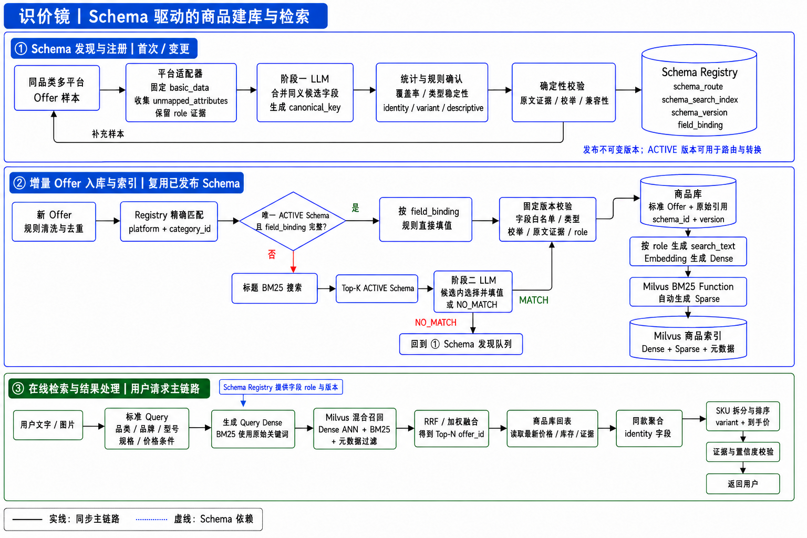

# 在线检索与结果处理



## 构建标准 Query

标准 Query 不是对用户原文进行一次简单改写，而是先找到对应的商品 Schema，再按照该 Schema 的字段、
role 和枚举约束，将用户需求整理成可用于 Dense、BM25 和元数据过滤的结构化请求。

```text
用户文字 / 图片
→ 提取原始商品词和约束
→ BM25 检索 schema_search_index
→ 确定 schema_id + ACTIVE schema_version
→ 按 Schema 字段和 role 抽取、归一化
→ 生成 Dense 文本、BM25 文本和硬过滤条件
```

### 1. 检索对应的 Schema

如果上游已经提供明确品类，可以直接读取对应的 ACTIVE Schema；否则使用用户原文查询注册中心的
`schema_search_index`。该索引包含品类名、品类别名、属性名和少量代表词，BM25 返回 Top-K ACTIVE
Schema。

```text
用户请求：找一个500元以内的 Keychron K2 青轴无线机械键盘

Schema BM25 Top-K：
1. product.mechanical_keyboard
2. product.gaming_keyboard
3. product.keyboard_accessory
```

Top-1 分数足够高且与 Top-2 差距明显时，可以直接选择；候选接近时，让 LLM 只能从 Top-K 中选择一个；
全部低于最低门槛时不强行确定 Schema。在线服务通常读取 ACTIVE Schema 的本地或 Redis 缓存，缓存未命中
时才访问注册中心。

### 2. 按 Schema 抽取并归一化字段

确定 `schema_id + schema_version` 后，规则优先提取品牌、型号、价格等明确内容，LLM 负责理解自然语言中
含义不固定的描述。LLM 只能填写当前 Schema 已定义的字段和枚举值。

例如机械键盘 Schema v1 可以完成以下转换：

```text
“Keychron”  → brand = Keychron，role = identity
“K2”        → model = K2，role = identity
“青轴”      → switch_type = blue，role = variant
“500元以内” → max_price = 500，currency = CNY
“无线”      → 含义可能包含蓝牙或 2.4G，先作为软偏好
```

明确且高置信度的品类、价格、在售状态等进入硬过滤；含义可能有多种解释的词保留为软偏好，避免错误过滤掉
相关商品。

### 3. 生成最终 Query

```jsonc
{
  "raw_query": "找一个500元以内的 Keychron K2 青轴无线机械键盘",
  "schema_id": "product.mechanical_keyboard",
  "schema_version": 1,
  "identity_constraints": {
    "brand": "Keychron",
    "model": "K2"
  },
  "variant_constraints": {
    "switch_type": "blue"
  },
  "hard_filters": {
    "listing_status": "onsale",
    "currency": "CNY",
    "max_price": 500.00
  },
  "soft_terms": ["无线"],
  "dense_text": "Keychron K2 青轴无线机械键盘，价格500元以内",
  "bm25_text": "Keychron K2 青轴 blue 机械键盘"
}
```

三个检索输出的用途分别是：

| 输出 | 用途 |
|---|---|
| `dense_text` | 生成 Dense 查询向量，召回语义相近商品 |
| `bm25_text` | 保留品牌、型号、规格原词和统一枚举，进行精确关键词召回 |
| `hard_filters` | 按 Schema、价格、币种和在售状态过滤 |

所以这里实际包含两次不同的 BM25：构建 Query 前检索 Schema，构建完成后检索商品 Offer。前者返回
`schema_id + schema_version`，后者返回 `offer_id`。

## Milvus 混合召回与结果融合

标准 Query 生成后，使用下面的流程从 Milvus 中获得候选 Offer：

```text
hard_filters → 限制品类、价格和在售状态
dense_text   → Embedding → Dense ANN 语义召回
bm25_text    → BM25      → 关键词召回
两路结果     → RRF 融合  → Top-N offer_id
```

### 1. 元数据过滤

先使用明确条件限制检索范围，例如：

```text
schema_id = product.mechanical_keyboard
listing_status = onsale
currency = CNY
price <= 500
```

### 2. Dense 和 BM25 并行召回

- Dense ANN 根据 `query_dense` 召回语义相近的 Offer。
- BM25 根据 `bm25_text` 匹配品牌、型号和规格词。

例如两路分别返回：

```text
Dense：offer_A、offer_B、offer_C
BM25： offer_B、offer_D、offer_A
```

### 3. 使用 RRF 融合

Dense 相似度和 BM25 分数的尺度不同，因此不直接相加。RRF 只根据候选在两路结果中的排名计算融合分数：

```text
RRF_score = 1 / (k + Dense排名) + 1 / (k + BM25排名)
```

两路都排在前面的 `offer_B` 会获得更高的最终排名。融合后输出：

```jsonc
[
  { "offer_id": "offer_B", "retrieval_score": 0.0325 },
  { "offer_id": "offer_A", "retrieval_score": 0.0323 },
  { "offer_id": "offer_D", "retrieval_score": 0.0161 }
]
```

这里先返回 Top-N `offer_id`，下一步再根据这些 ID 回查商品库，读取最新价格、库存和原始证据。
