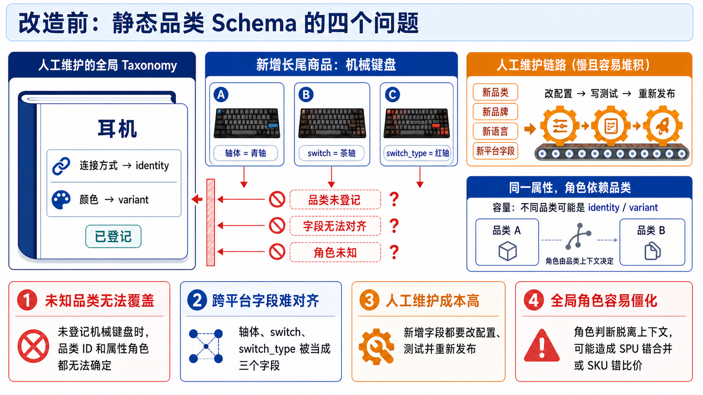
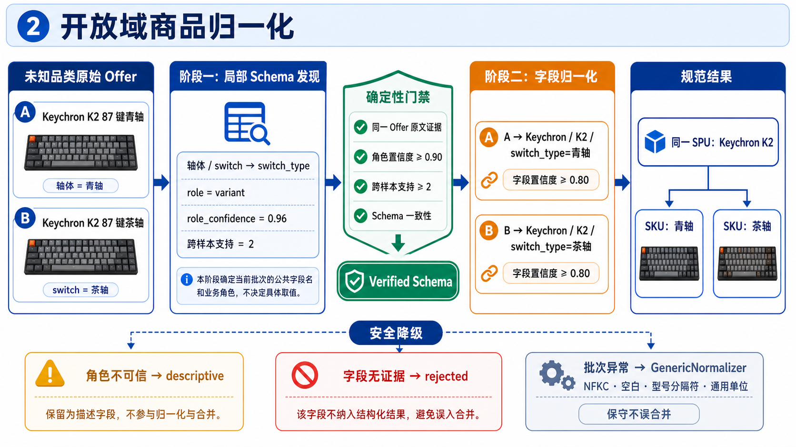

# 开放域商品归一化

## 配套讲解图一：旧静态品类 Schema 的问题

改造前，品类、字段别名和 `identity` / `variant` 角色主要由全局 Taxonomy 人工枚举。
下图用不同平台的机械键盘字段，展示这种闭世界做法的四个主要问题。

讲解重点：未登记机械键盘时，系统无法获得规范品类和字段角色；“轴体”、`switch` 和
`switch_type` 也不会自动对齐。每次出现新品类、新语言或平台字段，都需要修改配置、测试和重新发布；
将字段角色固化在全局表中，还可能因脱离品类上下文造成 SPU 错合并或 SKU 错比价。

## 配套讲解图二：用机械键盘串起两阶段归一化

统一例子：两个平台分别使用“轴体”和 `switch` 表示 Keychron K2 的轴体规格。下图展示系统
如何先发现当前批次的局部 Schema，通过确定性门禁后再逐条归一化，最终用 variant 拆分 SKU。

讲解重点：第一阶段只统一 `canonical_key` 和字段角色，不填写最终值；提议通过同一 Offer 原文
证据、角色置信度、跨样本支持和 Schema 一致性校验后，第二阶段才逐条填值。角色不可信时降为
`descriptive`，字段无证据时 `rejected`，批次异常时回退 `GenericNormalizer`。

## 讲解主线

这部分不要讲成“让 LLM 自动生成一个全局商品 Taxonomy”，而要围绕下面这条主线展开：

> 静态 Schema 是闭世界知识，难以覆盖持续变化的长尾商品；因此让 LLM 发现当前候选集的局部
> 语义，但模型输出始终只是 proposal，最终由确定性代码依据原文证据、置信度、跨样本支持度和
> 来源优先级决定字段能否进入同款判断与 SKU 拆分。

建议按照五段讲：

1. 静态品类 Schema 的具体问题；
2. 两阶段批量 LLM 调用分别做什么，以及为什么拆开；
3. 如何用原文、置信度和跨样本支持度校验模型提议；
4. 如何区分高可信、低可信、identity、variant 和 descriptive；
5. 哪些异常会触发按批回退，以及通用规则基线具体做什么。

全程使用一个未知品类例子串联，例如机械键盘：不同平台分别使用“轴体”“switch”和
`switch_type`，系统先发现统一字段及其角色，再归一化每条商品，而不是要求该品类预先写入全局
Taxonomy。

## 口播稿

> 这个问题首先来自静态品类 Schema 的闭世界假设。传统做法需要为每个品类人工维护品类 ID 和
> 别名、品牌别名、属性键、枚举值，以及哪些属性属于 identity、哪些属于 variant。当前静态
> Taxonomy 也是按照这个方式组织的。例如耳机会预先登记连接方式、佩戴方式、颜色和套装等字段，
> 并提前规定连接方式参与商品身份判断，颜色参与 SKU 拆分。
>
> 这种方案在已知品类中比较稳定，但进入开放电商域后会遇到几个具体问题。第一，未登记品类无法
> 得到规范品类 ID。例如出现机械键盘时，如果 Taxonomy 中没有这个品类，系统就无法基于静态配置
> 判断“轴体”“配列”和“连接方式”的作用。第二，不同平台可能分别使用“轴体”、`switch` 和
> `switch_type` 表达同一语义，如果没有人工维护别名映射，字段无法对齐。第三，新品牌、新语言和
> 平台字段都需要修改配置、测试和重新发布。第四，同一个属性在不同上下文中的角色可能不同，例如
> “容量”在某些品类中定义商品身份，在另一些品类中只是 SKU 规格，所以不能简单维护一张无限扩张
> 的全局字段表。
>
> 为了解决这个问题，我没有继续扩大静态 Taxonomy，而是把开放域归一化拆成“局部 Schema 发现”
> 和“按 Schema 进行字段归一化”两个阶段。这里的局部 Schema 只服务于当前候选窗口或短期缓存，
> 不会在在线请求中自动写入全局商品知识。
>
> 第一阶段是局部 Schema 发现。模型一次读取一批候选 Offer，当前默认 Schema 窗口最多 60 条。
> 它不输出最终商品，也不负责判断商品是否同款，而是提出当前窗口里有哪些局部商品概念、不同平台
> 属性应该统一成什么 `canonical_key`、有哪些 alias，以及属性在当前上下文中属于 `identity`、
> `variant` 还是 `descriptive`。每个概念和属性还必须携带角色置信度、支持的 Offer 和原文证据。
> 例如对于机械键盘，模型可以提出把“轴体”、`switch` 和 `switch_type` 统一为
> `switch_type`，并提议它在当前候选集中属于 variant。
>
> 举一个更具体的例子。假设这一批里有两条商品：A 的标题是“Keychron K2 87 键青轴”，平台属性
> 写的是 `轴体=青轴`；B 的标题是“Keychron K2 87 键茶轴”，另一个平台写的是
> `switch=茶轴`。第一阶段会综合两条商品，提出一个局部概念 `mechanical_keyboard`，再提出
> `canonical_key=switch_type`、`aliases=[轴体, switch]`、`role=variant`、
> `role_confidence=0.96`，并引用 A、B 两条商品里的原文作为跨样本证据。注意这一步只是在定义
> “这一批商品应该有哪些统一字段、字段叫什么、字段负责什么”，还没有逐条填写最终字段值。
>
> 第一阶段的结果不能直接使用。系统会先执行确定性 Schema 校验，只有校验后的
> `VerifiedDynamicSchema` 才能进入第二阶段。第二阶段再把这份已验证 Schema 和候选 Offer 一起交给
> 字段归一化模型，要求它逐条输出规范品类概念、品牌、型号和属性值。每个非空字段都必须附带字段
> 置信度和同一 Offer 的原文证据，无法判断的字段进入 `unresolved_fields`。
>
> 继续上面的例子。第一阶段的 `switch_type` 通过校验以后，第二阶段才逐条处理商品。对于 A，模型
> 可以输出 `category_concept=mechanical_keyboard`、`brand=Keychron`、`model=K2`，以及
> `switch_type=青轴`；对于 B，则输出相同的品类、品牌和型号，但 `switch_type=茶轴`。A 的“青轴”
> 必须引用 A 自己的标题或 `轴体` 字段，B 的“茶轴”也必须引用 B 自己的原文。模型不能临时输出
> 第一阶段 Schema 中不存在的 `rgb_mode`，也不能把 A 的青轴证据拿来填 B。最终两条商品可以先因
> 品牌和型号一致进入同一 SPU，再因为 `switch_type` 是 variant 被拆成两个 SKU。
>
> 所以可以把第一阶段理解为“先根据整批样本确定表头和每一列的业务含义”，第二阶段理解为
> “再按照已经审核过的表头逐行填值”。前者解决跨平台字段对齐和角色一致性，后者解决每条商品的
> 具体值抽取与规范化。
>
> 之所以拆成两个阶段，第一是为了保证批次一致性。如果每条商品单独归一化，同一个字段可能在不同
> 商品中被模型命名成不同的 key，角色也可能漂移；先发现局部 Schema，可以让整个候选窗口共享一套
> 字段语义。第二是为了支持跨样本验证，系统需要观察多条商品，才能判断某个角色是不是多个平台
> 共同支持，而不是某一条标题里的偶然营销词。第三是在模型发现语义和模型抽取字段之间增加一道
> 确定性安全门：第二阶段只能使用已经验证的 Schema，不能临时发明新字段或改变字段角色。第四，
> Schema 和字段结果可以分别缓存，也避免每条商品重复完成字段发现。
>
> 对模型提议的校验主要有原文证据、置信度、跨样本支持度和批次一致性四部分。原文证据使用
> `EvidenceSpan` 表达，其中包括 `offer_id`、`source_path`、`raw_value` 以及可选的起止位置。
> `source_path` 只能指向标题、品类、品牌、型号或原始属性字段。系统会对原文和 `raw_value` 做
> Unicode NFKC、大小写和空白规范化，然后检查该值是否连续出现在指定字段中，同时确认它属于同一
> 个 Offer。这样可以拒绝模型跨商品引用证据，或者凭常识补充输入中不存在的型号和规格。
>
> 置信度分为两个层次。品类概念和属性角色当前使用 0.90 的门槛，具体字段值使用 0.80 的门槛。
> 但模型自己填写一个高置信度还不够，identity 或 variant 角色还需要至少两个不同 Offer 的有效
> 证据支持。系统不会直接相信模型返回的 `support_offer_ids`，而是根据通过 grounding 校验的
> Evidence 重新统计支持 Offer 数。此外，还会检查一个 Offer 最多只能属于一个局部概念、同一个
> concept 内 `canonical_key` 不能重复、key 必须符合稳定的 snake_case 格式，以及同一个 alias
> 不能映射到多个 canonical key。
>
> 这里需要说明，当前字段 `confidence` 和角色 `role_confidence` 是模型在结构化输出中自评的分数，
> 还不是经过人工金标校准的真实正确概率。因此系统不会因为模型报了 0.95 就直接相信，而是先用
> Schema 成员关系、同一 Offer 原文证据和结构化来源冲突做不可绕过的硬校验，再把模型分数作为
> 准入条件之一。也就是说，模型即使报 0.99，只要证据不存在或与平台字段冲突，结果仍然会被拒绝。
>
> 如果继续向生产级演进，我会把模型自评分降为一个辅助特征，同时加入证据来源、原文匹配方式、
> 跨样本支持度，以及高风险字段的多次抽取一致性，再用人工金标训练并校准服务端置信度模型。最终
> 分别估计“字段值是否正确”和“字段角色是否正确”，而不是让 LLM 自己给一个看似精确的概率。
> `identity` 和 `variant` 会使用由真实错合并、错比价指标反推的更严格门槛；达不到门槛但字段事实
> 有证据时降为 `descriptive`，没有可靠证据时直接拒绝。这样置信度才能真正与 SPU 错误合并和 SKU
> 错误比价风险关联起来。需要注意，这是后续优化方案；当前已经落地的是模型分数门槛加确定性证据
> 门禁，还没有训练服务端校准模型。
>
> 这里还需要区分“角色不可信”和“字段事实不可信”。如果模型判断某个属性是 identity 或
> variant，但角色置信度低于 0.90，或者有效支持 Offer 少于两个，那么字段事实可以保留，但角色会
> 降为 `descriptive`。descriptive 表示这是一个有原文支持的商品描述，但它不会参与同款硬冲突，也
> 不会进入 SKU 签名。如果具体字段值的置信度低于 0.80、缺少同一 Offer 的有效证据、字段不属于
> 已验证 Schema，或者与平台已有结构化事实冲突，那么它不是降级，而是直接标记为 `rejected`。
>
> 通过校验的高可信字段会按照 Schema 角色进入不同的规范字段桶。`identity` 表示用于描述商品
> 身份或 SPU 的字段，可以参与规范标题、同款候选和硬冲突判断；`variant` 表示同一 SPU 下区分精确
> SKU 的销售规格，例如颜色、尺码、轴体或套装；`descriptive` 只保留为描述、审计或后续软信号，
> 不进入硬判断。品牌、型号和品类概念则作为独立的核心字段处理，不与普通动态属性混在一起。
>
> 例如候选中有“Keychron K2 87 键青轴”和“Keychron K2 87 键茶轴”。如果模型提议
> `switch_type` 是 variant，角色置信度为 0.96，并且青轴和茶轴分别有同一 Offer 的有效原文证据，
> 跨样本支持数也达到两个，那么 `switch_type` 会进入 `normalized_variant`，后续按青轴和茶轴拆成
> 不同 SKU。如果模型把 RGB 提议为 identity，但角色置信度只有 0.72 或只有一条有效支持证据，
> RGB 会降为 descriptive。如果模型声称某条商品是红轴，但原文中没有“红轴”，这个字段会直接
> rejected，而不是进入 descriptive。
>
> 最后是失败回退。第一阶段可能遇到模型超时、非法 JSON、Pydantic 结构校验失败、重复 concept、
> 一个 Offer 被重复 assignment、引用输入集合外的 offer_id、非法 canonical_key、alias 冲突或
> 伪造证据。第二阶段还可能返回错误的 schema_id、批次外的 offer_id、缺少某条商品，或者模型服务
> 整体不可用。这些情况都不会让整个检索失败，而是按批回退到 `GenericNormalizer`。Schema 发现
> 默认按 60 条一批，字段归一化按 20 条一批；某个 20 条批次失败时，只回退该批，其他批次继续。
>
> 通用规则基线不依赖具体商品知识。它只执行跨品类稳定的操作，包括 Unicode NFKC 和空白规范化、
> 型号中空格与常见分隔符的统一，以及毫升、升、克、千克、瓦和千瓦等通用单位转换。它会保留平台
> 已经提供的 identity、variant 和 descriptive 属性桶以及原始 Offer，但不会从标题猜测品类，不会
> 维护品牌词典，也不会自行判断属性角色。例如 `500 ml` 可以确定性转换成 `0.5L`，但是“轴体”
> 应该属于 identity 还是 variant，基线不会猜。
>
> 这种设计的错误偏好是漏合并优于错比价。模型失败时，系统损失的是动态字段的丰富度，而不是
> 检索可用性；没有可靠 variant Schema 时，Offer 会保守地单独形成 SKU 组，避免把不同规格的价格
> 错误地放在一起比较。

## 口播时需要强调的区别

- 局部 Schema 是请求级、可验证的临时语义，不是模型自动发布的全局 Taxonomy。
- LLM 负责发现语义和提出字段，不负责直接建立 SPU、SKU 或执行商品合并。
- `role_confidence` 判断角色是否可靠，字段 `confidence` 判断某个具体值是否可靠，两者不能混为一谈。
- 当前模型自评分只是准入信号，不是经过人工金标校准的真实正确概率；服务端校准模型属于后续优化。
- 角色可信度不足但事实有证据时降为 `descriptive`；字段本身无证据或发生来源冲突时直接拒绝。
- 跨样本支持度由系统根据有效 Evidence 重新计算，不信任模型声明的 `support_offer_ids`。
- 通用基线是确定性规范化，不是另一个标题抽取模型，也不会通过正则猜测未知商品语义。
- 当前商品归一化只有动态局部 Schema 路径，不再存在运行模式选择；静态 Taxonomy 仍可服务于
  识别等其他模块，但不再决定商品归一化、同款召回和 SKU 属性角色。
- 当前动态方案已经覆盖字段级校验、降级、缓存和按批回退，但真实未知品类金标、pair/cluster 差异
  评测和完整生产发布门槛仍未全部完成。

## 关键追问

### 问：为什么不直接让一个 LLM 一次性归一化所有商品？

> 一次性调用会把“发现字段语义”和“抽取具体值”混在一起，难以验证角色一致性，也无法在第二阶段
> 限制模型只能使用已经批准的字段。两阶段设计先对整个候选窗口建立统一局部 Schema，再由确定性
> 代码完成证据、支持度和冲突校验，最后按已验证 Schema 抽取字段。这样可以减少逐条模型输出的 key
> 和角色漂移，也为缓存、审计和安全降级提供明确边界。

### 问：模型置信度是模型自己给的，为什么可以相信？

> 系统不会单独依赖模型置信度。置信度只是一个准入条件，还必须同时满足同一 Offer 的原文证据、
> Schema 一致性、跨样本支持度和结构化来源优先级。模型即使返回 0.99，如果 raw_value 不在指定
> Offer 的原文字段中，或者与平台结构化字段冲突，仍然会被拒绝。实际阈值也需要通过真实金标校准，
> 当前 0.90 和 0.80 是保守的初始配置，不代表模型概率经过严格统计校准。

### 问：descriptive 属性还有什么用？

> descriptive 表示“字段事实可能可信，但不足以用于商品身份或 SKU 硬判断”。它可以保留在规范候选
> 中用于展示、审计或后续软信号，但不能造成两个商品自动合并，也不能把一个 SPU 拆成不同 SKU。
> 这样既不丢弃有价值的信息，又避免不稳定角色污染比价结果。

### 问：回退后还能做什么？

> 回退后仍然保留原始 Offer，并完成 Unicode、空白、型号分隔符和通用单位等确定性规范化。因此
> 检索结果仍然可用，只是不会获得模型发现的局部品类、属性别名和动态角色。后续同款与 SKU 判断会
> 更保守；没有可靠 variant Schema 时，不会把多个 Offer 自动断言为同一个精确 SKU。

## 代码位置

- 静态品类和属性角色结构：`src/shijiajing_agent/domain/taxonomy.py:43`
- 未知品类解析返回空：`src/shijiajing_agent/domain/taxonomy.py:107`
- 静态属性角色判断：`src/shijiajing_agent/domain/taxonomy.py:142`
- 动态 Schema proposal 契约：`src/shijiajing_agent/contracts.py:1059`
- EvidenceSpan 契约：`src/shijiajing_agent/contracts.py:1001`
- 动态字段归一化契约：`src/shijiajing_agent/contracts.py:1153`
- Schema 发现模型调用：`src/shijiajing_agent/adapters/ark_models.py:613`
- 字段归一化模型调用：`src/shijiajing_agent/adapters/ark_models.py:661`
- 原文证据 grounding：`src/shijiajing_agent/domain/dynamic_schema.py:70`
- Schema 确定性校验入口：`src/shijiajing_agent/domain/dynamic_schema.py:157`
- 角色置信度和支持度降级：`src/shijiajing_agent/domain/dynamic_schema.py:241`
- 通用规则基线：`src/shijiajing_agent/domain/open_world_normalization.py:72`
- 动态字段采纳入口：`src/shijiajing_agent/domain/open_world_normalization.py:203`
- identity、variant、descriptive 分桶：`src/shijiajing_agent/domain/open_world_normalization.py:338`
- 两阶段批处理入口：`src/shijiajing_agent/domain/product_canonicalization.py:53`
- Schema 发现调用与异常回退：`src/shijiajing_agent/domain/product_canonicalization.py:127`、
  `src/shijiajing_agent/domain/product_canonicalization.py:157`
- 字段归一化调用与异常回退：`src/shijiajing_agent/domain/product_canonicalization.py:208`、
  `src/shijiajing_agent/domain/product_canonicalization.py:224`
- Retrieval Agent 的唯一动态调用入口：`src/shijiajing_agent/multi_agent/agents/retrieval.py:80`
- 动态 variant SKU 拆分：`src/shijiajing_agent/domain/sku.py:39`
- 动态批大小与同款阈值配置：`src/shijiajing_agent/config.py:131`、
  `src/shijiajing_agent/config.py:142`
