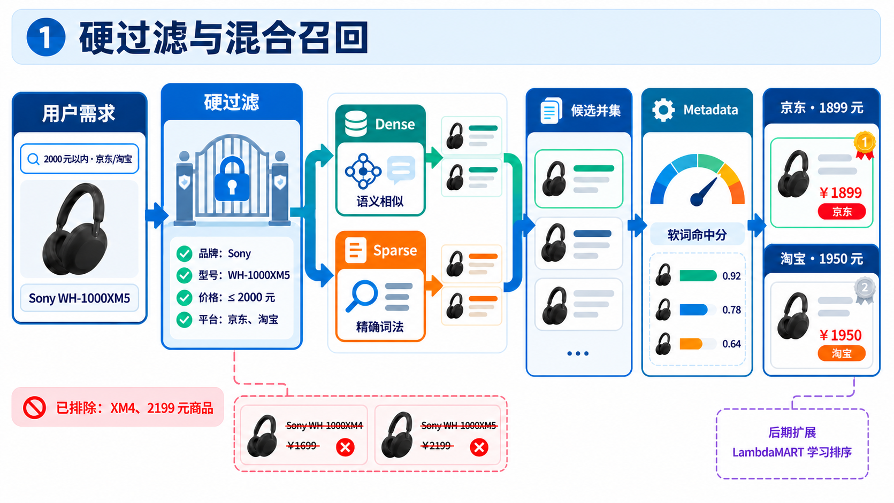

# 混合 RAG 与证据约束

## 配套讲解图：用一个例子串起第三点

统一例子：用户希望查找“2000 元以内、京东或淘宝的 Sony WH-1000XM5”。
下图用于说明哪些商品有资格被召回，以及 Dense、Sparse 和 Metadata 如何共同参与排序；紫色虚线框
表示后期可引入的 LambdaMART 学习排序，不属于当前已上线主链。

### 1. 硬过滤与混合召回

讲解重点：硬过滤同时约束 Dense 和 Sparse；两者产生候选并集后，再计算 Metadata 软词命中分，
因此 XM4 和超过 2000 元的商品在进入最终结果前就被排除。右下角 LambdaMART 通过虚线连接，强调它
只是在积累真实排序标签后的演进方向，当前结果仍由确定性规则排序。

## 讲解主线

这部分不要讲成通用知识库问答，而要先限定业务语境：这里的 RAG 是“商品检索增强的结果解释”。
系统先从商品索引中召回结构化 Offer，完成归一化、同款聚合、SKU 拆分和确定性排序，再把压缩后的
结构化证据交给模型生成解释。

建议按照下面八点展开：

1. **为什么纯向量检索不适合直接做比价。** 语义相似不能替代品牌、型号、预算和平台等业务约束；
   召回“很像但不满足条件”的商品，会直接造成错误推荐或错误比价。
2. **硬过滤与查询改写隔离（重点）。** 用户明确给出的品类、品牌、型号、价格区间、平台和最低评分
   由确定性代码构建为 `HardFilters`；模型只能改写 `query_text`、`soft_terms` 和
   `negative_terms`，不能生成或修改硬过滤。
3. **Dense、Sparse 与软匹配融合（重点）。** Milvus 中 Dense 负责语义召回，Sparse 负责型号、品牌
   和关键词等精确词法信号；两者先形成候选并集，候选再计算 `metadata_match` 软匹配分并参与融合。
   结构化元数据硬过滤则在每个 Milvus 检索请求执行前下推。
4. **同一过滤语义下的本地降级。** Milvus 调用重试后仍失败时，切换到同一商品快照上的本地 BM25；
   本地路径复用相同硬过滤谓词，Dense 分数保持为空，并显式标记 `fallback_used`。
5. **从业务结果构建 EvidenceBundle。** Explanation Agent 不接收任意检索上下文，而是从最终
   `RankedGroup` 中抽取标题、价格、平台、Offer 数、命中条件、缺失数据、风险和排名等结构化字段。
6. **生成后事实校验与模板回退（重点）。** 模型只接收 `EvidenceBundle`；输出后由确定性校验器检查
   价格数字和平台名是否存在于证据，失败或模型异常时直接使用确定性模板。
7. **准确说明当前边界。** 当前校验器还不是完整的 claim-level verifier；主执行链也没有启用图片
   向量召回和二阶段 reranker。面试时只讲当前真实接入的能力，再把结构化 claim 和证据引用作为演进。
8. **后期排序演进。** 当前最终 SKU 组使用可解释的确定性加权排序；积累真实人工偏好或经过去偏的
   点击、成交数据后，可只在综合推荐模式引入 LambdaMART，并以 Shadow 对比和规则回退逐步上线。

## 后期扩展：LambdaMART 学习排序

当前 `GroupRanker` 根据意图相关性、同款置信度、价格效用、卖家可信度、评分、销量和新鲜度计算确定性
推荐分。后期可以把这些业务维度连同 Dense、Sparse、Metadata 等召回信号组成 SKU 组特征，用
LambdaMART 学习综合推荐顺序；用户明确要求的价格、评分或销量排序仍走确定性分支，不交给模型改写。

接入时采用 `off → shadow → active` 三阶段：先只记录模型分并与规则结果比较，再用 NDCG@5/10 验证
真实排序收益，最后才切换综合推荐；模型缺失、特征版本不一致或预测异常时立即回退当前规则排序。

## 必要建议

- “混合 RAG”在本项目里是商品检索增强生成，不是把文档切块后做知识库问答。先说明这个定义，避免
  面试官按文档 RAG 追问 chunk、父子索引和文本引用定位。
- 和 `02` 的边界要分清：`03` 重点讲召回前的硬过滤、混合召回、故障降级和召回后的证据约束；
  候选如何归一化、判断同款和拆分 SKU 只作为中间步骤带过，细节留在开放域归一化部分。
- 不要说“Dense、Sparse、Metadata 三路分别 Top-K 召回”。当前真正产生候选并集的是 Dense 和
  Sparse；`metadata_match` 是候选产生后的软匹配分。品牌、型号、价格、平台等结构化元数据另以
  Milvus filter 的形式在召回前执行硬过滤。
- 当前默认融合策略是加权分数：文本查询中 Dense、Sparse、Metadata 权重分别为 0.50、0.30、0.20，
  缺失通道会按可用权重重新归一化。RRF 已实现为可选策略，但默认关闭。
- 当前 Multi-Agent 主链调用检索时传入 `image=None`，因此不要把可选的 `image_dense` 讲成已经进入
  当前端到端链路。图片的当前作用是先经过 Recognition，形成品牌、型号和品类等结构化理解。
- `CandidateRelevanceReranker` 当前用于策略对比评测，没有接入 `RetrievalAgent` 的生产主路径；
  `retrieval_rerank_enabled` 配置也不能据此讲成线上已启用 rerank。
- 图中的 LambdaMART 是后期的 SKU 组综合推荐扩展，不是当前已接入能力，也不要与召回候选阶段的
  `CandidateRelevanceReranker` 混为一谈；没有真实标签和 NDCG 对比前不能声称它已经提升排序效果。
- Milvus 的 Sparse 通道当前使用中英文 tokenizer 生成的稳定 token ID 和词频向量；本地降级才是
  纯 Python BM25。不要把当前 Milvus Sparse 说成已经接入 SPLADE 或标准 BM25 权重。
- “用户条件固化为硬过滤”要列出精确字段：品类、价格上下限、平台、最低评分，以及用户明确输入或
  修正的品牌和型号。颜色、偏好和任意动态属性当前不在 `HardFilters` 中，不能笼统说所有条件都硬过滤。
- 图片识别出的品牌和型号只有达到阈值才会进入硬过滤；默认品牌阈值为 0.85，型号阈值为 0.90。
  低置信识别结果不会伪装成用户硬条件。
- `HardFilterBuilder.relax()` 虽然存在并有单元测试，但当前 `RetrievalAgent` 没有在零结果时调用它。
  因此主链的准确口径是“不会自动放宽用户硬过滤”，不要声称已实现在线零结果逐级放宽。
- Milvus 降级以本地快照可用为前提；如果 Milvus 与本地快照都不可用，Retrieval Agent 返回可重试失败，
  由 Supervisor 的受控重规划处理，而不是返回伪造候选。
- “只能引用结构化证据”准确地说是模型输入面只提供 `EvidenceBundle`。当前确定性校验实际覆盖价格
  数字和平台名，还没有完整验证标题、店铺数、评分、风险描述和比较性措辞。`verified=True` 只表示
  通过当前这组规则，不代表每个自然语言 claim 都完成了语义证明。
- 当前校验器会保守拒绝证据白名单外的数字，标题型号、排名序号或店铺数也可能造成误报；模板回退
  会标记 `verified=False`。这是安全优先的降级，不要把它讲成校验器已经没有误报。
- 仓库内离线报告属于 provisional 回归数据；模板解释按构造计入一致性，真实模型解释需要 live
  校验。可以讲“已建立门禁和测试”，不要把当前报告说成生产流量上的最终效果证明。

## 口播稿

> 这里的 RAG 和常见的知识库问答有一点区别。它不是把长文档切块以后回答知识问题，而是先从商品
> 索引中检索结构化 Offer，再经过商品归一化、同款聚合、SKU 拆分和确定性排序，最后让模型基于
> 结构化比价证据生成解释。所以我把它称为商品检索增强的结果解释。
>
> 这个场景不能只做向量相似度搜索。比如用户说“帮我找京东或淘宝上 2000 元以内的 Sony
> WH-1000XM5”，向量检索可能召回语义上很接近的 XM4、其他品牌降噪耳机，或者价格超过预算的商品。
> 在普通问答里这可能只是相关性下降，但在比价里会造成条件违背，甚至把不同型号放在一起比较。
> 因此系统把“哪些条件绝对不能被召回模型改变”和“哪些信息只用于提高相关性”分成两条路径。
>
> 第一条是确定性的硬过滤路径。Intent 和 Recognition 的结果先经过约束合并，随后
> `HardFilterBuilder` 从中生成 `HardFilters`。当前字段包括品类、价格上下限、平台、最低评分、
> 品牌和型号。用户明确输入或修正的品牌、型号会直接进入硬过滤；图片识别出的品牌和型号只有达到
> 置信度阈值才会进入，默认阈值分别是 0.85 和 0.90。这样可以避免一次低置信图片识别把正确商品
> 全部过滤掉，同时用户明确说出的预算和平台等条件仍然不会被系统自动放宽。
>
> 第二条是查询改写和软召回路径。模型可以把口语化查询改成更适合商品库的关键词，例如把
> “索尼那款头戴降噪旗舰”改成“Sony WH-1000XM5 头戴式降噪耳机”，并补充少量 soft terms。
> 但是查询改写的 Pydantic 输出契约只允许 `query_text`、`soft_terms` 和 `negative_terms`，
> `extra=forbid` 会拒绝额外字段，提示词也明确禁止输出过滤条件。更重要的是，Retrieval Agent 会在
> 模型调用前用确定性代码生成一次硬过滤，模型返回后再逐字段比较；如果不一致，就用系统结果覆盖。
> 所以这里不是依赖提示词要求模型“不要改预算”，而是从输出 Schema 和执行代码两层阻断修改。
>
> 进入 Milvus 后，同一份硬过滤会先编译成 filter 表达式，并下推到 Dense 和 Sparse 检索请求。
> Dense 通道使用文本向量，适合处理“头戴式降噪旗舰”这类语义表达；Sparse 通道使用稳定 tokenizer
> 生成的词频稀疏向量，更擅长保留 Sony、WH-1000XM5 这类品牌、型号和精确词。两个通道的 Top-K
> 结果形成候选并集，再在当前候选集合内分别做 min-max 归一化。
>
> 对每个候选，系统还会计算 `metadata_match`，也就是查询词和 soft terms 在商品 `search_text` 中
> 的命中比例。它不是第三路独立 Top-K 召回，而是候选产生后的软匹配信号。默认文本融合权重是
> Dense 0.50、Sparse 0.30、Metadata 0.20；某个候选缺少某个通道时，权重只在可用信号间重新归一化，
> 不会用 0 冒充一个实际存在的向量分数。融合得到的是召回相关性分，后续同款判断、SKU 拆分和最终
> 业务排序仍由确定性领域代码完成，不交给生成模型。
>
> 排序侧的后期演进是：积累真实人工偏好或经过去偏的点击、成交标签后，把现有业务维度和召回信号
> 作为特征训练 LambdaMART，只替换综合推荐分；显式价格、评分和销量排序继续由确定性代码执行。上线
> 前先用 Shadow 模式比较 NDCG@5/10，模型不可用时仍回退当前规则排序，因此不会牺牲已有的可控性。
>
> 为了避免向量数据库故障让整个比价链路不可用，Milvus 检索会先在限定次数内重试；仍然失败时，
> 适配器切换到同一份只读商品快照上的本地 BM25。降级路径继续执行相同的品类、品牌、型号、价格、
> 平台和评分过滤，只是 Dense 分数明确保持为 `None`，候选来源只标记为 Sparse，并在结果中写入
> `fallback_used=true` 和固定的降级原因。这样系统可以牺牲语义召回能力，但不会伪装成仍然执行了
> 向量检索，也不会为了凑结果放宽用户预算。如果本地快照也不可用，任务会返回可重试失败，再交给
> Supervisor 做任务级重试和受控重规划。
>
> 检索完成以后，模型也不能直接读取完整状态或自由解释原始候选。Explanation Agent 先用
> `EvidenceBuilder` 从最终 `RankedGroup` 构造 `EvidenceBundle`，其中只包含查询摘要，以及每个 SKU
> 组的标题、最低价、均价、价格区间、平台、Offer 数量、命中条件、缺失数据、风险和排名。模型实际
> 接收到的是这份压缩后的结构化证据，而不是完整 `SupervisorState`，价格和排名也已经由确定性代码
> 算好，模型只负责把结果转成自然语言。
>
> 模型生成以后还要经过事实一致性校验。当前确定性校验器会提取回答中的数字，检查它们是否来自
> EvidenceBundle 中的最低价、均价或价格区间；同时检查回答提到的平台是否确实出现在证据中。例如
> 证据最低价是 1899 元，模型写成 1799 元，或者证据只有淘宝却写成京东，都会校验失败。模型超时、
> 返回空文本或事实校验失败时，系统不把可疑回答发给用户，而是直接根据同一份证据生成确定性模板，
> 并把任务标记为 fallback。
>
> 这里我也会明确当前边界：现在的校验器主要验证价格数字和平台名，还不是完整的 claim-level
> verifier，因此 `verified=True` 只代表通过当前规则，不能理解成每句话都完成了语义证明。下一步我
> 会把自由文本生成改成结构化 claim 生成，让模型先输出 `group_id`、claim 类型、值和 evidence ref，
> 服务端逐项校验后再渲染文本；同时把标题、店铺数、评分、风险和比较关系纳入字段级白名单。这样能
> 从“回答里没有出现未知数字”进一步提升到“每个业务事实都有明确证据引用”。

## 问：这和普通知识库 RAG 有什么区别？

> 普通知识库 RAG 的检索单元通常是文档 chunk，目标是为开放式回答提供相关上下文。本项目的检索
> 单元是结构化商品 Offer，用户条件中还包含预算、平台、品牌和型号等必须满足的业务约束。
>
> 所以这里不能只追求语义相关性。系统要先执行硬过滤，再进行混合召回；召回后还要做商品归一化、
> 同款聚合、SKU 拆分和确定性排序。生成模型只解释最终结构化结果，不负责决定哪些商品属于同款，
> 也不负责计算最低价。它本质上是“结构化商品检索 + 受证据约束的生成”。

## 问：为什么品牌、型号和预算要做硬过滤，不能放进相关性分数？

> 因为这些字段代表的是可行性约束，不是偏好强弱。用户明确要求 2000 元以内时，2100 元的商品即使
> 语义分再高也不应该进入结果；指定 WH-1000XM5 时，XM4 也不能因为标题相似就混入同款比价。
>
> 软打分适合“更轻”“降噪更好”这类可以权衡的偏好，硬过滤适合预算、平台、明确品牌和型号等不能
> 违反的条件。这样还能把 `hard_filter_satisfaction_rate=1.0` 作为独立的不变量测试，而不是依赖
> 一个难以解释的总分。

## 问：查询改写模型怎么保证不会偷偷修改硬过滤？

> 不是只靠 Prompt。第一层是模型输出契约根本没有 `hard_filters` 字段，并通过 `extra=forbid` 拒绝
> 额外字段；第二层是硬过滤由服务端根据 `ShoppingConstraints` 独立构建；第三层是 Retrieval Agent
> 在模型返回后重新比较硬过滤，不一致就用服务端版本覆盖。模型调用失败时也会退回原始查询文本加
> 同一份确定性硬过滤。

## 问：Dense、Sparse 和 Metadata 分别解决什么问题？

> Dense 解决语义表达差异，例如“头戴降噪旗舰”和“主动降噪头戴式耳机”；Sparse 保留品牌、型号、
> 数字和关键词的精确匹配；结构化 Metadata filter 在召回前保证价格、平台、品牌和型号等硬条件。
> 当前名为 `metadata_match` 的信号则是候选生成后的软词命中率，参与融合排序，不是独立召回通道。

## 问：为什么默认使用加权融合，而不是 RRF？

> 当前默认保留加权融合，因为各信号已经统一到 0 到 1，并且业务上希望显式控制 Dense、Sparse 和
> 软匹配的相对贡献。它的权重简单、可解释，也和现有回归基线一致。
>
> RRF 已作为可替换策略实现，优点是不依赖不同通道分数的绝对标定，只使用排名；但当前策略对比
> 数据仍是 provisional 小规模夹具，三种策略结果相同，还不足以证明切换默认值有收益。因此生产默认
> 仍保持 weighted，后续应在真实人工仲裁数据上比较 SKU Recall、MRR、零结果率和硬过滤满足率。

## 问：Milvus 不可用时，为什么用 BM25，而不是再部署一套本地向量库？

> 降级目标首先是保证链路可用和语义诚实，而不是完整复制主系统。BM25 可以直接从同一份只读 JSONL
> 快照惰性构建，依赖少、恢复快，并且能够复用相同硬过滤谓词。它会损失 Dense 语义召回，但品牌、
> 型号和商品关键词仍有较强词法信号。
>
> 同时结果会明确标记 fallback，Dense 分数保持为空，因此下游不会把降级结果误认为完整混合召回。
> 如果本地快照也不可用，则直接失败并触发任务级重试，不会返回伪数据。

## 问：如何证明降级前后没有放宽用户条件？

> Milvus 路径把同一个 `HardFilters` 对象编译成 filter 表达式；本地路径则调用
> `offer_matches_hard_filters()`，逐项检查同样的品类、价格、平台、评分、品牌和型号字段。契约测试
> 会构造价格区间和品类条件，分别验证本地路径只返回满足条件的 Offer，并验证 Milvus 故障切换后
> `fallback_used=true`、原因固定且候选仍满足过滤。

## 问：生成解释为什么不能直接读取完整商品列表？

> 完整候选里包含大量模型不需要的字段，也会扩大提示注入、无关信息和自由组合事实的空间。
> `EvidenceBuilder` 只从最终排序结果投影出解释所需字段，模型看不到完整 Supervisor 状态，也不参与
> 归一化、聚类、价格计算或排序。输入越窄，事实边界越清晰，校验和降级也越容易实现。

## 问：事实一致性校验具体检查什么？

> 当前检查两类强结构化事实：第一，回答中的价格数字必须出现在 EvidenceBundle 的最低价、均价或
> 价格区间白名单中；第二，回答中的平台 ID 或常用中文名必须属于证据里的平台集合。任一违规、模型
> 异常或空输出都会切换到确定性模板。
>
> 这里不能夸大成完整语义校验。当前标题、Offer 数、评分、风险和“更便宜”等关系型表述还没有全部
> 做字段级验证，所以通过只代表通过现有规则。更完整的方案是让模型先输出结构化 claim 和
> evidence ref，再由服务端校验 claim 类型、值和引用关系，最后由模板统一渲染成自然语言。

## 问：为什么事实校验失败后不让模型重写一次？

> 比价解释是低创造性、高事实风险的任务，已有结构化结果足以生成可用模板。事实失败后再次调用模型
> 会增加延迟和成本，而且第二次仍可能产生新的无依据事实。当前选择直接回退模板，优先保证价格、
> 平台和排序结果不被改写；如果以后增加修复循环，也应只允许基于明确 violations 修复一次，并继续
> 经过同一确定性校验。

## 问：如何处理商品标题里的 Prompt Injection？

> 当前模型只接收服务端构造的 EvidenceBundle，而不是直接接收用户可控制的完整状态，这已经缩小了
> 输入面；但商品标题仍然属于不可信数据，当前自由文本解释和有限事实校验还不能完全消除注入风险。
>
> 更稳妥的演进是把标题作为明确标记的数据字段传入，系统提示中声明所有商品字符串均不是指令；让
> 模型只输出结构化 claim，不允许输出新标题，并由服务端校验 `group_id`、claim 类型和值后再模板
> 渲染。对于高风险场景，还可以对标题做长度限制、控制字符清理和注入样本对抗测试。

## 问：当前有没有使用图片向量和二阶段 reranker？

> 底层 Milvus Adapter 支持可选 `image_dense`，领域层也实现了确定性
> `CandidateRelevanceReranker`；但当前 Multi-Agent 主链调用检索时传入的是 `image=None`，reranker
> 也只进入策略对比评测，没有接入 Retrieval Agent。因此当前面试口径只讲文本 Dense、Sparse、
> Metadata 软匹配和硬过滤；图片向量召回与在线 rerank 属于已预留但尚未接通的能力。

## 问：如何验证这套 RAG 约束有效？

> 测试分成四层。第一层验证查询改写输出不能改变服务端硬过滤；第二层验证 Milvus filter 与本地谓词
> 的字段语义一致；第三层使用 Fake Milvus 检查 Dense、Sparse、Metadata 融合分数和故障降级；第四层
> 对解释注入证据内和证据外的价格、平台，验证合法事实通过、伪造事实被校验器拒绝；Explanation
> Agent 再把拒绝结果转换成模板回退。
>
> 评测指标中把 `hard_filter_satisfaction_rate` 和
> `explanation_factual_consistency_rate` 设为阻断指标。不过当前仓库报告仍是 provisional 数据，且
> 模板解释按构造计为一致；只有补齐真实 live 模型输出并完成人工仲裁冻结后，才能作为生产发布证据。

## 代码位置

- 硬过滤构建与字段来源门槛：`src/shijiajing_agent/domain/filters.py:57`
- 本地与 Milvus 共用的硬过滤语义：`src/shijiajing_agent/domain/filters.py:21`
- 查询改写输出白名单：`src/shijiajing_agent/adapters/ark_models.py:531`
- 查询改写中确定性构建硬过滤：`src/shijiajing_agent/adapters/ark_models.py:552`
- Retrieval Agent 二次覆盖硬过滤：`src/shijiajing_agent/multi_agent/agents/retrieval.py:61`
- Retrieval Agent 调用检索并传入 `image=None`：`src/shijiajing_agent/multi_agent/agents/retrieval.py:70`
- Milvus filter 表达式构建：`src/shijiajing_agent/adapters/milvus_retrieval.py:82`
- Milvus 重试与本地降级：`src/shijiajing_agent/adapters/milvus_retrieval.py:172`
- Dense、Sparse 和可选 Image 召回：`src/shijiajing_agent/adapters/milvus_retrieval.py:226`
- 候选软匹配与融合入口：`src/shijiajing_agent/adapters/milvus_retrieval.py:303`
- Weighted 与 RRF 融合实现：`src/shijiajing_agent/domain/retrieval_fusion.py:18`
- 中英文 tokenizer、Sparse 词频向量和本地 BM25：`src/shijiajing_agent/adapters/lexical.py:30`
- 本地 BM25 降级和相同硬过滤：`src/shijiajing_agent/adapters/local_retrieval.py:67`
- 未接入主链的确定性 reranker：`src/shijiajing_agent/domain/retrieval_reranking.py:8`
- 当前 SKU 组确定性排序：`src/shijiajing_agent/domain/ranking.py:59`
- 排序 NDCG@5/10 评测入口：`src/shijiajing_agent/evals.py:732`
- 结构化证据构建：`src/shijiajing_agent/domain/evidence.py:51`
- 价格数字与平台事实校验：`src/shijiajing_agent/domain/evidence.py:143`
- Explanation Agent 校验失败后模板回退：`src/shijiajing_agent/multi_agent/agents/explanation.py:46`
- 查询改写硬过滤契约测试：`tests/contract/test_ark_models.py:245`
- 混合融合与 Milvus 降级测试：`tests/contract/test_retrieval_adapters.py:318`
- 证据与事实校验单元测试：`tests/unit/test_evidence.py:42`
- 评测门禁和当前限制：`docs/evaluation.md:152`
