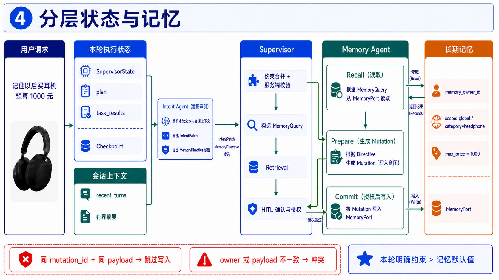

# 分层状态与记忆

## 配套讲解图：用“记住耳机预算”串起第四点

统一例子：用户说“记住以后买耳机预算 1000 元”。下图把一次请求中的本轮执行状态、会话上下文和
跨会话长期记忆分开，并展示长期记忆从召回、准备、用户确认到授权提交的完整链路。

讲解重点：`SupervisorState` 只服务于当前 turn 的计划、任务结果、Checkpoint 和中断；
`recent_turns` 是受边界控制的会话上下文；长期记忆必须绑定可信 `memory_owner_id`，并按 `scope_key`
隔离。历史偏好只作为默认约束、排序先验或负向偏好参与当前请求，用户本轮明确输入优先级更高；写入
则必须经过 `prepare → confirm → commit`，由 `mutation_id` 和 payload hash 保证恢复重放幂等。

## 讲解主线

这部分不要讲成“把所有聊天记录存进向量数据库”，而要围绕下面这条主线展开：

> 不同生命周期的数据必须有不同的状态边界：本轮状态用于可恢复执行，会话摘要用于有限的多轮上下文，
> 长期记忆只保存用户明确授权的、经过白名单和作用域校验的偏好；任何有副作用的提交都要可授权、可审计、
> 可幂等重放。

建议按照六段讲：

1. 为什么不能让任务状态、会话上下文和长期偏好混在一份状态里；
2. 三类状态分别保存什么、生命周期多长；
3. 长期记忆如何召回，以及它怎样参与当前约束合并；
4. 为什么写入要拆成 Prepare、HITL Confirm 和 Commit；
5. `owner`、`scope`、字段白名单和应用模式如何限制越权与误应用；
6. Checkpoint、`mutation_id` 和持久化 mutation ledger 如何保证恢复及并发场景不重复写入。

全程使用“记住以后买耳机预算 1000 元”这个例子：本轮的 `max_price=800` 若由用户明确提出，必须覆盖
长期记忆中的 `max_price=1000`；而用户只说“帮我找耳机”时，系统才可以把已确认的耳机品类预算作为默认值
补入本轮。

## 口播稿

> 这一点解决的是状态和记忆的生命周期边界问题。商品比价请求中同时存在三类数据：第一类是本轮执行状态，
> 例如当前计划、任务结果、预算和 HITL 中断；第二类是当前会话的有限上下文，用来帮助 Intent Agent 理解多轮
> 指代和近期约束；第三类是跨会话长期偏好，例如用户明确要求“以后买耳机预算不超过 1000 元”。如果把这三类
> 数据都放在一个共享状态里，恢复时可能误把临时候选当成新一轮输入，模型也可能把用户没有授权保存的自由文本
> 当成长期画像，最终造成状态污染或隐私越界。

> 当前 turn 的执行状态由 `SupervisorState` 管理，里面有 `session_id`、`request_id`、`turn_id`、当前请求、
> `ExecutionPlan`、任务记录、按 `task_id` 保存的 `AgentResultV2`、活动中断和最终响应。Checkpoint 的职责是让
> 这一轮从断点继续：例如 Retrieval 失败后，已经完成的 Intent 结果可以直接复用。它不是长期记忆，也不应该
> 用来替代用户偏好存储。

> 会话上下文使用 `recent_turns` 这样的有界摘要传给 Intent Agent。它只保留理解当前会话所需的近期信息，并受
> 条数和序列化字节数限制；`ConversationTurnSummary` 还可以记录约束变化、记忆效果和完成原因。持久化边界会
> 对摘要中的用户原文做哈希和长度脱敏，不把完整自由文本、图片内容或请求 metadata 原样写进 Checkpoint。

> 长期记忆由 `MemoryPort` 管理，核心标识不是用户在文本里随便写的字符串，而是可信调用上下文中的
> `memory_owner_id`。记忆记录还带有 `scope_key`，当前支持 `global` 和 `category:<category_id>` 两类作用域。
> 这样同一个用户可以有全局偏好，也可以只对耳机这一品类设置预算。召回时 Supervisor 根据当前品类构造
> `MemoryQuery`，同时查询品类作用域和 global 作用域；同一 key 发生冲突时，品类作用域优先。

> 记忆召回后不会直接覆盖本轮输入。系统先由 `resolve_memory_application()` 按状态、作用域、值域和应用模式
> 做确定性筛选，再由 `apply_memory_defaults()` 只填充本轮尚未明确提供的默认约束。`constraint_default` 可以补充
> 预算、平台或最低评分等默认值；`ranking_prior` 只影响排序先验；`negative_preference` 表示排除偏好。用户
> 本轮明确值的优先级高于 Memory 默认值，所以如果长期记忆是“耳机预算 1000 元”，而本轮用户明确说“预算
> 800 元”，最终检索约束仍然是 800 元。

> 写入链路和读取链路一样强调边界。以“记住以后买耳机预算 1000 元”为例，Intent Agent 只能提出一个
> `MemoryDirective`，不能直接写数据库。服务端先验证原文是否真的包含“记住、保存、默认”等显式授权语义，
> 再验证 `memory_key` 是否在白名单中、值的类型和范围是否合法、作用域是否属于当前品类，以及
> `apply_mode` 是否适配该字段。没有明确保存语义的普通偏好，只能用于当前请求，不能自动变成长期记忆。

> 通过校验的 directive 进入 Memory Prepare，按 `owner_id`、session、request 和 directive 顺序生成稳定的
> `MemoryMutation`。当前计划把 Prepare 放在 Intent 和 Explanation 之后，把 Commit 放在 Prepare 之后，避免
> 在用户确认前产生副作用。开启 HITL 时，Supervisor 会暂停并返回“本轮请求包含长期偏好变更，是否保存？”的
> `MEMORY_CONFIRMATION` 中断；拒绝就不提交，批准后才继续执行 Commit。

> 批准本身也不是一个布尔值就结束了。Supervisor 会把活动中断 ID、每个 mutation 的 `mutation_id` 和其
> payload hash 绑定成授权 ID，并把这些字段一起传给 Memory Agent。Memory Agent 只接收类型化的
> `MemoryTaskInput`，会重新计算授权关系；授权 ID、interrupt ID、mutation 列表或 payload hash 任一不匹配，
> 都返回 `CAPABILITY_DENIED`，不能伪装成“已经记住”。

> 最后是恢复和幂等。第一层是任务级 Checkpoint：恢复时已完成的 Memory Commit 不会再次派发。第二层是
> Memory Agent 的 mutation ID 去重。第三层是 SQLite/PostgreSQL 中的 `memory_mutation` 持久化账本：它只保存
> mutation 的 owner、操作、payload hash 和时间，不把记忆值重复写入审计表。相同 owner、相同 mutation ID 和
> 相同 payload 的重放直接跳过；同一 mutation ID 被不同 owner 使用，或 payload 发生变化，则报冲突。这样即使
> HITL 恢复请求重复到达，也不会产生两条长期记忆。

> 这套设计的降级语义也要讲清楚：Memory recall 不可用时，本轮比价可以继续，但必须提示“历史偏好未应用”；
> Prepare 失败时不生成 mutation；Commit 失败时返回失败并明确说明没有声明已保存。长期记忆是增强能力，不能因为
> 业务主链要继续，就把未授权、未验证或未成功提交的状态伪装成事实。

## 关键追问

### 问：为什么不把三类状态统一放进一个 AgentState？

> 因为它们的生命周期、恢复语义和安全要求不同。本轮状态需要支持任务级恢复，可以包含计划、结果和中断；
> 会话摘要只需要有限的近期上下文；长期记忆则是跨会话的用户资产，必须经过 owner、scope 和授权控制。混在
> 一起会让新 turn 继承临时候选，也容易让模型把共享状态中的普通字段误认为可持久化偏好。

### 问：长期记忆具体怎样影响当前比价？

> 记忆先按当前品类查询，再按 `category > global` 去重。`constraint_default` 只在本轮没有用户明确值时补默认
> 约束，`ranking_prior` 只投影给排序上下文，`negative_preference` 作为排除偏好应用。它不会绕过当前请求的
> 硬约束，也不会把低置信识别结果升级成用户明确条件。

### 问：为什么一定要 HITL，不能识别到偏好就直接保存？

> 因为“用户喜欢某种商品”和“用户要求以后默认使用某个条件”不是同一件事。只有原文出现明确的保存语义，
> 并且 directive 通过字段、值域、作用域校验后，系统才创建待提交 mutation；开启确认时还必须由用户批准。这样
> 模型的推断不会直接变成跨会话副作用。

### 问：`owner` 和 `scope` 分别解决什么问题？

> `owner` 解决跨用户隔离，来源必须来自可信调用上下文，不能由请求文本或 metadata 指定；`scope` 解决同一用户
> 内的适用范围，`global` 是全局默认，`category:headphone` 只对耳机生效。召回和提交都会带 owner，查询还限制
> scope 数量和格式，避免越权读取或把品类偏好错误扩大到全局。

### 问：同一个 mutation 重放时，为什么不会重复写？

> Checkpoint 先阻止已经完成的 Commit 任务再次派发；即使请求绕过第一层到达 Memory Agent，Agent 仍会按
> `mutation_id` 去重；最终 adapter 在 `memory_mutation` 账本中比较 owner 和 payload hash，相同就跳过，不同就报
> 冲突。测试中批准后重复 resume，Fake Memory 的 commit 调用次数仍然是 1。

### 问：记忆服务故障时，用户会看到什么？

> recall 故障会降级并提示本轮没有应用历史偏好，普通比价仍可以继续；Prepare 故障不产生写入；Commit 故障返回
> 失败，并在最终响应中提示长期偏好保存失败。系统不会为了让文案看起来完整而声称已经记住。

### 问：会不会把用户原话和敏感 metadata 写进 Checkpoint？

> 持久化边界会清空原始请求文本、图片 URI 和敏感 metadata；`ConversationTurnSummary` 中的用户原文也会被替换为
> SHA-256 和长度。Checkpoint 只保留恢复所需的结构化结果，长期记忆则只存通过白名单和授权链路生成的记录。

## 当前边界

- `recent_turns` 已有类型、上限配置和持久化脱敏契约，但面试时应把它准确描述为“有界会话上下文”，不要把它
  说成无限制的完整聊天历史。
- Memory 目前只接受有限的 `memory_key` 和三种 `apply_mode`，不是任意 JSON 用户画像，也不会根据商品标题自动
  生成长期偏好。
- Memory Adapter 已提供 SQLite 和 PostgreSQL 路径；测试重点覆盖 owner 隔离、授权提交、恢复幂等和失败语义，
  真实生产数据规模与跨区域一致性仍需进一步压测。
- `MemoryAgent` 内的 committed ID 集合是进程内快速去重；跨进程或重启后的最终幂等依赖 adapter 的
  `memory_mutation` 持久化账本，不能只依赖进程内集合。

## 代码位置

- 可信记忆调用上下文：`src/shijiajing_agent/contracts.py:187`
- Supervisor 分层状态：`src/shijiajing_agent/state.py:60`
- 会话摘要契约与字段：`src/shijiajing_agent/contracts.py:1441`
- Intent 接收前置约束和 `recent_turns`：`src/shijiajing_agent/contracts.py:479`
- Memory recall / prepare / commit 任务建图：`src/shijiajing_agent/multi_agent/planner.py:118`、`:160`
- Memory recall 查询动态注入：`src/shijiajing_agent/multi_agent/supervisor.py:1155`
- 召回结果合并与长期记忆应用：`src/shijiajing_agent/multi_agent/supervisor.py:1263`
- 作用域优先级、默认值和应用模式：`src/shijiajing_agent/domain/memory_policy.py:310`、`:379`
- 显式授权与 directive 校验：`src/shijiajing_agent/domain/memory_policy.py:141`、`:208`
- 稳定 `mutation_id` 与授权 ID：`src/shijiajing_agent/domain/memory_policy.py:243`、`:264`
- HITL 记忆确认中断：`src/shijiajing_agent/multi_agent/supervisor.py:513`
- 恢复后生成授权并装配 Commit 输入：`src/shijiajing_agent/multi_agent/supervisor.py:702`、`:1204`
- Memory Agent 的授权校验与提交：`src/shijiajing_agent/multi_agent/agents/memory.py:48`
- SQLite mutation ledger 与事务幂等：`src/shijiajing_agent/adapters/memory.py:23`、`:205`
- PostgreSQL owner/mutation 锁与幂等：`src/shijiajing_agent/adapters/memory.py:576`
- Checkpoint/摘要脱敏：`src/shijiajing_agent/persistence_safety.py:63`、`:96`
- 重复 resume 只提交一次的测试：`tests/multi_agent/test_supervisor.py:488`
