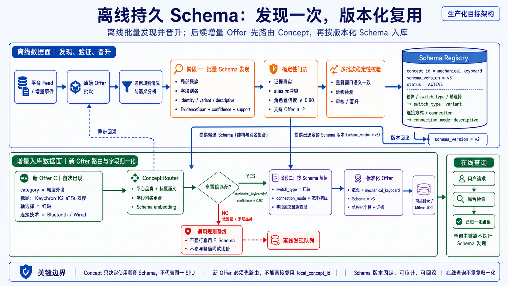

# 开放域商品归一化：离线持久 Schema 目标方案

> 口径说明：本页描述的是生产化目标架构。当前代码已经实现请求级局部 Schema、两阶段归一化、
> 证据门禁、缓存和按批回退，但尚未实现持久 Schema Registry 与 Concept Router。面试时应将两者
> 分别表述为“当前原型能力”和“生产化演进”，不能把目标架构直接说成已经落地。

## 配套讲解图

旧方案的问题仍可使用下面这张图说明：人工维护的静态品类 Schema 难以覆盖未知品类、跨平台字段
别名和动态字段角色。


新的主讲图改为“离线发现并持久化、增量 Offer 路由复用、在线查询只读索引”：



## 一句话架构

> 系统离线从平台 Feed 和增量事件获取 Offer，按语义分桶后批量发现局部 Schema；Proposal 经过
> 原文证据、置信度、跨样本支持度和多窗口稳定性校验后，晋升为带稳定 `concept_id` 和版本号的
> 持久 Schema。后续新 Offer 先由 Concept Router 选择 Schema，再按该版本完成字段归一化并建索引；
> 在线用户查询只检索已经归一化的商品索引，不重复执行 Schema 发现。

## 1. 离线数据从哪里来

离线建库不依赖用户查询词，主要消费供给侧商品数据：

- 平台商品 Feed 或目录 API；
- 商家新增、更新、下架事件；
- 价格、库存和商品属性的增量变更；
- 在线冷查询发现但本地尚未覆盖的 Offer 异步回灌。

处理单位仍然是平台 `Offer`。首次建库执行全量快照，日常通过 `source_product_id`、
`source_updated_at` 和游标进行增量同步。

## 2. 阶段一：离线批量发现局部 Schema

原始 Offer 先经过通用规则清洗和语义分桶。分桶只负责把大概率共享字段语义的商品放进同一窗口，
可以使用平台原始品类、标题关键词、品牌型号、字段名重合以及标题向量。

以机械键盘为例，某个窗口包含：

```text
Offer A：淘宝
category = 机械键盘
轴体 = 青轴
连接方式 = 蓝牙/有线

Offer B：亚马逊
category = keyboard
switch_type = 茶轴
connection = dual mode
```

LLM 一次读取整个窗口，只输出 `DynamicSchemaProposal`：

```text
局部概念：mechanical_keyboard

字段：
轴体 / switch_type / 轴选择
    -> canonical_key = switch_type
    -> role = variant

连接方式 / connection / 连接技术
    -> canonical_key = connection_mode
    -> role = descriptive
```

阶段一只确定概念、表头、别名、类型和角色，不填写每条 Offer 的最终字段值，也不判断 SPU 或 SKU。

## 3. 确定性门禁

模型输出不能直接发布。服务端至少检查：

- `offer_id` 与 EvidenceSpan 是否属于当前输入窗口；
- `raw_value` 是否真实出现在同一 Offer 的允许字段中；
- 一个 Offer 是否只被分配给一个局部概念；
- `canonical_key` 是否为稳定 snake_case，alias 是否发生一对多冲突；
- 概念和角色置信度是否达到门槛；
- identity/variant 是否获得足够的不同 Offer 支持；
- 模型是否引用了窗口外 Offer 或发明原文不存在的事实。

当前原型门槛可作为初始值：概念和角色置信度不低于 0.90，identity/variant 至少有两个有效 Offer
支持。角色不足时字段降为 `descriptive`；字段本身无证据时直接拒绝。

## 4. 从局部 Proposal 晋升为持久 Schema

单个窗口通过校验仍不足以写入全局 Registry。生产化方案增加“多批次稳定性校验”：

1. 在不同平台、不同时间窗口重复发现同一语义；
2. 对比字段 key、alias、value kind 和角色是否稳定；
3. 检测新旧 Schema 的字段增删和角色漂移；
4. 高风险 identity/variant 变更进入人工或规则审核；
5. 达到发布门槛后，从临时局部概念晋升为稳定 `concept_id`。

持久记录不再使用仅对一次响应有效的 `local_concept_id`，而是类似：

```json
{
  "concept_id": "mechanical_keyboard",
  "schema_version": "v3",
  "status": "ACTIVE",
  "attributes": {
    "switch_type": {
      "aliases": ["轴体", "switch_type", "轴选择"],
      "role": "variant",
      "value_kind": "string"
    },
    "connection_mode": {
      "aliases": ["连接方式", "connection", "连接技术"],
      "role": "descriptive",
      "value_kind": "string"
    }
  }
}
```

Registry 还需要保存来源窗口、有效证据统计、Prompt/模型版本、创建时间、审核状态和上一个可回滚版本。
PostgreSQL 作为事实源，Redis 只缓存 ACTIVE Schema；Concept 的语义向量可以放入 Milvus，用于路由
候选召回。

## 5. 新 Offer 如何复用已有 Schema

后续平台 Feed 中出现一个阶段一从未见过的新 Offer：

```text
Offer C：
category = 电脑外设
标题 = Keychron K2 红轴 双模
轴选择 = 红轴
连接技术 = Bluetooth / Wired
```

它不能直接拿一个旧的 `local_concept_id` 进入阶段二，而是先经过 Concept Router：

```text
Offer C
  -> 根据平台品类、标题语义和字段别名召回候选 Schema
  -> 候选：mechanical_keyboard@v3
  -> 校验标题与字段证据，检查硬冲突
  -> 高置信匹配后固定 schema_version=v3
```

Concept Router 的作用只是回答“该 Offer 应使用哪套字段定义”，不回答“它与另一个 Offer 是否同款”。
路由置信度不足时不能强行套用最相近的 Schema。

## 6. 阶段二：按选定 Schema 填值

只有路由成功后，阶段二才接收：

```text
Offer C + mechanical_keyboard@v3
```

模型被限制为只能使用 v3 中已发布的 canonical key 和角色：

```text
轴选择 = 红轴
    -> switch_type = 红轴
    -> normalized_variant

连接技术 = Bluetooth / Wired
    -> connection_mode = 蓝牙/有线
    -> normalized_descriptive
```

每个字段仍要携带 C 自己的原文证据和字段置信度。模型临时输出 Registry 中不存在的 `rgb_mode`，
或者擅自把 `connection_mode` 改成 identity，都不会被采纳。

阶段二通过后，标准化 Offer 写入商品目录，并生成 `search_text`、Dense/Sparse 向量和结构化过滤字段，
最后增量更新 Milvus。

## 7. Concept、SPU 和 SKU 的边界

三者不能混用：

```text
Concept：选择哪套 Schema，例如 mechanical_keyboard
SPU：品牌、型号及 identity 一致的同款商品组，例如 Keychron K2
SKU：同一 SPU 下 variant 完全一致的购买规格，例如 K2 红轴双模
```

两个 Offer 都被路由到 `mechanical_keyboard`，只说明它们共享机械键盘字段语义，不代表它们属于同一
SPU。后续仍要通过品牌、型号和 identity 判断同款，再通过 variant 拆分 SKU。

## 8. 未知 Concept 与 Schema 漂移

如果新 Offer 与任何 ACTIVE Schema 都不满足门槛：

1. 使用通用规则基线保留原始 Offer；
2. 不进行精确同款聚合或 SKU 比价；
3. 将 Offer 放入离线发现队列；
4. 与后续相似 Offer 聚成新窗口，再执行阶段一；
5. 稳定后发布新 Concept，或者形成现有 Schema 的新版本。

如果已有 Concept 出现新字段，也不直接原地修改 v3，而是生成 DRAFT v4，经稳定性和兼容性校验后
切换为 ACTIVE。出现错误可以回滚 v3，历史 Offer 通过 `schema_version` 保持可审计。

## 9. 在线查询链路

用户查询主链路不做 Schema 发现，也不重新归一化整批商品：

```text
用户文字 / 图片
  -> 意图理解与硬过滤
  -> Dense + Sparse + 元数据混合检索
  -> 已归一化 Offer
  -> 同款聚合、SKU 拆分和排序
  -> 证据约束解释
```

如果索引完全未命中，可以通过平台接口做冷查询兜底，但新 Offer 只能在高置信路由和字段校验后参与
精确比价；低置信结果只展示原始 Offer，并异步回灌离线发现队列。

## 10. 缓存与版本键

- Schema 缓存：`concept_id + schema_version + status`；
- 路由缓存：`offer_payload_hash + registry_version`；
- 字段归一化缓存：`offer_payload_hash + schema_id + canonicalizer_version`；
- Embedding 缓存：`normalized_text_hash + embedding_model_version`；
- 商品查询缓存：必须携带 `index_version`，价格和库存使用短 TTL。

Registry 是事实源，缓存不能自动创建或修改 Schema。版本变化时通过版本键自然失效旧缓存。

## 口播稿

> 我把商品归一化改成了离线持久 Schema 的架构。平台 Feed 或增量事件首先提供原始 Offer，离线任务
> 先做通用清洗和语义分桶，再让 LLM 对一批相似 Offer 发现局部概念、字段别名以及 identity、
> variant、descriptive 角色。模型输出只是一份 Proposal，服务端还会验证同一 Offer 原文证据、
> alias 冲突、角色置信度和跨样本支持度。单个窗口通过校验后也不会立即发布，还要经过多个时间和
> 平台窗口的稳定性与漂移校验，最终才晋升为带稳定 concept_id 和 schema_version 的 ACTIVE Schema，
> 保存到 Schema Registry。
>
> 后续出现第一阶段没有见过的新 Offer 时，它不能直接复用临时 local_concept_id，而是先通过
> Concept Router，利用平台品类、标题语义、字段别名和 Schema embedding 召回候选 Schema。只有
> 高置信且没有硬冲突时，才固定到某个版本进入第二阶段；第二阶段只能按照已发布字段和角色填写值，
> 每个结果仍需同一 Offer 原文证据。匹配失败时使用通用规则基线并进入离线发现队列，不强行套用
> 最近的 Schema。
>
> 归一化后的 Offer 才会写入商品目录并构建 Dense、Sparse 和结构化索引。在线用户查询只检索这些
> 已处理的数据，不重复执行 Schema 发现。这里的 Concept 只决定使用哪套字段定义，不代表同一 SPU；
> 同款和 SKU 判断仍然由后续的 identity 与 variant 逻辑完成。

## 当前代码与目标架构的边界

当前代码仍然是请求级局部方案：

- 阶段一和阶段二处理同一个 `batch_offers`；
- `VerifiedDynamicSchema.input_offer_ids` 必须与当前窗口一致；
- `local_concept_id` 只在当前响应中关联 Offer；
- 没有持久 Schema Registry、Concept Router、晋升状态机或多窗口漂移发布流程。

当前已实现、可以如实讲的能力：

- 两阶段结构化 LLM 调用；
- EvidenceSpan grounding；
- 置信度、跨 Offer 支持度和 alias 冲突校验；
- identity/variant 角色降级；
- Schema 与字段结果缓存；
- 模型或批次异常时回退 GenericNormalizer。

目标架构对应的关键代码缺口：

- 持久 `ConceptSchema` / `SchemaVersion` 数据模型；
- PostgreSQL Schema Registry；
- Concept Router 与匹配门禁；
- DRAFT / ACTIVE / DEPRECATED 生命周期；
- 多窗口稳定性、漂移评估与版本发布；
- 增量 Offer 归一化和索引回写任务。

当前实现位置：

- Schema 发现调用：`src/shijiajing_agent/adapters/ark_models.py:613`
- Schema 确定性校验：`src/shijiajing_agent/domain/dynamic_schema.py:157`
- 同批次进入阶段二：`src/shijiajing_agent/domain/product_canonicalization.py:176`
- 未分配 Concept 时拒绝动态字段：`src/shijiajing_agent/domain/open_world_normalization.py:229`
- 请求级 Schema 契约：`src/shijiajing_agent/contracts.py:1101`
