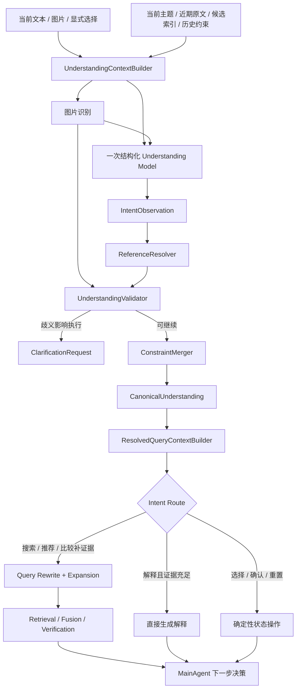

# 意图理解与 Query Expansion 一体化设计

状态：设计完成，尚未实施。日期：2026-09-10。

本文把意图体系、指代消解、当前轮槽位抽取、历史约束合并、Query Rewrite、Query Expansion 和 MainAgent 路由整合为一条生产链路。Query Expansion 的检索策略、预算、通道编译和评测细节继续以 [Query Expansion 完整系统设计](query_expansion_system_design.md)为准；本文负责定义它的上游输入和与 Agent Runtime 的衔接。

编排沿用 [MainAgent + 按需 Subagent 唯一架构](subagent_only_architecture_design.md)。意图理解和 Query Expansion 都是 Runtime 内部的确定性服务与受控模型能力，不新增 IntentAgent、RewriteAgent 或 ExpansionAgent，也不增加第二套编排模式。

## 1. 设计结论

完整查询理解采用以下职责分离：

1. **业务意图 `task_intent`**：表示用户希望系统完成什么任务，用于 MainAgent 路由。
2. **对话动作 `dialogue_action`**：表示用户本轮如何延续、修改或结束当前任务，用于状态迁移。
3. **指代结果 `reference_resolutions`**：将“这个”“第二款”“刚才那台”绑定到当前会话中的真实 ID；不能由模型虚构 ID。
4. **槽位增量 `intent_patch`**：只保存本轮新增、替换、删除的商品条件，继续由 `ConstraintMerger` 确定性合并。
5. **基础查询 `resolved_base_query`**：把已消解主体和当前有效条件改写成一条可独立检索的查询。
6. **扩写计划 `ExpansionPlan`**：在不改变硬约束的前提下生成少量召回变体，并编译到 Dense、Sparse 等物理通道。
7. **MainAgent 决策**：依据统一理解、检索诊断和预算，选择检索、比较、解释、追问、直接补查或按需调用 Subagent。

一级意图保持在少量稳定业务目标，不为品牌、品类、属性或每种话术建立意图标签。这些信息属于实体、槽位或对话动作。

## 2. 当前实现与关键缺口

当前文本意图实现已经具备一个可靠的“槽位抽取 + 确定性合并”骨架：

- `IntentPatch` 明确要求模型只输出当前轮变化，包含品类、品牌、型号、价格、颜色、平台、偏好、动态属性、清除字段、否定词和记忆候选，见 [contracts.py:280](/Users/zsc/Projects/E.C.26-B/src/shijiajing_agent/contracts.py:280)。
- `ArkIntentModel` 接收当前文本、历史约束、taxonomy 和最近会话摘要，使用结构化输出生成 `IntentPatch`，见 [ark_models.py:482](/Users/zsc/Projects/E.C.26-B/src/shijiajing_agent/adapters/ark_models.py:482)。
- 模型失败时，`IntentService` 使用 `RuleIntentParser` 返回有限结果，见 [intent.py:25](/Users/zsc/Projects/E.C.26-B/src/shijiajing_agent/services/intent.py:25)。
- Runtime 按“历史状态 → 图片识别 → 文本 Patch → 用户修正”合并约束并生成 `CanonicalUnderstanding`，见 [runtime.py:476](/Users/zsc/Projects/E.C.26-B/src/shijiajing_agent/agent_runtime/runtime.py:476)。
- 当前统一理解只包含识别、Patch、约束和记忆，见 [contracts.py:410](/Users/zsc/Projects/E.C.26-B/src/shijiajing_agent/contracts.py:410)。

因此，当前实现还缺少：

| 缺口 | 影响 |
|---|---|
| 没有稳定的一级业务意图 | MainAgent 主要根据缺口和已有结果推测下一步，搜索、比较、解释等任务缺少明确路由信号 |
| 没有独立对话动作 | “增加条件”“替换条件”“删除条件”“纠正识别”容易混入槽位字段，状态变化语义不完整 |
| 没有结构化指代结果 | “第二款”“它”“刚才那个”只能依赖有限摘要和模型隐式理解，无法审计绑定依据 |
| 没有多意图步骤 | “先找 XM5，再和 QC Ultra 比较”无法表达成有依赖关系的任务步骤 |
| 没有 `ResolvedQueryContext` | 含糊原文可能直接进入改写或检索，Query Expansion 缺少稳定上游契约 |
| Query Rewrite 与 Expansion 边界不完整 | 当前已有简单 rewrite 骨架，但缺少安全路由、通道分流、受控扩写和贡献评测 |

## 3. 总体流程



模型负责理解候选，确定性代码负责验证引用、合并状态、约束扩写范围、执行预算和最终路由准入。正常文本轮次默认只需要一次结构化理解调用；指代验证不再额外调用模型。

## 4. 意图体系

### 4.1 一级业务意图

`task_intent` 表达最终业务目标。首版建议固定为以下七类：

| `TaskIntent` | 含义 | 示例 | 典型路由 |
|---|---|---|---|
| `product_search` | 查找满足条件的商品或报价 | “找 2000 以内的降噪耳机” | 合并条件 → 扩写 → 检索 |
| `product_compare` | 比较两个或多个明确对象 | “对比刚才前两款” | 指代解析 → 补齐证据 → 比较 |
| `product_identify` | 识别图片或文本中的商品身份 | “图里是什么型号” | 图片/实体识别 → 必要时澄清 |
| `product_recommend` | 根据用途和偏好作选择 | “哪个更适合通勤” | 绑定候选或搜索 → 校验 → 推荐 |
| `product_explain` | 解释结果、差异或推荐原因 | “第二款为什么更贵” | 绑定候选 → 检查证据 → 解释或补查 |
| `general_qa` | 回答不依赖当前商品检索的知识问题 | “主动降噪是什么原理” | 知识回答或相应工具路径 |
| `task_control` | 控制当前任务或会话状态 | “重新开始”“取消这次比较” | 确定性清理、取消或恢复 |

重叠时以用户要求的最终动作作为 `primary_intent`：询问原因优先归为 `product_explain`，多个明确对象之间的差异归为 `product_compare`，要求系统替用户选择归为 `product_recommend`，只要求查找候选归为 `product_search`。一句话确实包含多个先后目标时使用 `steps`，不通过扩大一级标签数量解决。

约束变化放在 `dialogue_action` 中表达。这样“预算改成 1500”仍属于当前购物目标，同时明确它是一次字段替换。

### 4.2 对话动作

| `DialogueAction` | 含义 | 示例 |
|---|---|---|
| `start` | 创建新任务或新主题 | “帮我选一台轻薄本” |
| `continue` | 延续当前目标，不修改条件 | “继续看看” |
| `refine` | 增加条件或偏好 | “还要黑色的” |
| `replace` | 替换已有字段 | “预算改成 1500” |
| `remove` | 删除字段或偏好 | “不要品牌限制” |
| `correct` | 纠正识别、实体或旧值 | “不是 XM4，是 XM5” |
| `select` | 选择候选或澄清选项 | “就第二款” |
| `confirm` | 确认当前理解或结果 | “对，就是这个” |
| `reject` | 否定当前理解或结果 | “这几个都不合适” |
| `reset` | 清空当前任务状态 | “重新开始” |
| `cancel` | 结束当前动作或任务 | “不用比了” |

### 4.3 槽位不是意图

以下内容继续保存在 `IntentPatch` 或规范约束中：

- 品类、品牌、型号和商品属性；
- 价格、平台、颜色、评分等硬条件；
- 用途、排序和软偏好；
- 关键词、排除词和否定条件；
- `clear_fields`、`cancelled_preferences` 和长期记忆候选。

例如“把预算改成 1500，只看京东”的结果为：

```json
{
  "task_intent": "product_search",
  "dialogue_action": "replace",
  "intent_patch": {
    "max_price": 1500,
    "platforms": ["jd"]
  }
}
```

`task_intent` 决定仍在完成商品搜索，`dialogue_action` 表示本轮在修改状态，`intent_patch` 表示具体修改了哪些字段。

### 4.4 多意图表达

一句话包含多个有依赖关系的目标时，输出最多三个有序 `IntentStep`：

```json
{
  "primary_intent": "product_compare",
  "steps": [
    {
      "step_id": "s1",
      "task_intent": "product_search",
      "depends_on": [],
      "intent_patch": {
        "brand": "Sony",
        "model": "WH-1000XM5"
      }
    },
    {
      "step_id": "s2",
      "task_intent": "product_compare",
      "depends_on": ["s1"],
      "reference_mentions": ["刚才第二款"]
    }
  ]
}
```

步骤表达任务依赖，不直接启动新的 Agent。MainAgent 按步骤和预算执行；只有某一步需要多轮取证时，才按现有规则调用 ResearchSubagent。

## 5. 指代消解

### 5.1 可引用对象

指代解析只允许绑定上下文中真实存在的对象：

| 类型 | 示例 | 目标 ID |
|---|---|---|
| 当前主题 | “这个需求”“刚才的耳机” | `subject_id` |
| 商品候选 | “第二款”“便宜的那个” | `candidate_id` / `group_id` / `offer_id` |
| 图片实体 | “图里这个” | `recognition_id` 或规范商品线索 |
| 历史轮次 | “你刚才说的” | `turn_id` |
| 约束字段 | “把这个价格提高点” | `constraint_field` |
| 澄清选项 | “选第一个” | `option_id` |

### 5.2 解析顺序

`ReferenceResolver` 按以下顺序处理：

1. 显式 `selected_option_id`、候选 ID 或 UI 选择直接绑定；
2. 当前活跃主题内的唯一实体直接绑定；
3. “第一款／第二款”绑定到产生它的候选列表版本，不能绑定最新列表中的另一个位置；
4. 品牌、型号、价格等描述与候选索引做确定性过滤；
5. 剩余唯一候选可以解析，并记录依据；
6. 零个或多个候选且差异会影响执行时，生成澄清请求。

模型只输出原文 span、目标类型和候选提示；最终 ID 必须由 Resolver 从白名单上下文中赋值。任何模型生成但上下文不存在的 ID 都作为契约错误拒绝。

### 5.3 解析结果

```python
class ReferenceResolution(BaseModel):
    mention: str
    target_type: Literal[
        "subject", "candidate", "recognition", "turn", "constraint", "option"
    ]
    status: Literal["resolved", "ambiguous", "missing"]
    target_ids: list[str]
    source_turn_id: str | None
    candidate_set_version: int | None
    reason_code: str
```

`ambiguous` 或 `missing` 不一定阻塞整轮。只有该引用是当前动作必需输入时才追问。例如“这几个都不要，另外找黑色的”即使“这几个”的集合部分过期，仍可应用明确的黑色条件；比较“第二款和第三款”则必须先唯一绑定两个候选。

## 6. 统一理解契约

模型侧输出保持小而受限：

```python
class IntentStep(BaseModel):
    step_id: str
    task_intent: TaskIntent
    dialogue_action: DialogueAction
    depends_on: list[str]
    reference_mentions: list[str]
    intent_patch: IntentPatch
    confidence: float


class IntentObservation(BaseModel):
    primary_intent: TaskIntent
    steps: list[IntentStep]
    needs_clarification: bool
    clarification_question: str | None
```

本地完成引用解析、Schema 校验和约束合并后，Runtime 生成：

```python
class CanonicalUnderstanding(BaseModel):
    recognition: RecognitionResult | None
    intent_observation: IntentObservation | None
    reference_resolutions: list[ReferenceResolution]
    intent_patch: IntentPatch | None
    constraints: ShoppingConstraints | None
    memory_records: list[MemoryRecord]
    memory_application: MemoryApplication
    unresolved_ambiguities: list[str]
```

`IntentObservation` 是模型观察，`reference_resolutions` 和 `constraints` 是本地验证后的生效状态。下游只能根据生效状态执行工具。

## 7. 单轮处理流程

### 7.1 构建有界理解上下文

`UnderstandingContextBuilder` 只提供本轮需要的投影：

- 当前用户原文、图片识别摘要和显式 UI 选择；
- 当前 `subject_id` 及有效约束；
- 最近原文窗口与更早的结构化主题摘要；
- 当前候选列表的 ID、顺序、品牌、型号和必要属性；
- 活跃澄清问题与选项；
- taxonomy 的品类、品牌别名和属性 Schema。

不会把完整长期记忆库、全部召回结果或大段证据正文发送给意图模型。长期记忆仍在约束合并后按默认值规则应用。

### 7.2 一次结构化理解

Understanding Model 在一次调用中联合提出：

- `primary_intent` 和有序步骤；
- 每步 `dialogue_action`；
- 待解析的指代 span 和目标类型；
- 当前轮 `IntentPatch`；
- 是否存在必须澄清的语义歧义。

模型不得复制未被本轮提及的历史条件，不得生成最终候选 ID，不得直接清空状态，不得把软偏好升级为硬条件。

### 7.3 本地验证与降级

确定性代码依次执行：

1. Schema、枚举、数量、长度和 step DAG 校验；
2. 指代候选白名单与列表版本校验；
3. taxonomy、属性值域、否定和清除操作校验；
4. 记忆候选的用户原文证明校验；
5. 业务意图与对话动作组合校验；
6. `ConstraintMerger` 合并并检测冲突；
7. 形成统一理解或澄清请求。

模型超时或输出非法时继续使用 `RuleIntentParser`。规则降级输出有限 Patch，并根据是否存在当前主题推导安全的 `product_search + start/refine`；无法可靠判断比较、解释或复杂引用时返回澄清，不猜测对象。

## 8. 从意图到 Query Rewrite 与 Expansion

### 8.1 先改写一条基础查询

`ResolvedQueryContextBuilder` 使用已解析引用和最终约束生成：

```python
class ResolvedQueryContext(BaseModel):
    raw_user_text: str
    subject_id: str
    task_intent: TaskIntent
    dialogue_action: DialogueAction
    resolved_targets: list[str]
    resolved_base_query: str | None
    constraints: ShoppingConstraints
    constraints_version: int
    semantic_requirements: list[SemanticRequirement]
    unresolved_ambiguities: list[str]
```

Query Rewrite 只负责生成一条语义完整、可以独立检索的 `resolved_base_query`。例如：

```text
上一轮：索尼 XM5，预算 2000，京东
本轮：这个要黑色的
resolved_base_query：Sony WH-1000XM5 黑色
HardFilters：price <= 2000，platform = jd
```

价格和平台等硬条件保留在独立过滤结构中，基础查询文本不能成为约束的唯一载体。

### 8.2 再进行受控扩写

只有需要召回或补证据的路由进入 Query Expansion：

| 意图 | 是否扩写 | 处理方式 |
|---|---|---|
| `product_search` | 是 | base + 最多两个高价值变体 |
| `product_recommend` | 通常是 | 将用途和软偏好改写为检索表达，最终仍做资格校验 |
| `product_compare` | 按缺口决定 | 候选已明确时只补缺少的规格或报价证据 |
| `product_identify` | 通常否 | 先完成识别；需要搜索型号证据时再进入 expansion |
| `product_explain` | 按缺口决定 | 已有证据直接解释，证据不足才补查 |
| `general_qa` | 走独立知识路由 | 不使用商品召回扩写计划 |
| `task_control` | 否 | 执行状态操作 |

扩写可使用规范化、别名、翻译、属性同义表达、分解、HyDE 和证据驱动补查。每个变体必须共享当前硬过滤和约束版本；模型提出候选，本地 Validator、Deduplicator、Selector 和 ChannelCompiler 决定是否执行。详细规则见 [Query Expansion 完整系统设计](query_expansion_system_design.md)。

### 8.3 澄清边界

以下情况停止改写和扩写，先澄清：

- 引用对象无法唯一确定，且会改变比较、选择或解释结果；
- 商品主体或品类存在多个合理解释；
- 用户新表达与锁定型号、价格区间等硬条件直接冲突；
- 多意图步骤缺少必须的前置目标；
- 所有安全扩写都需要引入没有来源的新品牌、型号或代际。

Query Expansion 用于扩大召回覆盖，不能替用户决定含糊意图。

## 9. MainAgent 与 Subagent 路由

MainAgent 接收完整 `CanonicalUnderstanding`、`ResolvedQueryContext`、候选摘要、证据摘要、缺口、冲突和剩余预算。路由采用以下规则：

| 条件 | MainAgent 动作 |
|---|---|
| 存在阻塞歧义或冲突 | `ask_user` |
| 搜索或推荐且没有可用候选 | `search_and_compare` |
| 比较目标明确但证据不足 | 直接 `supplement_search`；需要多步调查时 `delegate_research` |
| 候选字段需要事实核验 | `delegate_verification` |
| 解释所需证据已经充分 | `respond` |
| 选择、确认、清除、取消 | 确定性更新状态后 `respond` 或继续受影响步骤 |

MainAgent 不重新解析用户原文，也不自行修改 `IntentPatch`。ResearchSubagent 只负责需要多步证据调查的补查，VerificationSubagent 只核验候选事实；两者通过已有结构化 action、结果和共享 runtime state 通信。

当前 MainAgent observation 已包含约束、识别、统一理解、检索诊断、缺口和冲突，见 [policy.py:223](/Users/zsc/Projects/E.C.26-B/src/shijiajing_agent/agent_runtime/policy.py:223)。实施时增加已解析意图、引用和目标投影即可。

## 10. 完整示例

### 10.1 新搜索与跨轮修改

第一轮：

```text
用户：找索尼 XM5，2000 以内，只看京东。
task_intent：product_search
dialogue_action：start
IntentPatch：brand=Sony, model=WH-1000XM5, max_price=2000, platforms=[jd]
结果：合并约束 → 生成 base → 扩写与检索
```

第二轮：

```text
用户：改成黑色，不要品牌限制。
task_intent：product_search
dialogue_action：replace
IntentPatch：colors=[黑色], clear_fields=[brand]
结果：保留型号、价格和平台，修改颜色并清除品牌，约束版本递增后重新检索
```

一句话包含多个字段操作时，可以在同一个 step 中携带多个经过校验的 Patch 操作；`dialogue_action` 记录主状态迁移，原子操作细节以 `intent_patch` 为准。

### 10.2 候选指代与解释

```text
用户：第二款为什么更贵？
task_intent：product_explain
dialogue_action：continue
reference：第二款 → group:g2，绑定 candidate_set_version=4
```

若 `g2` 的价格口径、规格和来源证据完整，MainAgent 直接解释。若缺少套装内容或容量等关键字段，MainAgent 先提交有明确 gap 的补查；只有需要多步调查才调用 ResearchSubagent。

### 10.3 多意图任务

```text
用户：找一下 XM5，再和刚才的 QC Ultra 比较。
step 1：product_search，目标 XM5
step 2：product_compare，依赖 step 1，引用已解析的 QC Ultra group_id
```

系统先完成或复用 XM5 候选，再对两个确定目标做证据对齐。不会把整句话扩成一组没有依赖关系的搜索词。

## 11. 评测与发布门禁

### 11.1 意图理解专项集

每条样本保存：当前原文、必要历史、候选列表版本、期望 `task_intent`、`dialogue_action`、引用目标、IntentPatch、最终约束变化、是否应澄清和允许的执行路由。至少覆盖：

- 新任务、追问、补充、替换、删除、纠正、确认、拒绝和重置；
- “它”“这个”“第一款”“便宜的那个”和跨轮明确型号；
- 同一句多意图和前后依赖；
- 否定、取消偏好、字段清除和主题切换；
- 无法解析、多个候选、候选列表变化和过期引用；
- 模型超时、非法 JSON、越权 ID 和规则降级。

### 11.2 指标

| 层级 | 指标 |
|---|---|
| 意图 | `task_intent` Macro-F1、`dialogue_action` Macro-F1、多步骤顺序准确率 |
| 指代 | span F1、目标 ID 准确率、歧义识别召回率、错误绑定率 |
| 槽位 | 字段级 Precision/Recall/F1、否定保留率、清除操作准确率 |
| 状态 | 约束变更准确率、未提及字段保持率、主题切换准确率 |
| 路由 | Search/Compare/Explain/Clarify 动作准确率、不必要模型与 Subagent 调用率 |
| 检索 | Recall@K、MRR、nDCG、扩写边际贡献、无关扩张率 |
| 系统 | 任务成功率、澄清轮数、P50/P95 延迟、Token 和工具成本 |

硬门禁包括：模型虚构 ID 执行次数为 0、未提及历史字段被复制为当前输入次数为 0、扩写改变用户硬条件次数为 0、阻塞歧义未澄清直接执行次数为 0、超出步骤和查询预算次数为 0。

效果阈值应在冻结数据集和当前实现基线上标定，不使用模型自报 confidence 作为发布依据。

## 12. 实施方案

### 12.1 文件调整

| 文件/模块 | 目标修改 |
|---|---|
| [contracts.py:280](/Users/zsc/Projects/E.C.26-B/src/shijiajing_agent/contracts.py:280) | 保留 `IntentPatch`；新增 `TaskIntent`、`DialogueAction`、`IntentStep`、`IntentObservation` 和 `ReferenceResolution` |
| [contracts.py:410](/Users/zsc/Projects/E.C.26-B/src/shijiajing_agent/contracts.py:410) | 扩展 `CanonicalUnderstanding`，加入经过验证的意图、引用和未决歧义 |
| [ports/models.py:35](/Users/zsc/Projects/E.C.26-B/src/shijiajing_agent/ports/models.py:35) | `IntentModelPort` 返回 `IntentObservation`，输入增加有界候选索引和活跃主题摘要 |
| [ark_models.py:482](/Users/zsc/Projects/E.C.26-B/src/shijiajing_agent/adapters/ark_models.py:482) | 将现有 intent prompt 升级为一次联合结构化理解，不允许模型输出最终内部 ID |
| [intent.py:25](/Users/zsc/Projects/E.C.26-B/src/shijiajing_agent/services/intent.py:25) | 增加组合校验、规则降级的安全意图和失败原因 |
| 新 `domain/reference_resolution.py` | 候选白名单、序号列表版本、唯一性判断和澄清原因码 |
| 新 `services/query_understanding.py` | ContextBuilder、Resolver、Validator 和 `ResolvedQueryContextBuilder` 的唯一执行链 |
| [runtime.py:476](/Users/zsc/Projects/E.C.26-B/src/shijiajing_agent/agent_runtime/runtime.py:476) | 在约束合并前验证意图与引用，合并后生成统一查询上下文 |
| [policy.py:223](/Users/zsc/Projects/E.C.26-B/src/shijiajing_agent/agent_runtime/policy.py:223) | observation 加入业务意图、步骤和引用；按路由表限制可用动作 |
| Query Expansion 相关模块 | 按 [Query Expansion 完整系统设计](query_expansion_system_design.md)实现 Planner、Validator、Selector、通道编译和统一预算 |
| evals/tests/observability | 增加意图、指代、状态迁移、路由和端到端扩写专项集及指标 |

### 12.2 分阶段交付

| 阶段 | 交付物 | 退出条件 |
|---|---|---|
| P0：基线 | 冻结当前 IntentPatch、指代和路由评测集 | 当前正确率、失败类型、延迟和成本可复现 |
| P1：意图契约 | 新枚举、Observation、Step、引用和统一理解 Schema | 契约测试与历史 Patch 兼容测试通过 |
| P2：指代与状态 | 有界上下文、Resolver、澄清门禁、ConstraintMerger 衔接 | 虚构 ID 不可执行；序号绑定版本可复现 |
| P3：查询衔接 | `ResolvedQueryContext`、基础改写和 Expansion 输入 | 含糊原文不直接进入检索；硬过滤一致 |
| P4：MainAgent 路由 | 意图驱动动作准入、多步骤执行、Subagent 边界 | 各意图轨迹有界、可恢复、可审计 |
| P5：评测发布 | 消融、失败回放、阈值、监控和回滚 | 所有硬门禁通过，效果相对基线达到评审阈值 |

迁移期间允许从旧 `IntentPatch` 生成兼容的单步 `IntentObservation`，但生产最终只保留一条“统一理解 → 约束合并 → ResolvedQueryContext → Expansion/路由”路径，兼容转换器在迁移完成后删除。

## 13. 完成标准

- 每个请求都有可审计的业务意图、对话动作、引用结果、槽位 Patch 和最终约束；
- 模型只提出理解结果，内部 ID、状态变更、硬过滤和动作准入均由本地代码验证；
- “这个”“第二款”等引用绑定到具体上下文版本，无法唯一绑定时准确澄清；
- 未被本轮提及的历史条件不会进入 Patch，字段修改和清除由 `ConstraintMerger` 确定性执行；
- 只有需要召回或补证据的意图进入 Query Expansion，其他意图走对应的直接路径；
- 基础查询始终来源于已解析主体和生效约束，扩写不能改变硬要求或制造商品事实；
- 多意图通过有序步骤表达，由 MainAgent 执行，复杂取证才按需调用现有 Subagent；
- 意图、指代、状态、路由、扩写贡献、延迟和成本均能离线评测与在线审计；
- 生产只保留一套统一理解与检索路径，不增加新的 Agent 类型或编排模式。
