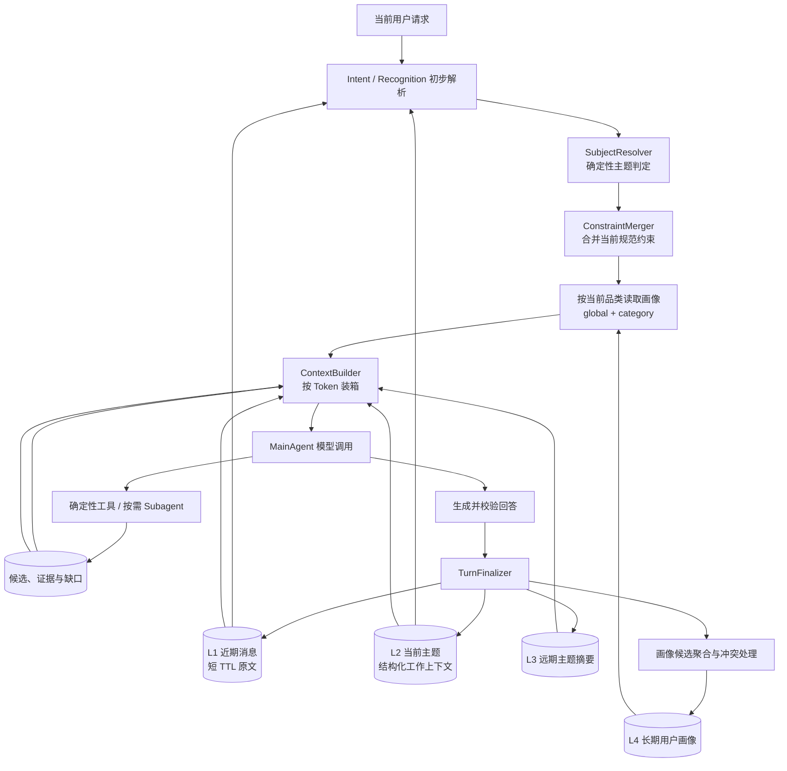

# 识价镜：分层上下文与长期记忆更新方案

状态：设计完成，尚未实施。日期：2026-09-09。代码核对基线：`6e3da65`。

本方案把现有“最近若干轮摘要 + 显式长期 Memory”升级为四层结构：近期原始对话、中期工作上下文、远期主题摘要、长期用户画像；所有模型调用统一通过 Token 窗口装配上下文。本文件只描述后续改造，本次不修改运行代码、配置、测试和数据。

本方案服从[主 Agent + 按需 Subagent 的唯一编排架构](subagent_only_architecture_design.md)：主 runtime 是上下文与规范状态的唯一写入者；Research 和 Verification 只接收由 runtime 裁剪出的任务上下文，不形成新的编排模式。商品数据和按需补召回继续遵循 [SKU 原始数据与按需补召回方案](sku_offer_rag_on_demand_retrieval_design.md)。

## 1. 结论与边界

### 1.1 最终结构

| 层级 | 保存内容 | 生命周期 | 主要用途 |
|---|---|---|---|
| L1 近期对话 | 最近的用户与助手原始消息 | 短期、按 Token 淘汰、带 TTL | 代词、省略、修正和连续追问 |
| L2 中期工作上下文 | 当前购物主题的结构化状态 | 主题活动期间；结束后短期保留 | 当前目标、有效约束、候选取舍、缺口和未解决问题 |
| L3 远期主题摘要 | 较久对话按 `subject_id` 形成的可验证摘要 | 中长期、按相关性召回 | 恢复旧购物主题，避免反复携带原始对话 |
| L4 长期用户画像 | 跨主题稳定偏好 | 跨会话，支持过期、冲突和删除 | 补充默认值或排序先验 |

四层数据用途不同，不能合并成一个自由文本摘要：L3 记录“过去谈过什么”，L4 记录“用户较稳定地偏好什么”。“上次比较了两款耳机”属于 L3；“买耳机通常优先降噪和佩戴舒适”才可能成为 L4。

### 1.2 必须保持的不变量

1. `ShoppingConstraints` 仍是当前购物目标的规范事实，字段包含来源、置信度和用户锁定状态；定义见 [contracts.py:893](/Users/zsc/Projects/E.C.26-B/src/shijiajing_agent/contracts.py:893)。摘要、历史消息和画像都不能直接覆盖它。
2. 优先级固定为：用户本轮明确修正／约束 > 当前主题中用户锁定约束 > 显式长期默认值 > 推断画像排序先验。
3. 推断画像只允许使用 `ranking_prior` 或 `negative_preference`，不得进入硬过滤；即使用户确认过推断画像，也不改变这一限制。
4. `subject_id` 表示一次具体购物目标，例如“给父亲选一台 3000 元以内的手机”，不能直接使用 `category_id`。同一品类可以有多个主题，一个主题也可能在品类尚未确定时创建。
5. 上下文由 runtime 中的确定性 `ContextBuilder` 生成。模型可以决定下一步动作，不能自行选择要读取的完整会话、画像库或证据库。
6. 子 Agent 没有会话记忆写权限、画像写权限或完整历史读取权限；其结果必须回到父 runtime 校验后才能合并。

### 1.3 本次范围

包含：上下文数据模型、主题识别、规则裁剪、摘要、画像提取、Token 装箱、存储与隐私、恢复与迁移、文件级实施计划、测试和评测。

不包含：修改 Agent 编排方式、增加 Agent 类型、改变商品索引或 SPU/SKU 模型、引入新的向量数据库、立即实现代码。

## 2. 当前实现和主要问题

当前会话快照只保存 `subject_id`、约束、识别结果和最多 6 个 `recent_turns`，见 [agent_runtime/contracts.py:453](/Users/zsc/Projects/E.C.26-B/src/shijiajing_agent/agent_runtime/contracts.py:453)。长期 Memory 已支持 `global`／`category:<id>`、置信度、版本和过期时间，见 [contracts.py:317](/Users/zsc/Projects/E.C.26-B/src/shijiajing_agent/contracts.py:317)；应用方式已有 `constraint_default`、`ranking_prior`、`negative_preference`，见 [contracts.py:233](/Users/zsc/Projects/E.C.26-B/src/shijiajing_agent/contracts.py:233)。这些能力应保留并扩展，不需要重做一套互不兼容的记忆系统。

需要解决的问题如下：

| 当前行为 | 问题 | 目标修改 |
|---|---|---|
| 会话按 `recent_turns_limit=6` 和 `recent_turns_max_bytes=65536` 裁剪，见 [config.py:172](/Users/zsc/Projects/E.C.26-B/src/shijiajing_agent/config.py:172) | 轮数和字节数不能代表模型实际 Token 占用，也没有各类上下文的优先级 | 使用模型 tokenizer 和分区预算装箱 |
| `_trim_recent_turns` 从最旧记录开始按条数、字节删除，见 [agent_runtime/runtime.py:1332](/Users/zsc/Projects/E.C.26-B/src/shijiajing_agent/agent_runtime/runtime.py:1332) | 删除后没有形成中期状态或远期摘要，指代信息可能突然丢失 | 淘汰前先确定性归并到 L2，必要时生成 L3 |
| Intent 模型最多读取最近 6 个摘要，见 [ark_models.py:488](/Users/zsc/Projects/E.C.26-B/src/shijiajing_agent/adapters/ark_models.py:488) | 没有原始近期消息，模型难以恢复“它”“第二个”等局部指代 | 在短 TTL 内保存和传入 L1 原始消息 |
| `_turn_summary` 仍可保存完整 `intent_patch`，见 [agent_runtime/runtime.py:1288](/Users/zsc/Projects/E.C.26-B/src/shijiajing_agent/agent_runtime/runtime.py:1288) | `intent_patch` 可携带自由关键词、属性和 `memory_directives`，摘要契约过宽 | 改为白名单 `WorkingContextDelta`／`SubjectSummary` |
| `subject_id` 直接取 `category_id`，见 [agent_runtime/runtime.py:1247](/Users/zsc/Projects/E.C.26-B/src/shijiajing_agent/agent_runtime/runtime.py:1247) | 同品类新购物任务会继承旧主题；跨品类纠正也可能误切换 | 新增独立主题身份和切换判定 |
| Memory 查询使用 `previous_constraints`，见 [agent_runtime/runtime.py:498](/Users/zsc/Projects/E.C.26-B/src/shijiajing_agent/agent_runtime/runtime.py:498) | 本轮刚确定新品类时，可能按旧品类查询画像 | 先解析当前请求和主题，再查询 `category + global` |
| 当前持久化边界会删除原始请求和 `user_text`，见 [persistence_safety.py:63](/Users/zsc/Projects/E.C.26-B/src/shijiajing_agent/persistence_safety.py:63) | 直接把 L1 放入通用 checkpoint，重启后只剩哈希 | 使用独立、加密、带 TTL 的近期消息存储；checkpoint 只保存引用 |
| `MainRuntimeState` 可持有大量候选和证据，见 [agent_runtime/contracts.py:465](/Users/zsc/Projects/E.C.26-B/src/shijiajing_agent/agent_runtime/contracts.py:465) | 运行状态上限不等于模型输入上限，整包输入会挤掉对话和约束 | 候选与证据单独预算，只投影必要字段 |
| 主 Agent 观察目前固定取最多 10 条证据和少数字段，见 [agent_runtime/policy.py:214](/Users/zsc/Projects/E.C.26-B/src/shijiajing_agent/agent_runtime/policy.py:214) | 数量固定但 Token 不固定，也没有按当前缺口选择字段 | 按相关性、排名、缺口和 Token 共同选择 |
| runtime 的 `max_tokens` 是整轮调用累计上限，见 [agent_runtime/runtime.py:1213](/Users/zsc/Projects/E.C.26-B/src/shijiajing_agent/agent_runtime/runtime.py:1213) | 它不能防止某一次调用超过模型上下文窗口 | 增加每次调用的 `ContextBudget`，保留整轮预算作为第二道限制 |

现有 [docs/memory.md:1](/Users/zsc/Projects/E.C.26-B/docs/memory.md:1) 仍描述旧 Supervisor 和三类上下文。实施完成时应重写为实际架构说明，本设计文档保留为决策与迁移依据。

## 3. 目标架构



一次请求的正确顺序是：

1. 从 L1 和 L2 取出解析当前请求所需的最小上下文。
2. Intent／Recognition 产生本轮 patch，不读取长期画像来猜当前品类。
3. `SubjectResolver` 判断继续旧主题还是创建新主题。
4. `ConstraintMerger` 先合并用户当前输入，得到不含画像的初步约束。
5. 依据初步 `category_id` 读取 `category:<id>` 和 `global` 画像，再按现有确定性规则应用；本轮明确值始终优先。
6. 每次主 Agent 决策、回答生成或 Subagent 启动前，分别构建符合其权限和 Token 上限的 `ContextEnvelope`。
7. 回答事实校验完成后执行 `TurnFinalizer`，幂等更新四层数据。

## 4. 建议数据模型

模型放在新的 `context/contracts.py`，避免继续扩大根 `contracts.py`。下列字段是最小契约，实施时用 Pydantic `extra="forbid"`、字段长度限制和枚举校验。

### 4.1 `RecentMessage`

```text
message_id:        稳定 ID；由 session_id + turn_id + role + ordinal 派生
memory_owner_id:   可信执行上下文提供，只用于存储隔离，不进入模型
session_id:        所属会话
turn_id:           所属回合
subject_id:        当时判定的购物主题
role:              user | assistant
content:           短期保存的原始文本
content_hash:      规范文本哈希，用于幂等和审计
token_count:       指定 tokenizer 下的 Token 数
tokenizer_id:      计算版本
created_at:        创建时间
expires_at:        强制 TTL
encryption_key_id: 静态加密使用的密钥版本；不进入模型
```

原始图片、图片 data URL、自由 metadata、模型隐藏推理、工具原始响应不得写入 `RecentMessage`。图片只保存安全的识别结果或不可逆内容哈希。

### 4.2 `WorkingContext`

```text
schema_version:          working-context-v1
session_id / subject_id: 当前会话和主题
category_id:             独立于 subject_id
goal_summary:            规则模板生成的单句目标，不是自由发挥的事实源
constraints:             ShoppingConstraints 的当前规范快照
constraints_version:     与主状态一致
accepted_candidate_ids:  用户明确保留或已选择的候选
rejected_candidates:     candidate_id + 标准 reason_code
open_questions:          尚未回答的问题及来源 turn_id
gaps / conflicts:        当前结构化缺口和冲突
corrections:             字段、旧值哈希、新值、turn_id；不重复保存整句原文
query_fingerprints:      已执行查询指纹，防止重复检索
last_result_ids:         最近有效比价组引用
last_evidence_ids:       仍与当前问题相关的证据引用
updated_at / expires_at: 生命周期控制
```

L2 只保存当前仍有效的状态。已被修正的旧约束、重复工具输出、完整候选对象、完整证据正文、模型动作历史、失败堆栈都不进入该对象。

### 4.3 `SubjectSummary`

```text
summary_id:              owner + subject + summary_version 的稳定哈希
memory_owner_id:         所有者隔离
subject_id / category_id:主题与品类
source_session_ids:      来源会话集合
source_turn_ids:         有界来源回合集合
goal:                    该主题的购物目标
final_constraints:       白名单字段和值、来源及锁定状态
decision_summary:        selected | deferred | abandoned | unresolved
selected_result_ids:     最终保留的结果引用
rejected_reasons:        结构化排除原因，不保存大段商品文本
unresolved_questions:    未解决项
evidence_ids:            支撑摘要事实的证据引用
user_feedback:           用户明确评价的结构化投影
summary_text:            供模型阅读的短摘要
facts_hash:              结构化事实哈希
summary_model/version:   摘要器和 Prompt 版本；规则摘要则标 deterministic
created_at / updated_at / expires_at
```

`summary_text` 不是规范事实。装箱时同时传入关键结构化字段；恢复旧主题后仍由 `ShoppingConstraints` 和有效证据重建规范状态。

### 4.4 `UserProfileItem`

```text
profile_id:              稳定 ID
memory_owner_id:         可信 owner
scope_key:               global | category:<category_id>
memory_key / value:      沿用白名单值域
apply_mode:              constraint_default | ranking_prior | negative_preference
origin:                  explicit | inferred
status:                  pending | active | superseded | forgotten
confidence:              0..1
observation_count:       独立有效观察数量
source_session_count:    独立会话数量
source_subject_ids:      有界来源主题引用
source_turn_hashes:      来源回合哈希，不复制原文
confirmed_at/by:         显式确认信息，可空
last_observed_at:        最近得到支持的时间
version / expires_at:    乐观并发和过期
```

该对象是现有 `MemoryRecord` 的兼容扩展。现有唯一键 `(owner, scope, memory_key)` 见 [adapters/memory.py:23](/Users/zsc/Projects/E.C.26-B/src/shijiajing_agent/adapters/memory.py:23)，实施时需改为允许同一键存在一个 active 版本和若干审计版本，或增加独立 observation 表；不能把来源计数塞进不可解释的 `value_json`。

### 4.5 `ContextBudget`

```text
model_id / tokenizer_id
context_limit_tokens
system_tokens / tool_schema_tokens
output_reserve_tokens / safety_margin_tokens
payload_capacity_tokens
section_budgets:
  section -> min_tokens, target_tokens, max_tokens, priority
actual_tokens:
  section -> measured_tokens
overflow_actions:        本次发生的淘汰、压缩和按 ID 降级记录
```

### 4.6 `ContextEnvelope`

```text
envelope_id / purpose:   intent | main_decision | final_answer | research | verification
session_id / turn_id / subject_id
current_request
active_constraints
current_corrections
candidate_evidence_view
recent_messages
working_context
subject_summaries
applied_profile_items
available_actions
budget
source_versions:         constraints/evidence/context/profile 版本
content_hash
```

`ContextEnvelope` 是一次模型调用的不可变输入快照。调用日志只记录 `envelope_id`、版本、各区 Token 和哈希，不记录整包原文。

## 5. “商品候选与证据”具体包含什么

候选与证据是当前任务事实，不属于用户画像，也不能混进对话摘要。模型输入只保留当前问题真正需要的投影：

| 内容 | 传入字段 | 不直接传入的内容 |
|---|---|---|
| 候选身份 | `candidate_id`、`offer_id`、`group_id`、排名 | 完整数据库对象、所有召回中间结果 |
| 商品关键信息 | 标题短版、品牌、型号、当前比较所需规格 | 与当前约束无关的全部动态属性 |
| 交易信息 | 价格与价格口径、平台、卖家、可售状态、更新时间 | 大段店铺介绍、整页 HTML |
| 比较判断 | 是否满足硬约束、排序分项、匹配置信度 | 模型未验证的营销结论 |
| 风险与缺口 | 缺失字段、冲突字段、规格不可比、价格口径不明 | 重复的无结果日志 |
| 证据引用 | `evidence_id`、来源、状态、支持字段、时间／版本 | 完整证据正文和全部来源 payload |

默认选择顺序为：用户正在询问的候选 > 用户已选候选 > 排名前列且满足硬约束的候选 > 能解释冲突或缺口的候选。每个候选只附与当前决策有关的证据摘要；需要原始字段时，主 Agent 或 Subagent 通过 `evidence_id` 调用 `inspect_evidence`，现有证据引用准入校验见 [agent_runtime/policy.py:130](/Users/zsc/Projects/E.C.26-B/src/shijiajing_agent/agent_runtime/policy.py:130)。

例如用户问“第二款为什么更贵”，上下文应携带前两款的型号、规格、价格口径、卖家和相关 `evidence_id`，而不是把 60 个召回候选和所有详情页放进 Prompt。

## 6. 主题识别与切换

### 6.1 主题身份

新主题 ID 使用 `subject:<ULID>` 或等价不可猜测 ID，由 runtime 创建。`category_id` 只是主题属性；品类未确定时也可以先创建主题，之后再补齐品类。

### 6.2 确定性判定顺序

`SubjectResolver` 输入当前请求、上一 `WorkingContext`、本轮 IntentPatch 和 RecognitionResult，按以下顺序判定：

1. 用户明确说“换一个”“重新选”“再帮我买……”且目标实体改变：创建新主题。
2. 新图片与旧识别实体高置信不一致，且用户没有表达“这是同一个商品的另一张图”：创建新主题。
3. 本轮明确品牌／型号／核心品类与用户锁定的旧目标冲突，且不是修正表达：创建新主题。
4. 用户回复活动澄清选项、引用“它／第二个／刚才那个”、补充预算颜色或纠正旧字段：继续旧主题。
5. 只有品类相同不能证明是同一主题；只有品类不同也不能在“你把它识别错了，是耳机”这类纠正中强制新建主题。
6. 规则仍无法判断且错误继承会改变硬约束时，生成一个主题澄清问题；不得静默混合两个目标。

每次判定记录 `decision=same|new|clarify`、`reason_code`、输入版本和新旧 `subject_id`，但不记录模型推理文本。

### 6.3 切换行为

创建新主题时：

- 冻结旧 `WorkingContext`，必要时生成或更新 `SubjectSummary`；
- 新主题不继承旧主题的品牌、型号、预算、颜色、候选和未解决问题；
- 只在当前品类确定后应用 `global` 和该品类的长期画像；
- 若用户明确说“预算和刚才一样”，只复制被明确引用的字段，并把来源记为当前用户指令。

## 7. 中期规则裁剪

L2 不依赖模型总结。`WorkingContextReducer` 在每次有效状态变化后应用白名单规则：

1. 从最新 `ShoppingConstraints` 全量替换约束快照，不通过自然语言增量拼接。
2. 同一字段只保留当前值和最近一次有效修正；旧值只保留哈希与原因码。
3. 用户明确选择／拒绝的候选保留；普通低排名候选在不再进入前 N 且未被引用时删除。
4. 已解决的 `open_questions` 删除；仍影响回答的缺口和冲突去重保留。
5. 查询只保留 fingerprint、目的和结果状态，不保存完整工具输出。
6. 证据只保留活跃候选与未解决字段对应的 ID；详细字段留在 Evidence Store。
7. 重复助手措辞、模型动作解释、网络错误正文、堆栈和过期中断全部删除。
8. 每次裁剪后进行 Schema 校验、最大项目数校验和 Token 计数；不能截断半个 JSON 对象。

确定性 reducer 失败时保留上一个有效版本并记录降级，不能用未经校验的自由文本替代。

## 8. 远期摘要生成与召回

### 8.1 触发条件

满足任一条件时生成或更新 L3：

- 主题显式结束、放弃或切换；
- L1 消息即将因 Token 上限或 TTL 淘汰；
- 活动主题的 L2 超过自身 Token 上限；
- 会话关闭后执行幂等 finalizer。

不按每一轮都总结，避免成本和摘要漂移。

### 8.2 生成方式

先由规则从规范状态提取 `final_constraints`、结果 ID、证据 ID、缺口和用户反馈，再允许摘要模型把这些字段写成短文本。摘要模型不能新增商品事实；输出必须通过以下校验：

- 提到的约束字段和值必须存在于结构化输入；
- 提到的候选和证据 ID 必须在允许集合中；
- 不保存原始图片地址、自由 metadata、敏感标识或无关聊天；
- 校验失败时使用确定性模板摘要，不阻塞主回答。

有原始来源时从来源重新生成，不反复对“摘要的摘要”改写。原始消息过期后，只能合并结构化字段和已验证的旧摘要，并标注 `source_detail_expired=true`。

### 8.3 召回方式

默认先按 `memory_owner_id + category_id + subject status` 过滤，再用当前目标的关键词／向量相关性排序，最多返回 3 个主题摘要。完全匹配当前 `subject_id` 的恢复请求优先；仅因品类相同不得把旧主题约束自动合并到当前主题。

远期摘要用于帮助理解“上次那两款耳机”，不作为硬过滤来源。用户明确要求恢复某个旧主题时，runtime 根据摘要引用加载该主题的结构化约束，再让用户当前输入覆盖。

## 9. 长期用户画像

### 9.1 候选生成位置

画像整理放在 `TurnFinalizer`：业务回答已经形成并通过事实校验之后、完成 checkpoint 最终提交之前。这样失败的检索、模型草稿或未完成中断不会被当成稳定偏好。

显式“记住／以后默认”指令仍在 Intent 阶段生成待处理 mutation。若需要确认，runtime 先保存 `pending_response` 和 mutation 后发出 `MemoryConfirmation`；恢复后只提交匹配的 mutation，再由 finalizer 释放回答。推断画像的聚合是幂等旁路，不延迟本轮回答。

### 9.2 显式画像

显式画像沿用 prepare → confirm → commit：

1. 只接受当前用户原文确实包含保存、忘记或清空语义的 directive；现有服务端验证入口见 [memory_policy.py:141](/Users/zsc/Projects/E.C.26-B/src/shijiajing_agent/domain/memory_policy.py:141)。
2. `scope_key` 只允许 `global` 或当前明确品类；含糊的“这个”必须能绑定当前主题。
3. 用户确认后可写 `constraint_default`、`ranking_prior` 或 `negative_preference`；应用时仍低于本轮明确约束。
4. 同一 mutation 重放必须返回同一结果，不能重复增加观察次数或版本。

示例：“以后买耳机默认预算 2000 元”可成为 `category:headphones / max_price / constraint_default`；本轮用户随后说“这次预算 3000”，当前请求仍使用 3000。

### 9.3 推断画像

仅把以下事件计为有效观察：用户明确选择某候选、明确拒绝某属性／平台、主动重复同一偏好，或对推荐结果给出明确反馈。模型的推荐、用户沉默、候选恰好排第一、检索无结果都不算观察。

推断项至少满足：

- 同一规范键值有 3 次独立观察；
- 覆盖至少 2 个 `subject_id` 和 2 个会话；
- 最近观察未出现相反偏好；
- 聚合置信度达到 0.80；
- 值通过与显式 Memory 相同的白名单和规范化校验。

达到阈值后可写为 `origin=inferred`。它只能影响排序，不能成为 `constraint_default` 或数据库硬过滤。产品可在“我的偏好”中展示来源、置信度和删除入口；若启用统一确认策略，则先保存 `pending`，确认后才变为 `active`。默认建议自动激活满足门槛的排序先验，但保留全局关闭推断画像的配置。

### 9.4 冲突、衰减、过期和删除

| 情况 | 处理 |
|---|---|
| 本轮明确值与画像冲突 | 本轮值生效；记录画像未应用原因，不降低用户明确值 |
| 显式画像与推断画像冲突 | 显式画像生效，推断项转为 `superseded` |
| 两个显式指令冲突 | 后一次已确认指令形成新版本，旧版本保留审计状态 |
| 推断观察发生反转 | 对旧项降置信；连续反向观察达到门槛后替换，不同时应用两者 |
| 推断项长期未观察 | 180 天后过期，或按时间衰减低于阈值后停止应用 |
| 显式项长期未使用 | 默认不自动删除；可按用户指定的到期时间过期 |
| “忘记这个偏好” | 精确 forget 对应 scope/key，清除相关 active/pending 项 |
| “删除我的全部历史和记忆” | 级联清除 L1、L2、L3、L4 和画像观察记录，保留不含内容的法定最小审计记录（如确有要求） |

## 10. Token 窗口管理

### 10.1 预算计算

每次模型调用独立计算：

```text
effective_context_limit
  = min(provider_context_limit, configured_context_hard_cap, remaining_runtime_tokens)

input_capacity
  = effective_context_limit
  - requested_output_reserve
  - safety_margin

payload_capacity
  = input_capacity
  - measured(system_prompt)
  - measured(tool_schemas)
  - measured(protocol_wrapper)
```

首期建议把 `configured_context_hard_cap` 设为 32,768 Token。即使模型支持 64K／128K，初期也只使用 32K，优先通过候选投影和证据按 ID 查询控制成本；后续只有在溢出率和质量评测证明必要时才提高。模型实际窗口小于 32K 时使用模型上限；provider 无法报告窗口时必须配置已核实的上限，不能猜测。

`remaining_runtime_tokens` 是整轮累计预算的剩余额度。主 Agent 当前默认累计预算为 100,000 Token，Subagent 为 20,000 Token；它们不是单次上下文窗口。后续调用剩余额度低于 32K 时，单次窗口随之缩小。

必须使用目标模型对应的 tokenizer 对最终序列化消息计数。provider 没有可用 tokenizer 时，使用明确标注的保守估算器并扩大安全余量；不能以 Python 字符数、UTF-8 字节数或固定轮数代替 Token。

整轮 `RuntimeBudget.max_tokens` 继续限制所有模型调用累计成本；`ContextBudget` 负责保证单次调用不超窗口，两者不能互相替代。

### 10.2 内容优先级

固定优先级为：

1. 当前请求；
2. 当前有效约束、用户锁定字段和本轮修正；
3. 当前候选、证据摘要、风险与缺失项；
4. 近期原始消息；
5. 当前主题的中期工作上下文；
6. 与当前请求相关的远期主题摘要；
7. 本轮实际应用的用户画像。

System Prompt、工具 Schema、输出预留和安全余量在上述业务内容之前预留，不参与抢占。

### 10.3 首期 32K 有效窗口的示例预算

假设目标模型至少支持 32K，并且本轮累计预算仍充足。下列控制开销是规划估值，实施时必须按实际 Prompt 和工具 Schema 重新测量；各业务分区只是默认 target，不是固定切片：

| 项目 | Token |
|---|---:|
| 模型窗口 | 32,768 |
| System + 工具 Schema + 协议包装（示例） | 5,500 |
| 输出预留 | 4,096 |
| 安全余量 | 1,500 |
| 可用业务载荷 | 21,672 |
| 当前请求 | 2,000 |
| 有效约束和修正 | 2,500 |
| 候选与证据 | 6,000 |
| 近期消息 | 5,000 |
| 中期工作上下文 | 3,000 |
| 远期主题摘要 | 2,000 |
| 已应用画像 | 1,172 |

### 10.4 动态借用

每个分区配置 `min / target / max / priority`：

1. 先放入所有强制区块的 `min` 内容。
2. 按优先级扩展到 `target`。
3. 某区没有用满时，余额进入共享池，允许其他区扩展到 `max`。
4. 每加入一个完整对象重新计数；达到上限后停止，不做字符串尾部截断。
5. 最终对完整 Provider 请求再次计数，确保包装开销已经计算。

例如没有候选的澄清轮次可把候选预算借给近期对话；需要核验 5 个规格字段时，可从没有命中的远期摘要和画像预算借给证据。

### 10.5 溢出处理

超限时按以下顺序降低内容，且每步记录 `overflow_action`：

1. 移除低相关的远期摘要和未应用画像；
2. 删除 L2 中已解决问题、旧查询指纹和非活跃候选引用；
3. 候选从低排名开始减少，并把详细字段降为 ID + 风险 + 缺失项；
4. L1 从最旧完整消息开始淘汰，淘汰前更新 L2／L3；
5. 对当前仍相关但过长的证据正文只保留验证字段和 `evidence_id`；
6. 仍无法容纳强制区块时，不调用模型，返回明确的 `context_capacity_exceeded`，由输入限制或工具 Schema 治理解决。

当前请求、用户锁定约束和本轮修正不得被静默删除；不能把两个 JSON 对象截成无效文本，也不能让摘要替代被删掉的硬约束。

### 10.6 DeepSeek-V4-Flash 模型配置

DeepSeek 官方 API 当前声明 `deepseek-v4-flash` 支持 1M 上下文和最大 384K 输出，见 [DeepSeek Models & Pricing](https://api-docs.deepseek.com/quick_start/pricing)。这里的 1M 是模型物理能力，不应直接作为本项目每次调用的业务装箱目标。

本项目使用该模型时建议采用三层限制：

| 层级 | 建议值 | 含义 |
|---|---:|---|
| provider 物理窗口 | 1,048,576 | DeepSeek 原生 API 的能力；通过 Ark 等平台接入时还要取平台实际限制 |
| 应用硬上限 | 65,536 | `CONTEXT_HARD_CAP_TOKENS` 的 DeepSeek-V4-Flash 覆盖值 |
| 常态业务输入目标 | ≤ 32,768 | System、工具、请求、四层记忆和候选证据的正常总输入目标 |

应用硬上限设为 64K 是为了给思考模式和多次工具调用留出余量，不表示每次都填满 64K。普通 Intent、路由和严格 JSON 决策优先使用非思考或低思考，输出预留 4K～8K；只有 Research 等复杂任务使用高思考，并把输出预留提高到 16K。DeepSeek Responses API 的 `max_output_tokens` 同时包含推理和可见答案，见 [Responses API](https://api-docs.deepseek.com/api/create-response/)。

DeepSeek 思考模式默认是 high；携带工具时，当前工具循环里先前的 `reasoning_content` 必须回传并会重新进入上下文，见 [Thinking Mode](https://api-docs.deepseek.com/guides/thinking_mode/)。因此 Token 计数必须包含 request-local 的 reasoning、assistant tool call 和 tool result。它们只保存在当前 request checkpoint，用于恢复工具循环；不得写入 L1～L4、用户画像、日志或最终回答。

以高思考主 Agent 为例，首次调用的最大业务载荷上界为：

```text
65,536 应用硬上限
-16,384 推理与可见输出预留
- 2,048 安全余量
- 5,500 System、工具 Schema 和协议包装示例
=41,604 最大业务载荷
```

ContextBuilder 仍以约 20K～32K 的常态业务输入为目标。只有当前工具循环的 reasoning、必要证据或近期对话确实需要时才借用剩余额度。若经 Ark 或其他兼容网关调用，`provider_context_limit` 和输出上限必须使用该具体部署的已核实规格，而不是直接照搬 DeepSeek 原生 API 数值。

## 11. 不同角色可见的上下文

| 调用方 | 可见内容 | 明确不可见 |
|---|---|---|
| Intent／主题解析 | 当前请求、必要的近期消息、当前 L2 目标和约束 | 商品证据全文、完整画像库、无关旧主题 |
| MainAgent 决策 | 当前请求、规范约束、活跃候选／证据投影、缺口、近期消息、相关 L2/L3、实际应用画像 | 未召回画像、原始长期存储、无关主题全文 |
| 最终回答模型 | 已验证结果、必要对话、约束、证据引用、风险和 notices | 未验证候选、过期摘要、模型动作草稿 |
| ResearchSubagent | 明确 objective、冻结约束和版本、有限候选摘要、允许证据 ID、缺口、查询历史指纹、子预算 | 完整会话、L3 全库、L4 画像库、主状态写权限 |
| VerificationSubagent | 争议字段、候选 ID、允许证据 ID、冻结约束和版本、详情工具权限 | 无关候选、完整对话、画像库、Research 查询历史全文 |

主 Agent 与每个 Subagent 都是独立的模型请求，因此分别构建 envelope、分别执行单次上下文窗口校验；不能把主 Agent 的完整 Prompt 与 Subagent Prompt 拼成一个窗口。Subagent 内部发生多次“模型—工具”循环时，每次模型请求也重新计算窗口，但当前工具循环协议要求回传的 assistant／reasoning／tool 消息必须计入该次输入。

窗口独立不等于预算独立。父 runtime 启动 Subagent 时，从父级剩余额度与 Subagent 配置中取较小值作为子预算；Subagent 完成后，其模型输入、输出、工具、检索和耗时全部归集到父级总账。任何一层先耗尽都停止继续调用，不能通过委派重置 Token。当前子预算裁剪见 [budget.py:66](/Users/zsc/Projects/E.C.26-B/src/shijiajing_agent/agent_runtime/budget.py:66)，子结果用量进入主状态见 [agent_runtime/runtime.py:338](/Users/zsc/Projects/E.C.26-B/src/shijiajing_agent/agent_runtime/runtime.py:338)。

现有 `SubagentTask` 已包含 objective、冻结约束、版本、允许证据和预算，见 [agent_runtime/contracts.py:343](/Users/zsc/Projects/E.C.26-B/src/shijiajing_agent/agent_runtime/contracts.py:343)。本次只把其输入统一改由 `ContextBuilder.for_subagent()` 投影，不让 Subagent 接收 `ContextEnvelope` 的全部字段。

主 Agent 的每次动作完成后，由 runtime 更新版本并重建下一次 envelope。Subagent 返回的候选、事实或建议先经过 ID、权限、约束版本、证据版本和字段值校验，再进入主状态。

## 12. 存储、隐私与恢复

### 12.1 存储拆分

| 数据 | 建议端口／存储 | 默认保留 |
|---|---|---|
| L1 `RecentMessage` | 新 `ConversationContextPort` 的加密 TTL 表 | 7 天；受 Token 窗口提前淘汰 |
| L2 `WorkingContext` | `ConversationContextPort` 版本化文档／表 | 活动主题持续保存；结束后 30 天 |
| L3 `SubjectSummary` | `ConversationContextPort` 主题摘要表 | 180 天，可由用户清除 |
| L4 `UserProfileItem` | 扩展现有 `MemoryPort` | 显式项直到忘记；推断项默认 180 天无新观察则过期 |
| 详细商品证据 | 现有 Evidence／商品数据存储 | 沿用数据策略；上下文只存 ID |

近期原文不能直接放进当前通用 checkpoint，因为该边界会主动清空请求文本和 `user_text`。生产环境要恢复 L1，必须配置独立的应用层加密存储，并在读取后按 owner、session、TTL 校验。没有该存储时可以使用内存实现，但应明确重启后只剩 L2/L3，不能宣称原文可恢复。

### 12.2 隐私规则

- `memory_owner_id` 只能来自可信 `AgentExecutionContext`，禁止从用户文本或自由 metadata 读取。
- L1 静态加密，传输使用 TLS，密钥版本可轮换；日志、trace、事件和 checkpoint 不写原文。
- L2/L3 在写入前执行字段白名单、敏感信息扫描和长度限制；个人地址、联系方式、支付信息不得进入画像。
- L4 只允许受控 memory key；不得保存健康、身份、账户凭据等与购物任务无关的敏感推断。
- list、forget、clear、purge 都按 owner 隔离。用户清除后使相关缓存、索引和摘要引用失效。
- 指标只记录层级 Token、命中数、原因码和哈希，不记录内容。

### 12.3 幂等与并发

- `RecentMessage.message_id`、`SubjectSummary.summary_id`、画像 observation ID 和 mutation ID 均稳定派生。
- L2 使用 `expected_version` 乐观并发；旧 turn 不能覆盖新 turn。
- finalizer 保存顺序为：主回答／中断状态 → L1/L2 → L3 → 画像 observation → 完成标记。每一步重放安全。
- 摘要生成失败不回滚已完成回答；保留待重试标记。画像提交失败返回 notice／指标，不能声称已经记住。
- 恢复时先加载主 request checkpoint，再按其中的 `context_version` 读取 L1/L2；版本不匹配时使用较新版本并重新构建 envelope，不复用旧模型输入。

## 13. 配置修改建议

只增加控制资源、安全和画像策略的配置，不增加上下文“模式选择器”。模型窗口优先来自模型适配器元数据，只有 provider 无法报告时才使用显式覆盖。

| 配置 | 建议默认值 | 说明 |
|---|---:|---|
| `CONTEXT_HARD_CAP_TOKENS` | 32768 | 单次调用有效窗口上限；不得超过模型真实窗口和整轮剩余额度 |
| `CONTEXT_OUTPUT_RESERVE_TOKENS` | 4096 | 单次调用输出预留 |
| `CONTEXT_SAFETY_MARGIN_TOKENS` | 1500 | tokenizer／包装偏差余量 |
| `CONTEXT_RECENT_TARGET_TOKENS` | 5000 | L1 target，可动态借用 |
| `CONTEXT_WORKING_TARGET_TOKENS` | 3000 | L2 target |
| `CONTEXT_SUMMARY_TARGET_TOKENS` | 2000 | L3 target |
| `CONTEXT_PROFILE_TARGET_TOKENS` | 1200 | L4 target |
| `CONTEXT_CANDIDATE_TARGET_TOKENS` | 6000 | 候选与证据 target |
| `CONTEXT_MAX_CANDIDATES` | 12 | Token 之外的防御性对象上限 |
| `RECENT_MESSAGE_TTL_SECONDS` | 604800 | L1 默认 7 天 |
| `WORKING_CONTEXT_CLOSED_TTL_SECONDS` | 2592000 | 已结束 L2 默认 30 天 |
| `SUBJECT_SUMMARY_TTL_SECONDS` | 15552000 | L3 默认 180 天 |
| `SUBJECT_SUMMARY_RECALL_LIMIT` | 3 | 单次最多召回摘要数 |
| `PROFILE_INFERENCE_ENABLED` | true | 是否生成推断画像 |
| `PROFILE_INFERENCE_MIN_OBSERVATIONS` | 3 | 独立观察门槛 |
| `PROFILE_INFERENCE_MIN_SESSIONS` | 2 | 跨会话门槛 |
| `PROFILE_INFERENCE_MIN_CONFIDENCE` | 0.80 | 激活门槛 |
| `PROFILE_INFERRED_TTL_SECONDS` | 15552000 | 推断画像无新观察的过期时间 |

实施初期可保留现有 `RECENT_TURNS_LIMIT` 和 `RECENT_TURNS_MAX_BYTES` 仅用于读取旧快照；完成迁移后删除。它们不能继续控制新 ContextBuilder。

所有比例／target 的总和不要求等于模型窗口；启动校验只要求各项为正、`min <= target <= max`，运行时根据真实 control tokens 计算共享池。

## 14. 文件级实施清单

### 14.1 新增模块

| 文件 | 内容 |
|---|---|
| `src/shijiajing_agent/context/contracts.py` | 六个核心契约、版本和枚举 |
| `src/shijiajing_agent/context/token_counter.py` | 模型 tokenizer 注册、保守 fallback、最终请求计数 |
| `src/shijiajing_agent/context/window.py` | `ContextBuilder`、分区预算、动态借用和溢出记录 |
| `src/shijiajing_agent/context/subject.py` | `SubjectResolver` 和 reason codes |
| `src/shijiajing_agent/context/working.py` | 确定性 `WorkingContextReducer` |
| `src/shijiajing_agent/context/summary.py` | 摘要输入投影、校验和模板 fallback |
| `src/shijiajing_agent/context/finalizer.py` | 四层更新、画像观察聚合与幂等恢复 |
| `src/shijiajing_agent/ports/conversation_context.py` | L1/L2/L3 的最小存取、删除和 purge 端口 |
| `src/shijiajing_agent/adapters/conversation_context.py` | 内存、SQLite、PostgreSQL 实现及 TTL 清理 |

### 14.2 修改现有模块

| 位置 | 修改 |
|---|---|
| [agent_runtime/contracts.py:453](/Users/zsc/Projects/E.C.26-B/src/shijiajing_agent/agent_runtime/contracts.py:453) | `RuntimeSessionSnapshot` 升级为 v2 引用 `subject_id/context_version`；`MainRuntimeState` 增加 envelope 和 context 版本引用，不内嵌 L1 原文 |
| [agent_runtime/runtime.py:465](/Users/zsc/Projects/E.C.26-B/src/shijiajing_agent/agent_runtime/runtime.py:465) | 重排 `_prepare`：解析当前请求 → 判定主题 → 初步约束 → 按当前品类 recall → 应用画像 → 构建 envelope |
| [agent_runtime/runtime.py:1247](/Users/zsc/Projects/E.C.26-B/src/shijiajing_agent/agent_runtime/runtime.py:1247) | 用 `TurnFinalizer` 取代 `_turn_summary/_trim_recent_turns`，保存四层引用和版本 |
| [agent_runtime/policy.py:214](/Users/zsc/Projects/E.C.26-B/src/shijiajing_agent/agent_runtime/policy.py:214) | `observation_for` 接收已装箱的候选／证据视图和真实 remaining budget |
| [adapters/ark_models.py:488](/Users/zsc/Projects/E.C.26-B/src/shijiajing_agent/adapters/ark_models.py:488) | 模型端口改收用途明确的 envelope 投影，移除内部固定 `[-6:]` |
| [contracts.py:317](/Users/zsc/Projects/E.C.26-B/src/shijiajing_agent/contracts.py:317) | 兼容扩展 `MemoryRecord` 的 origin、观察计数、确认和状态；旧 API 字段继续可读 |
| [contracts.py:1462](/Users/zsc/Projects/E.C.26-B/src/shijiajing_agent/contracts.py:1462) | `ConversationTurnSummary` 标记为旧快照迁移契约，业务不再写入完整 `intent_patch` |
| [domain/memory_policy.py:30](/Users/zsc/Projects/E.C.26-B/src/shijiajing_agent/domain/memory_policy.py:30) | 保留白名单和确定性应用，增加 explicit/inferred 准入、冲突和衰减规则 |
| [ports/memory.py:11](/Users/zsc/Projects/E.C.26-B/src/shijiajing_agent/ports/memory.py:11) | 增加 observation 聚合、profile list/delete；不允许按任意自然语言搜索画像 |
| [adapters/memory.py:88](/Users/zsc/Projects/E.C.26-B/src/shijiajing_agent/adapters/memory.py:88) | 增量 DDL、画像版本／观察表、索引、TTL 和 owner 级 purge；PostgreSQL 同步实现 |
| [agent_runtime/checkpoint.py:18](/Users/zsc/Projects/E.C.26-B/src/shijiajing_agent/agent_runtime/checkpoint.py:18) | 保存 session v2 和 context 版本；保持 request checkpoint CAS 与 namespace 隔离 |
| [persistence_safety.py:96](/Users/zsc/Projects/E.C.26-B/src/shijiajing_agent/persistence_safety.py:96) | 继续禁止通用 checkpoint 原文；增加新契约白名单和引用清洗 |
| [config.py:172](/Users/zsc/Projects/E.C.26-B/src/shijiajing_agent/config.py:172) | 增加 Token、TTL 和画像门槛配置；迁移后删除旧轮数／字节配置 |
| [docs/memory.md:1](/Users/zsc/Projects/E.C.26-B/docs/memory.md:1) | 实施完成后更新为四层实际运行说明和用户删除语义 |

Prompt 只需改输入契约和“引用 ID、不得新增事实”约束。不能通过 Prompt 承担主题切换、Token 计数、硬约束优先级或画像写入授权。

## 15. 数据迁移

### 15.1 会话快照

1. 新增 `agent-runtime-v2` session schema，旧 `agent-runtime-v1` request checkpoint 仍按原规则完成或明确结束，不在活动回合中途换状态模型。
2. 读取旧 `RuntimeSessionSnapshot` 时，为当前活动会话创建新的 `subject:<id>`，把旧 `subject_id/category_id` 仅作为 `category_id`。
3. 从旧 `constraints`、`recognition` 和安全的 `ConversationTurnSummary` 字段构建 L2；不把旧 `intent_patch.memory_directives` 复制到新摘要。
4. 旧 checkpoint 已经脱敏的 `user_text` 无法恢复，不伪造 L1 原始消息；可以从结构化字段生成 `origin=legacy_deterministic` 的 L3 摘要。
5. v2 稳定后停止写旧 `recent_turns`，经过一个保留周期再移除旧读代码。

### 15.2 现有长期 Memory

- 现有 active 记录迁移为 `origin=explicit`、`observation_count=1`、`source_session_count=1`，保留 `memory_id`、scope、apply_mode、version 和 expires_at。
- 现有 forgotten 记录保留状态，不因迁移重新激活。
- migration ledger 记录 schema version 和 payload hash，SQLite/PostgreSQL 可重复运行。
- 旧值不满足新白名单时隔离为 `migration_rejected`，不进入 recall；生成数量指标供人工检查，不静默改值。

### 15.3 发布与回退

DDL 先增表／增列，不立即删旧列。发布前备份并执行 dry-run 计数；应用切换到 v2 后验证 owner 数、active memory 数、约束迁移数和拒绝数。回退旧应用时不读取新 L1/L2/L3 表，新表保留；不得把推断画像降级成旧系统的显式 `constraint_default`。

## 16. 测试和评测

### 16.1 必测场景

| 类别 | 场景 | 期望 |
|---|---|---|
| 主题 | 同品类购买两个不同对象 | 创建两个 `subject_id`，不继承旧预算和候选 |
| 主题 | “不是音箱，是耳机” | 作为当前识别修正，不误建新主题 |
| 近期对话 | “第二款呢”“它有黑色吗” | 在 L1 未淘汰时正确绑定候选 |
| 中期裁剪 | 30 轮内多次修改预算 | L2 只保留最终规范值和最近有效修正 |
| 远期摘要 | L1 淘汰后恢复“上次那两款” | 召回相关 L3，找不到证据时明确说明 |
| 画像 | 单次选择京东候选 | 不生成 active 推断画像 |
| 画像 | 两会话三主题重复明确偏好 | 只形成 ranking prior，不形成硬过滤 |
| 冲突 | 画像预算 2000，本轮明确 3000 | 使用 3000，画像记录 ignored reason |
| Token | 证据很大、消息很多 | 最终 Provider 请求低于窗口，强制区块完整 |
| 子 Agent | Research 被委派 | 只能看到任务投影，不能列出用户完整画像／会话 |
| 隐私 | checkpoint、日志、event、cache 扫描 | 不出现 L1 原文、图片 URI、密钥或自由 metadata |
| 恢复 | finalizer 任一步骤后崩溃重放 | 不重复消息、摘要、观察或 mutation |
| 删除 | clear owner 后再次请求 | 四层数据和派生缓存均不可召回 |

### 16.2 单元与集成测试

- 单元测试：主题判定表、WorkingContext reducer、摘要事实校验、profile 聚合／冲突／衰减、精确 tokenizer 计数、动态借用、溢出顺序。
- 属性测试：任意区块组合下 `actual_input_tokens <= input_capacity`；裁剪后 Pydantic 对象始终有效；同一事件重放结果相同。
- 集成测试：SQLite／PostgreSQL owner 隔离、TTL、CAS、迁移、进程重启和 HITL resume。
- 端到端测试：短对话、长对话、旧主题恢复、多候选证据、Research／Verification 权限边界。
- 安全测试：Prompt 注入要求“读取全部记忆”、伪造 owner／subject／evidence ID、敏感文本进入摘要或画像，全部拒绝或清洗。

### 16.3 评测指标

| 指标 | 目标 |
|---|---|
| 单次上下文溢出率 | 0；所有实际请求均不超过模型声明窗口 |
| 用户锁定约束保留率 | 100% |
| 长对话指代正确率 | 相比现基线提升，按固定 20／50 轮集报告 |
| 摘要事实支持率 | 100% 的商品／约束事实可映射到结构化字段或证据 ID |
| 推断画像精确率 | 上线前离线集 ≥ 95%，并单列错误硬过滤数为 0 |
| 无关画像应用率 | < 1%，按 category/scope 错配统计 |
| 上下文 Token 节省 | 对 20+ 轮会话相对“全量历史”报告 P50/P95 |
| finalizer 附加延迟 | 同步路径 P95 受预算约束；异步摘要／聚合不阻塞回答 |
| 删除传播时间 | 在约定 SLA 内所有可召回层和缓存失效 |

效果指标必须记录模型、tokenizer、Prompt、数据集和预算版本；不能只用 Fake 模型证明摘要质量或画像准确率。

## 17. 分阶段实施

| 阶段 | 交付物 | 退出条件 |
|---|---|---|
| P1：契约与可观测性 | 六个新契约、token counter、envelope 构建但不改变模型输入 | 能对现有调用报告真实分区 Token 和潜在溢出 |
| P2：L1 + L2 | 加密近期存储、主题判定、规则 reducer、Intent/Main envelope | 长对话与重启测试通过，checkpoint 无原文 |
| P3：L3 | 主题摘要、事实校验、相关性召回、旧快照迁移 | 淘汰 L1 后可恢复旧主题，摘要无新增事实 |
| P4：L4 | 显式记忆兼容、推断 observation、冲突／衰减／删除 | 画像精确率达标，推断项绝不进入硬过滤 |
| P5：统一与清理 | 所有主／子模型调用使用 ContextBuilder，删除旧 recent 配置和写路径 | 不存在固定 `[-6:]`、字节裁剪或模型自行拼接上下文 |

这些是发布阶段，不是运行时编排模式。生产始终只有主 Agent + 按需 Subagent 一条执行链路。

## 18. 完成定义

满足以下条件才算改造完成：

1. 四层契约、生命周期和 owner 隔离均已落地，L3 与 L4 可独立查询和删除。
2. 所有模型调用都由同一个 Token 计数实现生成 envelope，最终请求有硬性窗口校验。
3. 当前请求和用户锁定约束在任何裁剪路径都不会丢失；摘要／画像无法覆盖规范约束。
4. `subject_id` 与 `category_id` 完全分离，主题切换测试矩阵通过。
5. Memory recall 使用本轮解析出的当前品类，`global + category` 去重和优先级正确。
6. 候选与证据按相关性和 Token 投影，详情通过 ID 按需读取。
7. 推断画像达到独立观察门槛后也只影响排序；显式确认、冲突、过期、forget 和 purge 幂等。
8. Research／Verification 的上下文权限测试证明其无法读取完整会话或画像库。
9. SQLite、PostgreSQL、checkpoint 恢复和旧数据迁移测试通过，隐私扫描无原文泄漏。
10. [docs/memory.md](/Users/zsc/Projects/E.C.26-B/docs/memory.md:1)、配置示例和运维删除说明已与实现同步，旧 Supervisor 描述和旧裁剪配置已移除。
