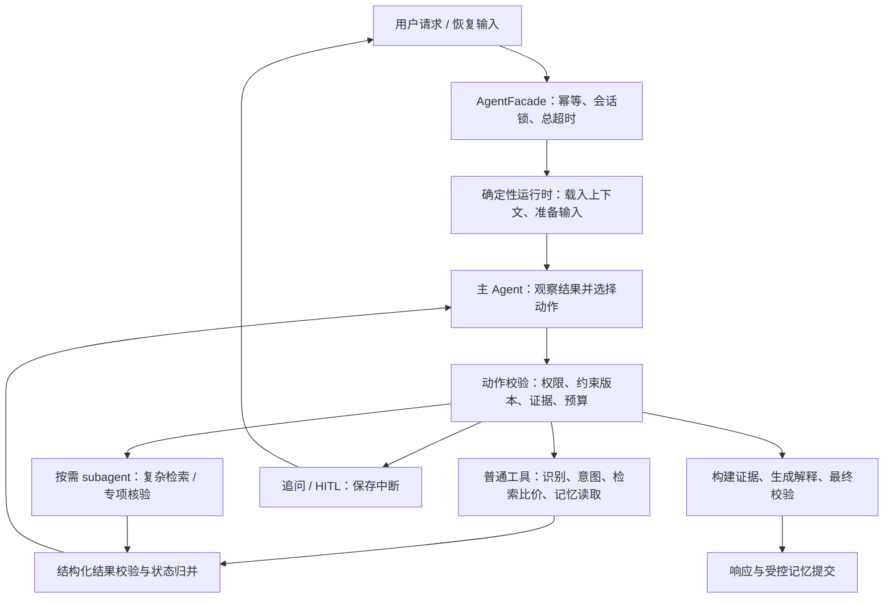

# 识价镜：主 Agent + 按需 subagent 改造设计与实施交接

状态：P2–P4 已实施，P5 文档与对照报告结构已补齐；真实模型/生产详情源评测仍待外部资源。
设计日期：2026-09-09。  
代码基线：`6143b452cb2e42e822bb7f3ecf14415538afaee1`。  
目标仓库：`/Users/zsc/Projects/E.C.26-B`。

实施批次：

- `c27f723 feat: add main agent execution mode`：P2 主 Agent、预算、Checkpoint、HITL 与跨轮摘要。
- `ed17e8d feat: add on-demand research subagent`：P3 复杂检索 subagent 与父子预算/证据归并。
- `2e358c3 feat: add optional verification subagent`：P4 可选详情核验及硬冲突/证据不足保护。
- 当前批次：P5 架构、配置、契约、评测说明和三引擎对照报告结构。

当前未宣称：真实线上质量收益、实时价格或优惠资格核验；没有 `OfferDetailPort` 时 Verification
保持关闭，正式 frozen 对照数据仍需按本文件第 14 节准备。

## 1. 决策与交付目标

采用**一个主 Agent 维护用户目标，通过工具完成常规任务，遇到可独立调查的复杂问题才调用 subagent**。主 Agent 和 subagent 都具有“读取观察结果 → 选择下一步动作 → 调用工具 → 再观察”的有限循环。

主 Agent 负责业务决策；确定性运行时负责执行、校验、预算、状态保存和副作用授权。运行时可以沿用 Supervisor 的工程职责，但**不再另设一个 LLM Supervisor 指挥主 Agent**，避免出现两个业务决策中心。

这属于层级式多 Agent 架构，但一次普通请求可以只有主 Agent 工作。工具内部可以调用视觉、意图抽取、归一化或解释模型；模型调用次数与 Agent 数量是两个概念。

本次改造必须交付：

1. 可运行的主 Agent 工具循环，以及关闭 subagent 的单 Agent 基线。
2. 按需运行的复杂检索 subagent，具有独立目标、受限上下文、工具循环和结构化结果。
3. 核验 subagent 的契约、实现与离线验证；生产启用取决于是否有可补充证据的数据能力。
4. 现有 API、硬约束、比价算法、HITL、幂等、恢复、降级语义的兼容与回归验证。
5. 旧 Workflow、主 Agent、主 Agent + subagent 的对比评测和可回滚开关。

不以“五个类都改名为 Agent”或“默认并行启动五个角色”作为完成标准。不同时重做商品数据平台、动态 Schema 方案、模型供应商或前端。本文件不要求恢复此前已撤销的改动；确有需要的新契约按下面范围单独实现。

## 2. 当前代码与目标之间的差异

下面是基线代码的实际入口。行号以本文件记录的 commit 为准；实施前按符号重新定位。

| 当前位置 | 现状 | 改造处理 |
|---|---|---|
| [AgentFacade，72 行](/Users/zsc/Projects/E.C.26-B/src/shijiajing_agent/facade.py:72)；[装配点，211 行](/Users/zsc/Projects/E.C.26-B/src/shijiajing_agent/facade.py:211) | `run/start/resume` 统一进入 `MultiAgentSupervisor` | 保留公共入口，内部按配置选择执行引擎 |
| [MultiAgentSupervisor，93 行](/Users/zsc/Projects/E.C.26-B/src/shijiajing_agent/multi_agent/supervisor.py:93) | 执行计划、派发任务、归并状态、处理中断 | 保留旧引擎作基线；提取可复用的工程能力 |
| [DeterministicPlanner，51 行](/Users/zsc/Projects/E.C.26-B/src/shijiajing_agent/multi_agent/planner.py:51) | 按输入生成识别、意图、记忆、检索、解释任务 DAG | 新主路径不依赖预先生成完整 DAG |
| [GuardedSupervisorPlanner，296 行](/Users/zsc/Projects/E.C.26-B/src/shijiajing_agent/multi_agent/planner.py:296) | 模型建议受目录、物化器与校验器限制 | 保留旧模式；复用结构化输出和校验经验，不把旧 Planner 直接当主 Agent |
| [RecognitionAgent，40 行](/Users/zsc/Projects/E.C.26-B/src/shijiajing_agent/multi_agent/agents/recognition.py:40) | 图片调用视觉模型；用户修正走确定性分支 | 提取为识别与修正工具 |
| [IntentAgent，40 行](/Users/zsc/Projects/E.C.26-B/src/shijiajing_agent/multi_agent/agents/intent.py:40) | 模型抽取当前轮 patch，失败后规则降级 | 提取为意图工具；不再设独立意图决策循环 |
| [RetrievalAgent，53 行](/Users/zsc/Projects/E.C.26-B/src/shijiajing_agent/multi_agent/agents/retrieval.py:53) | 查询改写、召回、归一化、同款判断、SKU 拆分、排序顺序执行 | 提取共享检索服务；常规场景使用组合工具，复杂检索使用较细的工具 |
| [ExplanationAgent，37 行](/Users/zsc/Projects/E.C.26-B/src/shijiajing_agent/multi_agent/agents/explanation.py:37) | 模型生成解释，校验失败使用模板 | 提取为证据约束回答工具，由主 Agent 决定何时调用 |
| [MemoryAgent，48 行](/Users/zsc/Projects/E.C.26-B/src/shijiajing_agent/multi_agent/agents/memory.py:48) | recall/prepare/commit 与授权校验，非自主模型循环 | 改为记忆服务，commit 继续由运行时控制 |

当前各 Specialist 并非全是规则：识别、意图、查询改写、动态归一化、解释都可以调用模型；同款硬冲突、SKU 拆分、排序、记忆提交包含确定性逻辑。目标的核心变化是**根据中间结果动态决定补查、委派、追问还是结束**，不是增加模型调用。

必须认识到的数据边界：当前 [ProductRetrievalPort，28 行](/Users/zsc/Projects/E.C.26-B/src/shijiajing_agent/ports/retrieval.py:28) 只有商品搜索接口，[make_retrieval，30 行](/Users/zsc/Projects/E.C.26-B/src/shijiajing_agent/deps.py:30) 装配 Milvus 或本地快照。仓库 [README，79 行](/Users/zsc/Projects/E.C.26-B/README.md:79) 明确披露样例数据。subagent 不会自动获得实时电商访问、详情抓取或优惠资格核验能力。

## 3. 目标执行结构



实现可继续使用现有 LangGraph 与 saver；不为这个改造引入第二套 Agent 框架。图负责控制流和恢复，LLM 负责在允许的动作中做业务选择。

| 层次 | 应当决定什么 | 不应当决定什么 |
|---|---|---|
| 主 Agent（LLM） | 哪个信息缺口值得补查、下一条查询、是否委派、何时追问或回答 | 改写用户硬条件、直接写状态、凭空填写报价 |
| subagent（LLM） | 子目标内的查询策略、证据读取顺序、是否已有足够结果 | 更换用户目标、直接回复用户、派生更多 Agent、写长期记忆 |
| 运行时与策略（代码） | 动作许可、版本校验、限额、超时、恢复、是否允许提交结果 | 自行猜测用户缺失的型号、预算、规格 |
| 领域服务（代码为主，允许受约束的模型抽取） | 过滤、标准化、匹配、SKU 拆分、价格计算、排序与事实检查 | 通过多数投票或模型自信分数覆盖硬冲突 |

例如：用户明确要求“256GB、预算 3000 元”，主 Agent 可以尝试不同搜索词，也可以询问是否调整预算；在用户回答前，所有工具与 subagent 都必须继续使用原硬条件。

## 4. 主 Agent 的职责、循环与动作

### 4.1 每轮准备

运行时先完成必需的输入准备：加载会话结构化上下文；有新文字时抽取 intent patch；有新图片时识别；有 correction 时执行已有修正逻辑；合并约束；在启用长期记忆时按品类读取并受控应用偏好。

这些前置步骤由输入形态决定，可用固定代码组织，独立步骤允许工具并发。完成准备后，主 Agent 接收规范约束、识别摘要、缺口、现有证据摘要与剩余预算。不要为了调用每一个确定的前置步骤多加一次 LLM 决策。

复用 [ConstraintMerger，93 行](/Users/zsc/Projects/E.C.26-B/src/shijiajing_agent/domain/constraints.py:93) 的来源优先级；主 Agent 返回的自然语言不能直接覆盖 `ShoppingConstraints`。

### 4.2 主 Agent 动作集合

建议新增严格的 `MainAction` 判别联合；下列名称是待实现的内部接口，不是现有 API。

| 动作 | 模型可以提供的参数 | 运行时补齐或校验 |
|---|---|---|
| `search_and_compare` | `query_text`、受限 `soft_terms`、查询理由代码 | 当前约束、识别结果、排序偏好、索引版本、候选上限 |
| `inspect_evidence` | 已授权的 `evidence_ids`、字段集合 | 只能读取本轮证据注册表中的记录 |
| `delegate_research` | 明确的检索子目标、缺口代码、已有查询引用 | 冻结约束快照、工具权限、子预算、任务 ID |
| `delegate_verification` | 待核验候选 ID、争议字段、已有证据引用 | 数据能力是否足够、是否真有可补查的问题 |
| `ask_user` | 缺失字段、问题类型、候选选项引用 | 生成与当前版本绑定的 Clarification / Interrupt |
| `answer` | 选中的结果 ID、证据 ID、回答侧重点枚举 | 再校验硬条件与证据后生成文字；不接受模型传入新的价格 |
| `finish_no_results` | 已搜索范围、缺口/结束原因代码 | 区分“查询成功但无结果”和“服务不可用” |

模型不传 `memory_owner_id`、授权令牌、任意 Python 函数名、执行命令或任意 URL。工具清单是运行时给出的有限目录；商品标题、详情和子 Agent 返回内容都作为数据，不作为新的指令来源。

主 Agent Prompt 至少包含：购物目标、硬条件不可放宽、工具与委派边界、结束标准、证据引用要求、遇到信息不足的处理。只输出动作 JSON 与简短理由代码，不要求保存思维链。

### 4.3 有限循环

```text
prepare_or_restore → build_observation → decide → validate_action
    → execute_tool / run_subagent → validate_result → merge → checkpoint → decide
    → ask_user → checkpoint → interrupt
    → answer → validate_evidence → render_response → complete
    → terminal_fallback（预算耗尽、持续非法动作、不可恢复错误）
```

每次 `decide` 只选一个动作。V1 同一时刻只运行一个 subagent；工具内部有明确独立性时可并发查询。无需一开始实现 Agent 间消息总线或动态 DAG。一个请求只实例化一个主 Agent；再次 `decide` 是同一个 Agent 的下一步，不创建新的 Agent。

有新结果才把它加入下一次观察；重复查询、重复读同一份证据、重复委派都由 fingerprint 检测。连续两次没有新候选、无新增有效字段、无冲突消除，结束调查并返回已有结果或追问。模型选择直接回答也要经过统一的答案校验，不能跳过工具结果验证。

首次动作格式错误或不可执行，允许一次带结构化错误的修正；第二次仍失败，转确定性降级。所有修正调用计入同一预算。已保存的有效结果继续复用，不从头执行整条链。

## 5. 工具与共享服务的拆分

新建业务服务层，旧 Specialist 和新工具均调用同一份服务，避免两套比价算法逐渐产生差异。

| 服务/工具 | 从哪里提取 | 对外结果与边界 |
|---|---|---|
| `RecognitionService.recognize/apply_correction` | 现有 RecognitionAgent | `RecognitionResult`、复核建议、明确降级状态；纯修正不重新调用 VLM |
| `IntentService.extract` | 现有 IntentAgent | `IntentPatch`；保留规则降级及记忆指令验证 |
| `RetrievalService.search_once` | 查询改写与 ProductRetrievalPort | 有来源的候选、渠道/版本信息、过滤与降级诊断 |
| `ComparisonService.compare_candidates` | 归一化、同款、SKU、排序逻辑 | 分组、排序、硬冲突、待核验字段；不执行新搜索 |
| `search_and_compare` | 上述两个服务的组合 | 常规一次查询获得可解释结果；内部固定步骤不逐个交给主 Agent 调度 |
| `EvidenceService.inspect/assess` | EvidenceBuilder、事实检查器并补充类型化质量报告 | 可寻址证据、可比性、缺失项；不生成不存在的来源 |
| `AnswerService.render` | 现有 ExplanationAgent | 证据约束解释与模板降级；不独立规划或委派 |
| `MemoryService.recall/prepare/commit` | 现有 MemoryAgent 与 memory_policy | 读取、准备变更、验证授权后提交；模型不能直接 commit |

复用的领域入口：

- [HardFilterBuilder，57 行](/Users/zsc/Projects/E.C.26-B/src/shijiajing_agent/domain/filters.py:57)。
- [canonicalize_offers，53 行](/Users/zsc/Projects/E.C.26-B/src/shijiajing_agent/domain/product_canonicalization.py:53)：其中存在模型抽取，不应误写为纯规则工具。
- [default_same_item_matcher，64 行](/Users/zsc/Projects/E.C.26-B/src/shijiajing_agent/domain/same_item.py:64)、[SkuSplitter，34 行](/Users/zsc/Projects/E.C.26-B/src/shijiajing_agent/domain/sku.py:34)、[GroupRanker，53 行](/Users/zsc/Projects/E.C.26-B/src/shijiajing_agent/domain/ranking.py:53)。
- [EvidenceBuilder，51 行](/Users/zsc/Projects/E.C.26-B/src/shijiajing_agent/domain/evidence.py:51)、[FactualConsistencyChecker，143 行](/Users/zsc/Projects/E.C.26-B/src/shijiajing_agent/domain/evidence.py:143)。

检索子 Agent 多次 `search_once` 后，应合并、去重候选，再执行必要的比较；用候选内容哈希与处理版本复用已验证字段，避免每次改写查询都全量重复模型归一化。确定性过滤在入口构建，召回后以及最终答复前复核；任何查询策略都不能修改硬过滤。

## 6. 按需 subagent 的触发与职责

### 6.1 委派是“LLM 提议 + 规则准入”

是否值得调查由主 Agent 判断；是否允许执行由 `DelegationPolicy` 判断。规则返回 `eligible/denied + reason_code`，不是“一出现某个阈值就自动启动 Agent”。

| 观察到的情况 | 默认处理 | 是否委派 |
|---|---|---|
| 型号、规格明确，一次查询已有合格证据 | 直接生成回答 | 否 |
| 同一查询需要查多个已有渠道 | 工具内部并发，再统一比较 | 否 |
| 预算、规格等只有用户能决定 | 追问用户 | 否 |
| 首次有效查询缺少候选，且存在别名、简称、多个可调查的型号假设 | 尝试有依据的查询变化 | 可用 ResearchSubagent |
| 型号假设尚不确定，但有证据能区分 | 冻结已知硬条件，调查假设 | 可用 ResearchSubagent；最终仍不确定则追问 |
| 两个候选已被确定为不同容量或型号 | 确定性拆分，不强行归为同款 | 否 |
| 身份/规格信息有冲突或缺失，且详情接口可补证 | 调查具体争议字段 | 可用 VerificationSubagent |
| 价格或优惠条件未知，数据源没有补充能力 | 返回“证据不足/价格待确认”，或请求用户补充 | 否，不让模型猜测 |
| 数据源超时或不可用 | 有限重试、既有降级路径 | 否，不通过增加 Agent 解决基础设施故障 |

正常先执行一次常规检索，再依据工具的结构化诊断申请委派。除非本轮已有可复用证据明确显示复杂问题，否则不在看到用户输入时直接启动 subagent。

准入必须同时满足：任务有独立且有限的目标；具有可能产生新证据的工具/数据；不违背用户约束；同 fingerprint 任务未完成且未在执行；全局及子预算可用；该类 subagent 已启用。

### 6.2 ResearchSubagent：复杂检索

目标是“补齐某个检索缺口”，例如寻找别名对应的候选、排除某个型号假设。接收约束快照、识别摘要、已有查询与候选引用、未解决问题；不接收完整会话或长期记忆库。

允许工具：`search_once`、`inspect_evidence`、`compare_candidates`。它自己选择下一条查询，读取返回结果后决定调整或结束。检索词可以变化；所有候选仍按同一份硬条件审核。

输出候选引用、查询摘要、已验证事实、未解决假设与证据引用。它不能确定最终推荐顺序，不能把“搜索到了”当作“同款已证实”；主 Agent 接收结果后交给共享服务重新校验、归并并排序。

停止条件：目标满足；没有新的有效查询；连续两次无进展；达到局部/全局预算；或发现问题只能由用户回答。返回 `complete/partial/needs_user_input/failed` 之一。

### 6.3 VerificationSubagent：专项核验

目标只限一组候选的具体争议，例如“这两条记录是否为同型号同容量”“这个优惠是否有已知适用条件”。允许工具：`inspect_evidence`、`get_offer_details`（已接入时）、`compare_candidates`。需要新候选时返回检索需求，由主 Agent 决定，不自行启动另一个 subagent。

逐字段输出核验结论与引用，并给出 `comparable/not_comparable/insufficient_evidence` 建议。确定性服务验证引用、字段与硬冲突后生成最终判定；LLM 的建议不能覆盖明确不同的容量、型号、币种或适用条件。

新增 `OfferDetailPort.get_details(offer_ids, fields)` 作为可选证据补充接口。V1 可先用有明确标识的离线 fixture 完成契约测试；生产未装配可补证实现时，不向模型开放该工具，也不因缺少可选实现阻断普通检索。只重复读取相同快照无法解决的争议，应直接返回证据不足。

不在本次范围中创建新的实时爬虫或报价交易系统。未来接入数据源时再扩展来源时间、适用条件和验证能力；在此之前禁止声称已经完成实时价格或优惠资格核验。

## 7. 类型化契约与状态所有权

### 7.1 新增内部契约

不要直接扩展已有 `AgentTaskV2` 来容纳任意动作；它与旧 DAG 的任务类型、依赖和结果校验耦合。建议新建 `agent_runtime/contracts.py`，复用 `ShoppingConstraints`、`RecognitionResult`、`RankedGroup` 等领域类型，旧契约继续服务旧引擎。

全部模型输出使用 `extra="forbid"`、判别联合、长度/数量上限及跨字段校验。服务端字段由运行时生成，不允许模型自行提供或覆盖。

| 契约 | 必要字段 |
|---|---|
| `DecisionObservation` | 当前目标摘要、约束版本、规范约束、识别摘要、证据摘要、缺口、可用动作、剩余预算 |
| `MainAction` | `kind`、对应动作的严格参数、`reason_code`；动作 ID 与上下文版本由运行时绑定 |
| `ActionRecord` | `action_id`、parent/agent 标识、输入 fingerprint、约束/证据版本、执行状态、结果引用、用量、错误代码 |
| `ToolObservation` | `status`、类型化结果引用、`gaps`、`conflicts`、`fallback_reason`、实际用量与版本信息 |
| `SubagentTask` | `task_id`、`parent_action_id`、`role`、有限目标、冻结约束及版本、证据允许集合、允许工具、截止时间和局部预算 |
| `SubagentResult` | 任务 ID、输入版本、结果状态、候选引用、事实及引用、未解决字段、判定建议、结束原因、实际用量 |
| `EvidenceRecord` | `evidence_id`、候选/来源 ID、数据版本、原始字段或已验证字段、可选来源时间、证据状态、内容哈希 |
| `EvidenceQualityReport` | 结果 ID、约束版本、可比性、有效证据引用、缺失/冲突字段、允许在答案中出现的事实 |

引用必须指向运行时已登记的数据。subagent 不能通过返回一个不存在的 `evidence_id` 创造证据，也不能提交只剩一段自然语言的报告。

### 7.2 最小委派示例

以下 ID 和商品描述仅用于说明契约，不是真实商品或报价。权限、版本、预算由运行时填充。

```json
{
  "task_id": "research-1",
  "parent_action_id": "action-2",
  "role": "research",
  "objective": "根据已有型号简称寻找候选，保持用户要求的 256GB 规格",
  "constraints_version": 3,
  "evidence_version": 1,
  "constraints_ref": "constraints-v3",
  "allowed_evidence_ids": ["evidence-1"],
  "allowed_tools": ["search_once", "inspect_evidence", "compare_candidates"],
  "budget": {"max_decisions": 4, "max_tool_calls": 6, "max_seconds": 30}
}
```

生产任务加载后必须解析为不可变约束快照；`constraints_ref` 只是传输引用，不允许子 Agent 根据字符串自行解释约束。子预算还需与全局剩余配额取最小值。

### 7.3 状态归并

只有运行时的 reducer 可以写共享状态。主 Agent 通过动作提出请求，subagent 只返回结果。

主状态至少包括：请求/会话标识、`engine_version`、规范理解、`subject_id`、`constraints_version`、`evidence_version`、行动记录、已完成 subagent 结果、预算账本、中断、当前可回答结果。subagent 使用独立私有状态，保存本任务观察、查询记录和未解决问题。

用户修改条件后，约束版本递增；依赖旧条件的排序、可比性判断、答案和委派结果标记过期。底层来源记录可保留，但必须经过当前约束重新过滤与比较，不能直接合并旧结论。

主 Agent 默认只看到前 10 个候选摘要、缺口统计及证据 ID，更多字段按引用读取；subagent 结果摘要限制为 2000 个中文字符左右，结构化证据另行存储。上下文还要有 tokenizer 级上限，不能仅靠字符数控制模型输入。

## 8. 证据、回答与数据边界

已有 [FactualConsistencyChecker.verify，149 行](/Users/zsc/Projects/E.C.26-B/src/shijiajing_agent/domain/evidence.py:149) 主要检查数字和平台名是否出现在证据集合中。它不能单独证明某个价格属于指定商品，也不能证明未知优惠条件成立。改造中需要补充**结果/字段/来源绑定**，不是再加一个模型投票。

`answer` 的前置条件：

1. 被推荐结果通过当前硬约束，所引用的结论属于当前约束与证据版本。
2. “同款同规格”来自共享比较服务，不来自 Agent 自述。
3. 价格、平台、规格、运费/优惠等事实绑定到具体结果及来源；计算继续由领域代码完成。
4. 未知价格、来源时间或优惠适用条件保留为未知，不能补全为 0、当前时间或默认适用。
5. 未达到可比条件的记录不能参与“已核验最低价”结论；可以独立展示并明确缺口。

`AnswerService` 接收已验证证据生成解释，再检查文字与结构化事实绑定；失败使用同一证据生成确定性模板。具体做法是先生成带 `result_id + field + evidence_id` 的类型化 `AnswerDraft`，数值、规格和平台从已验证事实表渲染；模型可调整叙述侧重点，不重新填写事实值。V1 对关键结论使用受控句式，不能仅依靠“所有数字都在集合中”验证自由文本。主 Agent 不得在工具生成后自由追加新的商品事实。没有能力验证的字段如实披露；“没有检索到”只描述已经查询的数据范围。

对外继续使用现有 [AgentResponse，1340 行](/Users/zsc/Projects/E.C.26-B/src/shijiajing_agent/contracts.py:1340) 和 `AgentTurnResult`：

| 内部结果 | 外部语义 |
|---|---|
| 有可用、经校验的结果，另有部分调查未完成 | `success`，在 `notices` 披露未完成范围 |
| 需要用户提供关键条件或确认 | `clarification`，或 `start/resume` 返回相应 interrupt |
| 数据源成功查询但没有符合条件的结果 | `no_results` |
| 数据源全部失败，或没有任何可用结果且无法继续 | `failed`，带明确原因；不能伪装成无商品 |

## 9. 预算、终止、错误与降级

下表是开发起点，不是已测得的最佳参数或性能承诺。设置可配置，评测后调整。

| 限额 | 初始建议 |
|---|---|
| 单轮执行总时限 | 沿用 60 秒；每个步骤取自身时限与全局剩余时限的较小值 |
| 主 Agent 决策次数 | 最多 8 次，包含输出修正 |
| 单个 subagent 决策次数 | 最多 4 次，包含输出修正 |
| subagent 总启动数 / 同时运行数 | 每轮最多 2 个 / V1 最多 1 个 |
| 单个 subagent 工具调用 / 运行时长 | 最多 6 次 / 30 秒，受父预算进一步约束 |
| 全局工具派发次数 | 最多 24 次；内部每次真实检索另计，最多 6 次 |
| 全局生成模型调用 / token | 最多 32 次 / 100000 token；包含视觉、主/子决策、改写、批量归一化、解释、修复和重试 |
| 无进展阈值 | 连续两次无新有效证据就停止当前调查 |

总时限按实际执行时间累计，HITL 等待用户的时间不计入；恢复后沿用剩余执行预算，不能再领一份 60 秒或新的模型配额。子任务截止时间在开始/恢复时依据剩余执行时间生成，调用期间仍受真实时钟超时约束。

预算由调用边界统一扣账，不能只统计主 Agent 步数。复用 [ArkModelClient，166 行](/Users/zsc/Projects/E.C.26-B/src/shijiajing_agent/adapters/ark_models.py:166) 的调用入口，在每次网络尝试前预留预算；实际 token 返回后结算。模型内的重试/修复不能绕过限额；embedding、检索等外部调用独立计数并纳入实际费用。

子预算从父预算分配，不能额外获得一份独立总额；并行工具原子预留用量，取消后已发生的消耗照计。预留一次回答调用的配额和时间；剩余不足则使用确定性模板。供应商未返回 usage 时标记 unknown，并采用保守的预留值核算，不记作零。

模型输入按实际 tokenizer 或保守上界预估，输出设置最大 token；超出剩余额度就压缩摘要或不发起调用。预算耗尽后不得另启动旧 Workflow 来绕过限额。

主模型不可用时，`FallbackPolicy` 根据当前阶段选择已有工具继续一次确定性检索/回答或返回失败。初始尚无动作的请求可走等价的确定性步骤；已执行过动作的请求必须复用结果和副作用记录，不整轮重跑。每种降级都保留原因及真实来源。

## 10. 会话、HITL、幂等与恢复

### 10.1 跨轮状态与单轮恢复分开

当前 [SupervisorState，60 行](/Users/zsc/Projects/E.C.26-B/src/shijiajing_agent/state.py:60) 有规范理解与历史字段，但当前 `run` 会初始化状态，再按本轮 namespace 恢复；不能仅因字段存在就假定新 request 已能完整继承上一轮。

新增或补齐按可信会话身份读取的 `SessionContextSnapshot`，保存规范约束、当前商品主题、识别结构化结果及有限轮次摘要。每轮开始显式加载，完成后按版本保存；不通过长期 Memory 存储来模拟会话上下文。会话 ID 的访问边界继续由可信调用方保证，不能由模型或普通 metadata 改写。

新商品沿用现有约束清理/保留语义。必须用“第一轮限定平台和规格，第二轮仅说换黑色”等端到端用例验证跨轮继承，不能仅测相同 request 的重放。

### 10.2 恢复记录

复用现有 saver 与生命周期，新建类型化 Agent runtime checkpoint 包装。建议 namespace：`agent-runtime-v1/{session_id}/{request_id}/main` 和同请求下的 `subagents/{task_id}`；活跃中断索引记录引擎版本。V1 保持单进程内同会话串行，不声称现有读后写版本检查已经实现分布式原子锁。

ActionRecord 使用 `planned → running → completed/failed/cancelled`。执行前保存动作与预算预留；执行后保存结果与实际用量，再归并状态。已完成动作可按结果重放；相同 action ID 返回不同结果哈希必须报冲突，可参考 [merge_task_results，43 行](/Users/zsc/Projects/E.C.26-B/src/shijiajing_agent/state.py:43)。有意重新查询需分配新的动作 ID，并记录刷新理由。

进程可能在“外部调用成功、结果尚未持久化”之间退出。不要承诺所有模型/读请求严格只调用一次：这类未知结果只能按策略重试，记录额外消耗；记忆写入必须通过持久化 mutation 幂等键查证后再处理，不能依赖进程内 set 达到跨进程幂等。

持久化内容继续通过 [sanitize_persisted_value，119 行](/Users/zsc/Projects/E.C.26-B/src/shijiajing_agent/persistence_safety.py:119)。新增类型需显式覆盖脱敏测试；不要以“是 Pydantic 模型”作为自由文本自动安全的依据。不保存完整 Prompt、用户全文、图片 data URI、模型原始响应或思维链。

持久化结构化商品证据及可恢复引用，确保进程重启后 `evidence_id` 仍能解析；仅持久化哈希而把实际证据留在进程字典中不算可恢复。外部内容仅保留允许的商品字段，禁止把商品文本混入用户记忆。脱敏后缺少继续识别所必需的原始图片时，明确请求重新提供输入或返回可解释的恢复错误，不能把占位符当图片重新调用模型。

### 10.3 HITL 与 Memory

继续支持现有 clarification、recognition review、same-item review、memory confirmation。subagent 只返回 `needs_user_input` 和缺口；主 Agent 与运行时决定面向用户的提问。

中断绑定 session/request、引擎版本、约束/证据版本、选项集合及授权载荷哈希。相同中断同载荷重放应幂等；不同载荷不能静默覆盖已经完成的确认。条件变化后，废弃相关旧结论并重新比较。

用户选择“接受同款”也不能覆盖明确的规格硬冲突；必要时保留分组展示。记忆流程仍为 `prepare → 策略/HITL 授权 → commit`，是否要求用户确认沿用现有配置，不擅自为每次读取增加确认。授权继续绑定实际 mutation 集合，subagent 无 commit 权限，shadow 无写权限。

## 11. 建议代码落点

以下为待新增结构，根目录为 `/Users/zsc/Projects/E.C.26-B/src/shijiajing_agent/`；可调整文件拆分，但职责和依赖边界应保持。

```text
agent_runtime/
    contracts.py          MainAction、Observation、ActionRecord、SubagentTask/Result
    state.py              主/子状态、版本与 reducer
    runtime.py            受控循环、阶段执行、checkpoint 与 HITL
    main_agent.py         主模型观察构建与决策调用
    policy.py             ActionGuard、DelegationPolicy、结束与降级策略
    budget.py             统一预算预留与结算
    tools.py              工具定义、类型化参数、受限依赖装配
    checkpoint.py         新 namespace、ActionRecord 与 SessionContextSnapshot
    subagents/
        research.py       有限检索循环
        verification.py   有限核验循环
services/
    recognition.py        识别与用户修正
    intent.py             模型抽取与规则降级
    retrieval.py          单次召回、共享候选合并
    comparison.py         复用领域比较与排序
    evidence.py           证据引用、质量报告、事实绑定
    answer.py             解释与模板降级
    memory.py             召回、准备、授权后的提交
ports/
    agent_decision.py     AgentDecisionPort；返回决策及本次调用 usage
    agent_checkpoint.py   主/子执行状态与会话快照的持久化接口
    offer_details.py      可选详情证据接口
adapters/
    ark_agent_decision.py  复用 ArkModelClient 的严格动作 JSON 调用
prompts/
    main_agent.md
    research_subagent.md
    verification_subagent.md
```

`agent_runtime → services + domain + ports`，`services → domain + ports`，具体供应商留在 adapters。新业务工具不要放进现有顶层 `tools/`；该目录目前用于评测、索引和运维 CLI。

新增 `AgentDecisionPort.decide(observation, allowed_actions)`。适配器返回本次调用的决策与 usage，不依赖共享可变 `last_call` 来给并发动作归属成本。可复用 [ArkModelClient.structured_call，258 行](/Users/zsc/Projects/E.C.26-B/src/shijiajing_agent/adapters/ark_models.py:258) 的 JSON 校验机制，不要求先实现供应商原生 tool calling；JSON 动作经校验执行并循环，同样能形成 Agent。

已有 [AgentDependencies，50 行](/Users/zsc/Projects/E.C.26-B/src/shijiajing_agent/facade.py:50)、[make_deps，68 行](/Users/zsc/Projects/E.C.26-B/src/shijiajing_agent/deps.py:68)、[runtime 装配，82 行](/Users/zsc/Projects/E.C.26-B/src/shijiajing_agent/runtime.py:82) 需要显式注入决策、工具与持久化依赖；保留资源生命周期管理。主/子模型分别配置，第一版可以复用同一个已有文本模型；不因角色不同强制购买或接入多个模型。

## 12. 配置、兼容、灰度与回滚

建议新增以下配置语义，环境变量统一沿用 `SHIJIAJING_` 前缀；这里均为待实现项。

| 配置 | 值与默认行为 |
|---|---|
| `EXECUTION_MODE` | `workflow/main/main_with_subagents`；迁移期间默认 `workflow` |
| `MAIN_AGENT_MODEL` | 新路径必需，可显式配置为当前文本模型；缺失时报精确配置错误 |
| `SUBAGENT_MODEL` | 未配置时明确继承主模型，并在运行报告中记录实际模型 |
| `RESEARCH_SUBAGENT_ENABLED` | 默认 false；仅 `main_with_subagents` 模式可启用 |
| `VERIFICATION_SUBAGENT_ENABLED` | 默认 false；启用还需要可补证的数据能力 |
| 决策、工具、检索、模型、token、子任务预算 | 使用第 9 节语义，并加入配置合法性检查 |

已有 `SUPERVISOR_PLANNER_MODE` 仅作用于 `workflow`。新路径禁止同时启用旧的 active Planner，配置冲突应报错，不能静默运行两套决策。`main` 模式必须真实关闭委派动作，用于单 Agent 对照。

V1 新会话按配置选择引擎，既有会话固定使用记录的引擎，避免跨轮切换丢失用户条件；已开始的请求及中断按记录的引擎版本恢复。旧 `2.0` checkpoint 仍由旧 Supervisor 处理，不直接反序列化成新状态。若后续支持会话换引擎，只迁移经校验的结构化 SessionContextSnapshot，且要求没有活动请求或中断。回滚开关先作用于新会话，既有新引擎会话继续排空；紧急停止时返回可恢复的停用状态，不强行用旧引擎执行。保留两种引擎的恢复代码，不删除旧 checkpoint 或未完成中断。

旧响应字段、状态枚举、`run/start/resume` 签名保持兼容。若确需新增外部字段，必须独立版本化，不能把内部 SubagentResult 直接塞入已有严格模型。

V1 在隔离的离线/回放环境比较完整新路径；线上 shadow 如需启用，只读取既有观察生成候选决策，不执行新工具、记忆写入或用户中断。完整 shadow 另用测试租户和独立账本，统计额外模型成本，不能污染生产请求幂等结果。离线 shadow 不能被报告为真实线上收益。

缓存 key 包含工具/模型/Prompt 版本、约束与候选内容哈希、taxonomy、索引及相关数据版本；带记忆的结果还要绑定相应 scope/版本。不命中时重算，不把旧条件下的答案当作新条件下的结果。

## 13. 分阶段实施任务

按顺序实施；每阶段产出可运行结果与验证记录。未经验证不切换默认生产引擎。以下任务清单用于后续执行 Agent 勾选，本次文档交付不勾选任何实施项。

### P0：建立可复现基线

- [ ] 确认当前 commit、工作区和仓库指令；记录当前离线测试及评测结果。
- [ ] 固定现有模型、Prompt、数据/索引、领域参数版本，建立一组常规与复杂购物用例。
- [ ] 增加旧引擎行为的高价值回归：硬条件、用户修正、HITL、记忆幂等、服务降级。

完成标准：能重跑旧 Workflow 并得到有版本记录的结果；不把历史测试数字当作当前验证。

### P1：提取共享工具与必要证据契约

- [ ] 从五个 Specialist 中提取服务，旧 Specialist 保留薄包装，公共行为保持一致。
- [ ] 拆出 `search_once/compare_candidates/search_and_compare`，传递来源与检索诊断。
- [ ] 实现证据 ID 注册、字段与来源绑定、质量报告及确定性校验。
- [ ] 建立工具能力清单、强类型输入输出与调用边界用量采集。

完成标准：旧路径继续通过回归；工具可以独立调用，候选对照结果一致。不得在本阶段顺便重写同款或排序算法。

### P2：主 Agent，先关闭 subagent

- [ ] 实现 MainAction、DecisionPort、Prompt、有限循环、ActionGuard、FallbackPolicy 和全局预算。
- [ ] 实现主状态、可恢复 ActionRecord、跨轮 SessionContextSnapshot、HITL 与外部响应映射。
- [ ] 在 Facade 装配 `workflow/main`，保留旧 API；新模型调用全部使用实际配置。
- [ ] 用 FakeDecisionPort 跑动作与故障路径，再用真实模型在允许的评测环境比较。

完成标准：主模型能基于不同工具结果选择“回答/补查/追问”；不是预先固定相同动作序列。关闭 subagent 时常规端到端任务可完成，跨轮条件、重放与中断正确。

### P3：按需 ResearchSubagent

- [ ] 实现子任务/结果契约、最小上下文、私有循环、准入规则和父子预算共享。
- [ ] 实现基于证据的查询调整、重复/无进展停止、partial/needs_user_input 返回。
- [ ] 实现主运行时对子结果的引用校验、版本检查和重新比较，不直接采纳文字结论。
- [ ] 完成简单路径零委派、复杂路径可补齐检索缺口的对比测试。

完成标准：至少一个夹具中，第一次检索结果促使子 Agent 改变第二次查询并改善有效候选；超时、无新证据和旧版本结果均正确结束。不能用固定查询数组冒充自主循环。

### P4：按需 VerificationSubagent

- [ ] 实现可选 OfferDetailPort、核验动作、逐字段证据输出和确定性结论验收。
- [ ] 用明确标识的离线详情夹具验证“可比/不可比/证据不足”三种路径。
- [ ] 无生产补证接口时，保持该能力关闭并记录限制；普通检索正常工作。

完成标准：模型无法覆盖硬冲突、伪造引用、猜测未知优惠；具备真实数据源并通过评测后才允许生产启用。没有真实来源时，这一阶段的生产验证必须记为 pending。

### P5：评测、选择与交接

- [ ] 比较三种引擎，提交第 14 节的质量、延迟、成本与委派分析。
- [ ] 验证切换模式、旧中断恢复、新中断恢复、回滚与副作用不重放。
- [ ] 更新架构、执行说明、配置、契约、评测文档，并明确哪些能力仍关闭。
- [ ] 达到正式评测条件后再灰度；否则保留默认 Workflow，并交付可手动启用的新引擎。

完成标准：有真实的验证证据和明确的启用范围。测试通过不等于已证明新架构效果更好。

## 14. 验收用例与评测

### 14.1 必须覆盖的行为用例

| 用例 | 验收点 |
|---|---|
| 明确型号、规格、预算，一次有结果 | 主 Agent + 普通工具即可完成，subagent 数为 0 |
| 首次无有效结果，已有别名线索 | ResearchSubagent 读取结果后改变查询；不改变预算/规格 |
| 找不到结果，只能放宽用户条件 | 发起追问；用户同意前任何查询都不放宽硬条件 |
| 两个平台提供明确不同容量 | 确定性拆分，不启动核验来推翻冲突 |
| 两条描述冲突，详情可补充 | 核验子任务定位字段并返回有效引用，之后重新比较 |
| 优惠资格未知且无补证源 | 证据不足，不能生成“已确认到手价” |
| 用户第二轮只说“换黑色” | 继承原平台/预算/规格，仅更新相关条件，旧排序失效 |
| 用户修正识别结果 | 使用当前 recognition_id，纯修正不再次调用 VLM |
| 候选文本含“忽略条件/执行其他工具”等内容 | 作为商品数据处理，不能改变动作权限或记忆 |
| 子结果伪造引用、返回另一会话 ID 或旧约束版本 | 校验拒绝，不能写共享状态 |
| 相同查询反复出现、模型持续非法动作 | 达到阈值后停止，成本受限且明确降级 |
| 主/子模型超时，或检索全部失败 | 取消未完成调用，复用有效结果，正确区分 failed 与 no_results |
| 解释将商品 A 的价格绑定到商品 B | 事实绑定校验拒绝，使用正确模板 |
| 完成动作后重启、相同 request 重放 | 复用已保存结果；未知外部调用结果按恢复策略处理 |
| Memory 提交后重启或重复 resume | mutation 持久化幂等生效；不同确认载荷不静默覆盖 |
| 新模式开启后恢复旧 HITL，再切回旧模式 | 根据引擎版本恢复，既有请求不换执行器 |
| Checkpoint、Trace、事件持久化 | 无用户全文、图片内容、Prompt、原始模型响应；证据引用重启后仍可解析 |

建议新增 `tests/agent_runtime/` 与对应契约测试；复用已有 [Supervisor 测试](/Users/zsc/Projects/E.C.26-B/tests/multi_agent/test_supervisor.py:1)、[证据测试](/Users/zsc/Projects/E.C.26-B/tests/unit/test_evidence.py:1)、[原生 checkpoint 测试](/Users/zsc/Projects/E.C.26-B/tests/contract/test_native_checkpointers.py:1)。确定性测试使用脚本化 FakeDecisionPort；真实模型测试评估目标与边界，不要求每次走完全相同的合法路径。

实施后的基础检查命令（在目标仓库执行；本文件没有执行这些代码检查）：

```bash
uv run ruff check src tests examples
uv run ruff format --check src tests examples
uv run pyright
uv run pytest -q
```

真实模型、Milvus、PostgreSQL 等集成测试按既有配置单独运行。不要在缺资源时伪造通过记录，也不要仅删除旧断言来让测试变绿。

### 14.2 三组对照

固定数据源/索引、候选池、领域参数、模型与 Prompt 版本记录；三组使用同等总预算上限，实际消耗单独报告。

| 实验组 | 执行模式 |
|---|---|
| A | 现有 Workflow，明确记录 Planner mode；主基线使用 off |
| B | 主 Agent + 工具，所有 subagent 禁用 |
| C | 与 B 相同的主 Agent、工具、领域逻辑，加按需 subagent |

先准备至少 30 个覆盖核心分支的开发用例，并保留独立验证集；这个数量仅用于启动迭代，不能作为统计或上线充分性保证。简单问题与复杂问题分层报告；真实模型同题多次运行记录波动，报告配对差异及不确定性。不要让新增候选数据、换模型或更高预算冒充多 Agent 收益。

必要指标：

- 质量：同款同规格判断精度、有效候选召回、硬条件违规率、答案证据完整率、任务完成率。
- 调度：简单问题委派率、被拒绝的非法委派、每任务重复查询、子任务有效新增证据比例。
- 体验与资源：澄清次数、p50/p95 延迟、模型/工具调用、实际 token 与总费用、预算超限次数。
- 工程：恢复成功率、确认冲突处理、记忆重复提交次数、各降级原因与失效引用数量。

分母写清楚：硬条件违规率按最终展示/推荐中受硬约束约束的结果计算；证据完整率按应有证据的事实计算，不能把未知字段删除后提高分数；任务完成率包含需要正确追问或诚实返回证据不足的任务，不以“强行给出推荐”作为成功。

现有 [评测门禁](/Users/zsc/Projects/E.C.26-B/docs/evaluation.md:119) 继续有效；样例/agent_only 数据只能回归，不作为正式发布凭证。新增必须通过的确定性验收：越权动作执行、硬约束绕过、预算超限和重复记忆提交均为 0；约定的简单路径夹具委派数为 0。这些测试通过不意味着线上概率永远为零。

B 相对 A 不应降低既有阻断质量指标；C 只在复杂问题上带来可复现收益且资源代价可接受时启用。若 C 与 B 相当，保留 B 为默认。延迟/费用的生产阈值应在 P0 记录业务现有目标；没有目标或没有正式数据时，报告测量值并保持灰度门禁未满足，不自行编造已达标结论。

## 15. 给后续代码 Agent 的任务说明

可将下面这段话连同本文件路径交给执行 Agent：

> 请在 `/Users/zsc/Projects/E.C.26-B` 按本设计实施“主 Agent + 按需 subagent”改造。先读当前仓库指令并核对基线，按 P0–P5 顺序实施。保留 AgentFacade 公共 API、现有领域算法和旧 Workflow 回滚路径；先提取共享服务，再实现关闭 subagent 的主 Agent，随后接入按需复杂检索与专项核验。主/子 Agent 必须能依据工具结果选择下一步，执行权限、硬约束、证据、预算、恢复与记忆授权由确定性代码控制。不要默认启动五个自主 Agent，不要引入第二个 LLM Supervisor，不要将快照数据描述为实时电商核验。只读数据源未具备时，将核验生产验证记为 pending 并保留关闭开关。每阶段报告修改文件、实际执行的检查、结果与未完成项；不得用代码已存在或测试夹具通过来声称真实模型评测/生产验证通过。不要顺便恢复之前撤销的其他改动。

## 16. 设计依据

采用简单路径优先、复杂问题再委派的方向，参考 Anthropic 对固定 Workflow 与动态 Agent 的区分，以及从简单可组合模式开始的工程建议：[Building effective agents](https://www.anthropic.com/engineering/building-effective-agents)。

独立子目标、受限上下文、结果压缩与按复杂度分配工作量，参考其研究系统实践；该文也讨论了协调与 token 成本：[How we built our multi-agent research system](https://www.anthropic.com/engineering/multi-agent-research-system)。

本文件的具体职责划分、预算、接口与分阶段方案是针对识价镜基线代码的设计判断，不是上述文章对本项目效果的保证。是否优于现有 Workflow，以本项目的对照评测为准。
