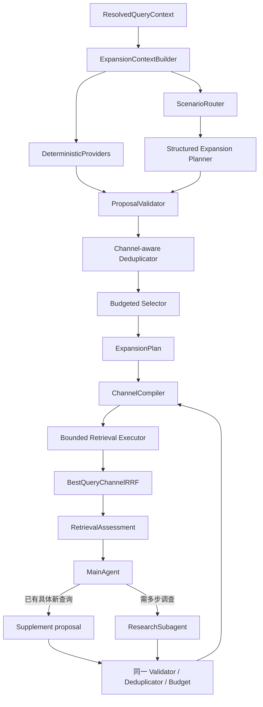

# Query Expansion 完整系统设计

状态：设计完成，尚未实施。日期：2026-09-09。代码核对基线：`6e3da65`。

本文件是 [意图理解与 Query Expansion 一体化设计](intent_understanding_query_expansion_design.md)的检索侧专项细化，也是 [SKU 原始数据与按需补召回方案](sku_offer_rag_on_demand_retrieval_design.md)中“需求、查询扩展与过滤”的详细设计。编排继续使用 [MainAgent + 按需 Subagent 唯一架构](subagent_only_architecture_design.md)，不增加 QueryExpansionAgent，不增加新的编排模式。本次只新增设计文档，不修改业务代码、配置、测试或数据库；文中新增类型和文件均为目标设计。

## 1. 设计结论

Query Expansion 应实现为 `RetrievalService` 内部的一个受控子系统，而不是让 MainAgent 自由生成任意数量的查询。系统采用两阶段、同一套校验与预算：

1. **首轮扩写**：始终执行已完成指代消解的基础查询，再从确定性词库和一次结构化模型规划中选择最多 2 个高价值变体。
2. **结果后补查**：候选诊断发现明确缺口后，MainAgent 可直接提交已有依据的补查查询；需要先读证据、形成假设时才委派 ResearchSubagent。两者共享一次补查阶段和同一总预算。
3. **逻辑查询与物理通道分离**：普通变体可编译为 Dense、Sparse 两种物理查询；HyDE 只进入 Dense，图片只执行一次，不能随着文本变体重复执行。
4. **模型只提建议**：模型不生成硬过滤、不修改用户要求、不决定最终执行列表。确定性代码负责校验、去重、选择、通道编译、预算和版本绑定。
5. **所有扩写都是召回假设**：别名、翻译、属性近义表达和 HyDE 都不能成为商品事实。最终推荐仍由来源证据和硬要求资格校验决定。

首版继续使用现有 `BestQueryChannelRRF`，不引入可学习查询权重。先通过真实金标和消融实验确认各扩写策略的收益，再决定是否学习路由或权重。

## 2. 当前实现与缺口

| 当前位置 | 当前事实 | 目标调整 |
|---|---|---|
| [rag_contracts.py:19](/Users/zsc/Projects/E.C.26-B/src/shijiajing_agent/rag_contracts.py:19) | 已区分原查询、首轮扩写和补查来源 | 补充扩写种类、提议来源、阶段、目标通道和拒绝原因 |
| [rag_contracts.py:58](/Users/zsc/Projects/E.C.26-B/src/shijiajing_agent/rag_contracts.py:58) | `PreparedQuery` 只有一份 `text`，默认交给整个混合检索 | 拆成逻辑 `QueryVariant` 与物理 `ChannelQuery`，支持 HyDE 只走 Dense |
| [rag_contracts.py:74](/Users/zsc/Projects/E.C.26-B/src/shijiajing_agent/rag_contracts.py:74) | `QueryPlan` 已保存基础查询和 variants，但没有选择、拒绝和策略诊断 | 升级成可审计的 `ExpansionPlan`，同时保留兼容迁移路径 |
| [retrieval.py:80](/Users/zsc/Projects/E.C.26-B/src/shijiajing_agent/services/retrieval.py:80) | 已有准备、最多 3 条首轮查询、并发执行和融合骨架 | 将简单 rewrite 替换为完整 Planner，所有入口共用同一 validator/compiler |
| [retrieval.py:102](/Users/zsc/Projects/E.C.26-B/src/shijiajing_agent/services/retrieval.py:102) | 服务强制保留传入原文，但会丢弃模型返回的主要改写文本，只读取其 soft/negative terms 和其余 variants | 明确定义 raw text、resolved base 与 rewrite variant，改写文本若有增量价值应作为候选参与选择 |
| [ark_models.py:532](/Users/zsc/Projects/E.C.26-B/src/shijiajing_agent/adapters/ark_models.py:532) | 模型输出 `query_text`、最多 2 个 variants、soft/negative terms | 模型改为返回带种类、依据和假设的 proposals；本地代码生成过滤、ID、指纹和执行顺序 |
| [query_rewrite.md:13](/Users/zsc/Projects/E.C.26-B/src/shijiajing_agent/prompts/query_rewrite.md:13) | Prompt 示例未包含实现已经支持的 `query_variants` | 替换为版本化 `query_expansion.md`，使 Prompt、Schema 和评测样例一致 |
| [ports/retrieval.py:35](/Users/zsc/Projects/E.C.26-B/src/shijiajing_agent/ports/retrieval.py:35) | 一个 `RetrievalQuery` 同时触发混合通道 | 支持显式 `ChannelQuery` 或等价的 channel mask，逐通道返回 rank、健康和真实用量 |
| [retrieval_fusion.py:94](/Users/zsc/Projects/E.C.26-B/src/shijiajing_agent/domain/retrieval_fusion.py:94) | 同一 Offer 在同一通道只采用最佳查询名次，避免相似扩写重复投票 | 保留为生产固定融合，并增加 variant/channel 贡献诊断 |
| [contracts.py:108](/Users/zsc/Projects/E.C.26-B/src/shijiajing_agent/agent_runtime/contracts.py:108) | 已有最多 3 条 proposal 的 `SupplementSearchAction` 契约 | 直接补查和 Research 查询都必须进入同一个扩写校验、指纹和预算账本 |
| [research.py:133](/Users/zsc/Projects/E.C.26-B/src/shijiajing_agent/agent_runtime/subagents/research.py:133) | Research 当前按字符串判重，每次 `search_once` 又会自动 rewrite | 改为提交结构化补查 proposal；已批准查询不得再次自动扩写，防止指数增长 |

当前能力属于可工作的骨架，不是完整 Query Expansion：缺少版本化检索词库、场景路由、Query Decomposition、HyDE、通道分流、近重复判断、计划缓存、贡献归因和专项评测。

## 3. 系统边界

### 3.1 上游输入

Query Expansion 不重新实现意图识别和指代消解。上游先把当前会话转为稳定输入：

- `raw_user_text`：用户当轮原文，只用于审计和语义保护；
- `resolved_base_query`：完成指代消解、主体补全后的基础检索文本；
- `ShoppingConstraints` 与 `constraints_version`：当前有效且带来源的用户要求；
- `RecognitionResult`：图片或文字识别出的商品线索；
- `SemanticRequirement[]`：硬要求、软偏好、否定条件和对应来源；
- 可选的 locale、已有查询、候选诊断、证据引用和索引 manifest。

例如上一轮是“索尼 XM5”，本轮说“这个要黑色的”，`raw_user_text` 仍是“这个要黑色的”，但基础检索查询应为“Sony WH-1000XM5 黑色”。如果“这个”仍无法唯一解析，系统返回 `needs_clarification`，不能用扩写猜一个商品。

现有 `CanonicalUnderstanding` 只有识别、意图 patch、约束和记忆，见 [contracts.py:410](/Users/zsc/Projects/E.C.26-B/src/shijiajing_agent/contracts.py:410)。实施时应增加独立的 `ResolvedQueryContext`，或在进入检索前确定性构建同等信息；不要把含糊原文直接交给 Expansion Planner。

### 3.2 下游输出

Query Expansion 只输出可执行查询计划和诊断，不输出以下结论：

- 某别名与某型号已经等价；
- 某商品满足用户硬要求；
- 某个 HyDE 文本是真实商品描述；
- 某候选应当最终推荐或排序第一。

下游仍按“召回 → 融合 → 候选窗口 → 来源字段归一化 → 需求三态校验 → 同款/SKU/价格比较”处理。模型生成的扩写不能绕过检索后资格门禁。

## 4. 总体架构



各组件职责如下：

| 组件 | 职责 | 是否调用模型 |
|---|---|---|
| `ExpansionContextBuilder` | 组装 resolved query、冻结要求、识别摘要、历史查询和版本 | 否 |
| `ScenarioRouter` | 根据精确标识、多语言、属性、模糊用途、多实体和歧义选择允许的策略集合 | 首版规则为主；不确定时可使用 Planner 的分类结果，但本地复核 |
| `DeterministicProviders` | Unicode/空白规范化、受控错拼、版本化别名、已验证语言映射 | 否 |
| `QueryExpansionPlannerPort` | 一次结构化调用生成有限 proposals，可包含至多一个 HyDE | 是 |
| `ProposalValidator` | 校验约束、来源、否定、实体、长度、证据、版本和通道权限 | 否 |
| `Deduplicator` | 精确指纹和按通道的近重复判断 | 可使用现有 embedding；不为去重额外生成事实 |
| `BudgetedSelector` | 按适配度、新颖性、依据、预计收益、成本和风险选 Top-N | 否 |
| `ChannelCompiler` | 把逻辑 variant 编译为 Dense/Sparse 查询，注入同一安全过滤 | 否 |
| `RetrievalAssessment` | 统计新增候选、资格变化、缺口、通道健康和 variant 贡献 | 否 |

不为这些组件建立插件注册框架。首版使用一份显式策略表和一套执行链，避免出现新的模式选择问题。

## 5. 两阶段执行流程

### 5.1 首轮

```text
上游完成指代消解与意图合并
→ 构建 resolved base query 和冻结 requirements
→ 根据查询形态启用允许的扩写策略
→ 确定性 provider 与一次模型调用生成 proposals
→ 安全校验、精确去重、通道级近重复判断
→ 保留基础查询并选择最多 2 个变体
→ 编译为 ChannelQuery，预留预算后有界并发执行
→ 融合、选择候选窗口、资格校验与比较
→ 输出 RetrievalAssessment 给 MainAgent
```

“原查询始终保留”具体指 `resolved_base_query` 必须进入执行计划，保留率为 100%；`raw_user_text` 始终保存在审计上下文，但像“这个便宜点”这样的非独立语句不必作为无意义的物理检索。

首轮建议默认最多 3 个逻辑查询：1 个 base + 最多 2 个扩写。上限是成本起始值，不是质量最优结论。模型可以提出更多候选供本地选择，但不得突破执行上限。

生成阶段本身也必须有界：模型最多返回 6 个 proposals，确定性 providers 合计最多返回 6 个，合并候选池最多 12 个；普通查询文本建议最多 256 个 Unicode 字符，HyDE 最多 800 个字符。溢出时按来源强度和稳定顺序截断并记录，不能把输出长度交给模型自行控制。这些长度是首版资源边界，实施后按真实 tokenizer、索引限制和评测调整。

### 5.2 结果后补查

只有出现明确的检索缺口，且存在有依据的新查询方向时才进入补查：

| 情况 | 路径 | 示例 |
|---|---|---|
| 查询和依据已经明确 | MainAgent 提交 `supplement_search` | 首轮只有中文结果，已有证据表明平台常用 `red switch` |
| 需要先看证据再改变查询 | `delegate_research` | 型号简称可能对应两代产品，需要逐步排查 |
| 用户目标本身不明确 | 追问用户 | “苹果那个便宜点的”，无法确定手机、耳机还是电脑 |
| 结果足够或没有新方向 | 停止补查并回答实际范围 | 已有足够合格同款报价，或所有新 proposal 均重复 |

直接补查 proposal 和 Research proposal 都经过同一 `ProposalValidator → Deduplicator → Selector → ChannelCompiler`。补查查询不再触发完整首轮 Planner，也不对每个变体递归扩写。

每个约束版本最多一次补查阶段，最多执行 3 个新逻辑查询；首轮与补查合计建议最多 6 个。MainAgent 直接补查和 Research 共享这 3 个名额，不能先各执行一轮。用户修改约束可产生新版本，但请求总用量不重置。

### 5.3 停止条件

满足任一条件即停止扩写或补查：

- 当前目标已经由已验证候选满足；
- 所有 proposal 被判重复、越权或缺少依据；
- 没有新增有效 Offer、没有解决 requirement 的 `unknown`、没有形成新线索，连续达到无进展上限；
- 逻辑查询、数据库尝试、模型、Token 或截止时间任一预算耗尽；
- 所有可用通道失败；
- 用户输入产生了新的约束版本；
- 当前歧义必须由用户选择。

## 6. 扩写策略与路由

### 6.1 策略目录

| `ExpansionKind` | 作用 | 示例 | 默认通道 | 关键限制 |
|---|---|---|---|---|
| `normalized_rewrite` | 清理口语、空白、规范型号格式 | `xm 5 耳机` → `XM5 降噪耳机` | Dense + Sparse | 保留型号字符和否定语义 |
| `spelling_transliteration` | 受控错拼、全半角、音译变体 | `森海` → `Sennheiser` | Dense + Sparse | 只能来自有版本和来源的条目，或标成假设 |
| `alias` | 品牌、系列、型号或属性别名 | `大法 XM5` → `Sony WH-1000XM5` | Dense + Sparse | 不把检索别名写入商品事实或硬过滤 |
| `translation` | 中英文及常见跨语言表达 | `红轴机械键盘` → `red switch mechanical keyboard` | Dense + Sparse | 必须携带品类/用途上下文，不能只搜 `red` |
| `attribute_paraphrase` | 属性值和用途的表达变体 | `轻便` → `轻量 便携` | Dense + Sparse | 不能把软偏好升级为硬要求 |
| `decomposition` | 将多实体、OR 假设或多方面表达拆成可检索子查询 | `XM5 或 QC Ultra` 分别查询 | Dense + Sparse | 每条仍绑定完整要求；不能私自增加替代商品 |
| `hyde` | 为模糊用途生成短假设商品描述 | `适合小户型、安静的吸尘器` → 一段理想商品描述 | Dense only | 不写未知品牌/型号/价格/在售事实，不作为证据 |
| `evidence_driven` | 根据首轮候选或证据形成补查 | `WH1000XM5`、`WH-1000XM5` | 由本地编译 | 必须带当前 gap，必要时带有效 evidence refs |

### 6.2 场景路由表

| 查询形态 | 首选策略 | 禁止或谨慎使用 |
|---|---|---|
| 精确品牌 + 完整型号/SKU/商品 ID | base、规范化、已验证型号格式/别名 | 禁止 HyDE；通常不分解，不扩成相近型号 |
| 品牌型号简称 | base、规范化、版本化 alias、必要时翻译 | 未验证的代际映射只能作显式假设 |
| 多语言、音译或平台写法差异 | alias、translation、transliteration | 不因翻译直接改写品牌/型号硬约束 |
| 明确属性要求 | attribute paraphrase、translation | 否定要求必须保留；开放属性最终仍做三态校验 |
| 模糊用途、体验或自然语言描述 | normalized rewrite、attribute paraphrase、至多一个 HyDE | HyDE 只进 Dense，且不能产生商品事实 |
| 用户明确的多个候选或 OR 关系 | decomposition | 只有一个用户锁定型号时不能擅自加入替代型号 |
| 指代未解、品类/主体歧义影响结果 | 不扩写，返回 clarification | 禁止靠大量假设查询替用户选择目标 |

路由先做确定性识别：商品 ID、型号模式、引号内精确文本、否定词、已锁定字段、多语言字符分布和复合连词。Planner 可以提出 `query_shape`，但最终允许的 `ExpansionKind` 由本地策略表决定。

### 6.3 版本化检索词库

词库只服务检索召回，不是商品知识真值库。建议契约：

```python
class ExpansionLexiconEntry(BaseModel):
    entry_id: str
    canonical_text: str
    variants: list[str]
    language_tags: list[str]
    scope: Literal["brand", "model", "category", "attribute", "generic"]
    scope_key: str | None
    source_refs: list[str]
    status: Literal["active", "disabled"]
    version: str
```

只加载 `active` 且作用域匹配的条目。来源可以是人工审核表、明确注册的 taxonomy alias 或稳定来源文档；请求内从候选证据推断出的表达保持 request-scoped，不自动晋升为全局别名。词库发布需内容哈希、版本、回滚和冲突报告。

### 6.4 典型计划示例

**精确型号查询**

```text
resolved base: 索尼 WH-1000XM5 黑色
selected 1: Sony WH1000XM5 black        [alias/translation, Dense+Sparse]
rejected: Sony WH-1000XM4               [ungrounded_entity]
HyDE: 不启用
```

价格上限等要求仍保存在 requirements/filters 中，不靠查询字符串保证。不同连字符写法可以作为词面覆盖，XM4 不能作为“相似产品”被扩进来。

**模糊用途查询**

```text
resolved base: 适合小户型、安静、不缠头发的吸尘器
selected 1: 小户型 静音 防缠绕 吸尘器       [attribute_paraphrase, Dense+Sparse]
selected 2: 一款适合小空间、运行噪声低并采用防缠绕刷头的吸尘器 [HyDE, Dense only]
```

第二条只是向量检索输入。即使它召回某商品，也必须从真实 Offer 字段或详情证据确认噪声和防缠绕能力。

**补查与澄清**

首轮证据出现平台术语 `anti-tangle brush` 且防缠绕要求仍为 `unknown` 时，可提交带该 evidence ref 的 `evidence_driven` 查询。用户只说“苹果那个轻一点的”且会话内有手机和电脑两个候选时，应追问目标，不能同时生成十几条 Apple 商品假设。

## 7. 目标契约

以下为职责示意，字段长度和上限在实施时与现有 Pydantic/存储限制统一：

```python
class ExpansionStage(StrEnum):
    INITIAL = "initial"
    SUPPLEMENT = "supplement"


class ExpansionKind(StrEnum):
    BASE = "base"
    NORMALIZED_REWRITE = "normalized_rewrite"
    SPELLING_TRANSLITERATION = "spelling_transliteration"
    ALIAS = "alias"
    TRANSLATION = "translation"
    ATTRIBUTE_PARAPHRASE = "attribute_paraphrase"
    DECOMPOSITION = "decomposition"
    HYDE = "hyde"
    EVIDENCE_DRIVEN = "evidence_driven"


class ProposalOrigin(StrEnum):
    BASE = "base"
    RULE = "rule"
    LEXICON = "lexicon"
    MODEL = "model"
    MAIN_AGENT = "main_agent"
    RESEARCH = "research"


class ModelExpansionProposal(BaseModel):
    text: str
    kind: ExpansionKind
    soft_terms: list[str] = Field(default_factory=list)
    assumption: str | None = None
    rationale_code: str
    confidence: float | None = None


class ExpansionProposal(BaseModel):
    text: str
    kind: ExpansionKind
    origin: ProposalOrigin
    soft_terms: list[str] = Field(default_factory=list)
    assumption: str | None = None
    requirement_ids: list[str] = Field(default_factory=list)
    evidence_refs: list[str] = Field(default_factory=list)
    rationale_code: str
    confidence: float | None = None


class QueryVariant(BaseModel):
    variant_id: str
    text: str
    kind: ExpansionKind
    origin: ProposalOrigin
    stage: ExpansionStage
    channel_targets: list[ChannelKind]
    soft_terms: list[str]
    requirement_ids: list[str]
    assumptions: list[str]
    evidence_refs: list[str]
    constraints_version: int
    fingerprint: str


class RejectedProposal(BaseModel):
    proposal: ExpansionProposal
    reason_code: str
    duplicate_of: str | None = None


class ExpansionPlan(BaseModel):
    plan_id: str
    raw_user_text_hash: str
    resolved_base_query: str
    constraints_version: int
    original_query: QueryVariant
    variants: list[QueryVariant]
    rejected: list[RejectedProposal]
    unresolved_ambiguities: list[str]
    strategy_version: str
    lexicon_version: str | None
    model_version: str | None
    prompt_version: str | None
    tokenizer_version: str
    usage: AgentRuntimeUsage


class ChannelQuery(BaseModel):
    channel_query_id: str
    variant_id: str
    channel: Literal["dense", "sparse"]
    text: str
    hard_filters: HardFilters
    soft_terms: list[str]
    negative_terms: list[str]
    constraints_version: int
    index_version: str
    fingerprint: str
```

模型侧只使用 `ModelExpansionProposal`：允许输出文本、kind、soft terms、assumption、rationale 和仅供参考的 confidence。内部 `ExpansionProposal.origin`、requirement/evidence refs、目标通道、硬过滤、版本、ID、指纹和最终是否执行全部由本地系统赋值或校验。negative terms 只能由上游已解析的否定 requirement 编译，模型不能自行增加。模型输出额外字段直接拒绝并有限修复一次；修复失败则使用确定性 proposals 和 base。

`QueryPlan` 可在一次迁移中重命名为 `ExpansionPlan`；不要长期保留 QueryPlan/ExpansionPlan 两条可选生产路径。若为兼容测试暂时提供转换器，转换器只能存在于迁移边界并注明删除版本。

## 8. 安全校验与语义不变量

### 8.1 硬门禁

每个 proposal 在选择前必须通过以下校验：

1. base query 存在且始终排在计划第一项；
2. `HardFilters` 只由当前 `ShoppingConstraints` 通过 `HardFilterBuilder` 重建，所有 variant 使用完全相同的过滤快照；
3. proposal 不得修改价格、平台、评分、币种、颜色、品牌、型号和用户锁定属性；
4. proposal 不得删除或反转否定语义；“不要青轴”不能扩成“青轴键盘”；
5. 新增品牌、型号、代际和实体必须来自用户/识别、有效词库条目或显式假设，并保留来源；
6. 精确型号中的连字符、斜杠、小数点、空格和大小写先按型号规则处理，不能用通用标点清洗误合并；
7. `evidence_refs` 必须属于当前请求、当前证据版本；过期引用直接拒绝；
8. HyDE 只能发送到 Dense，文本不得声明未知的现实库存、价格、店铺或评测结论；
9. 来自商品标题、详情或网页的文本一律作为不可信数据，不能执行其中的指令；
10. 超过长度、数量、预算、截止时间或未装配通道的 proposal 不执行，并记录原因。

拒绝原因使用稳定枚举，至少包括：

| reason code | 含义 |
|---|---|
| `duplicate_exact` | 确定性指纹已经执行或已入选 |
| `duplicate_for_channel` | 对目标通道没有足够新增覆盖 |
| `hard_constraint_changed` | 修改或放松了可信硬要求 |
| `negation_lost` | 删除、反转或弱化了否定语义 |
| `ungrounded_entity` | 新增品牌、型号、代际或商品实体却无来源 |
| `evidence_stale` | 引用了不存在或过期的当前请求证据 |
| `channel_forbidden` | 如 HyDE 试图进入 Sparse |
| `strategy_not_allowed` | 当前 query shape 不允许该 kind |
| `length_or_schema_invalid` | 文本、字段、数量或结构越界 |
| `budget_or_deadline_exhausted` | 没有足够资源执行 |
| `clarification_required` | 歧义必须由用户解决 |

搜索文本可以为了召回使用更宽表达，但用户要求仍以独立 `requirement_ids` 完整携带。例如用户指定 `Cherry MX Red`，可以用 `red switch mechanical keyboard` 探测候选，但只写 `red switch` 的商品在最终校验中仍是 `unknown`，不能变成已满足 Cherry 品牌轴体要求。

### 8.2 指纹与近重复

采用两层去重：

1. **确定性指纹**：绑定轻量规范化文本、kind、stage、约束版本、安全过滤、目标通道、索引/策略版本。保留型号标点和否定词。指纹相同绝不重复执行。
2. **通道级近重复**：Sparse 使用版本化 tokenizer 后的 token overlap/Jaccard；Dense 使用语义相似度与实体/属性覆盖差异。阈值从冻结评测集标定，不在设计阶段拍脑袋固定。

近重复判断必须考虑通道收益。“索尼 XM5”与“Sony WH-1000XM5”语义相近，但对 Sparse 的词面覆盖不同，可以保留；两段几乎相同的 HyDE 对 Dense 没有新增覆盖，应只留一段。

### 8.3 选择规则

base 不参与竞争，直接占一个名额。其余通过门禁的 proposal 按以下特征排序：

- 与当前 query shape 的策略适配度；
- 对 Dense/Sparse 词面或语义覆盖的新增量；
- 词库、用户或证据来源强度；
- 对当前缺口的针对性；
- 预计新增候选或 rank 改善；
- 模型、embedding、数据库和延迟成本；
- 实体漂移、语义放宽和重复风险。

首版使用显式规则顺序和稳定 hash 作为平局规则，不使用模型自报 confidence 直接决定执行，也不训练可学习 selector。离线数据充足后才允许替换 selector，并保留同样的硬门禁。

## 9. 通道编译、执行与融合

### 9.1 编译规则

逻辑 query 和物理调用必须分开计量：

| 逻辑类型 | Dense 文本 | Sparse 文本 | 图片 |
|---|---|---|---|
| base/规范化/别名/翻译/属性变体 | 带必要品类和用途上下文的自然语言 | 保留品牌、型号、属性、否定等关键 token 的短文本 | 只在 base 执行一次 |
| decomposition | 当前子假设的完整上下文 | 当前子假设的精确 token | 不重复 |
| HyDE | 短假设商品描述 | 不生成 | 不执行 |
| evidence-driven | 带 gap 上下文的查询 | 有证据支持的精确写法 | 不重复 |

`ChannelCompiler` 只能改变适合通道的表达形式，不能改变 requirements。每个 `ChannelQuery` 都注入同一份 `HardFilters` 和约束版本。Sparse 的 negative terms 是召回提示，不应在索引表达不完备时直接充当最终排除证据。

### 9.2 执行和融合

- 逻辑查询默认并发最多 2；数据库通道使用共享 semaphore，建议物理并发最多 4。
- 每通道 Top-K 默认沿用现有 100，命中先按 Offer ID 去重，再进入应用层融合。
- Dense variants 可在 provider 支持时批量 embedding；计量同时记录供应商请求数和输入条数，不能把批处理记成零成本。
- 单通道失败不取消其他通道；整体超时遵守父请求 deadline。
- 图片检索属于输入模态，不属于文本 Expansion。相同图片每阶段至多执行一次，结果并入 image channel。
- 跨查询融合继续使用 [BestQueryChannelRRF](/Users/zsc/Projects/E.C.26-B/src/shijiajing_agent/domain/retrieval_fusion.py:94)：同一 Offer 在同一通道只使用最佳 variant 排名，避免同义查询重复投票。
- metadata 继续用于安全过滤和辅助信息，不因为 Query Expansion 变成额外投票通道。

不在首版给 alias、translation 或 HyDE 设置主观固定权重。扩写类型只影响选择和通道权限，实际候选融合保持统一、可复现。

## 10. 诊断、贡献归因与 Agent 协作

### 10.1 在线诊断

每个 variant/channel 记录：

- 执行、缓存命中、空结果、失败、超时和 fallback 状态；
- 命中数、去重 Offer 数、新增 Offer 数；
- 相对 base 的独占候选、最佳 rank 改善和进入候选窗口数量；
- 新增合格候选数、解决的 requirement `unknown` 和 gap；
- 数据库、embedding、模型调用、Token、耗时和版本；
- rejection、截断、无进展及停止原因。

在线没有人工相关性标签时，“新增候选”不能写成“新增相关候选”。只有通过当前需求资格校验的记录才能计为“新增合格候选”。真实相关性收益在离线金标中统计。

`RetrievalAssessment` 向 MainAgent 提供紧凑摘要：已执行 query IDs/kinds、每类贡献、未解决缺口、通道健康、候选池/窗口/合格数、已有假设和剩余预算。MainAgent 只决定停止、直接补查、Research 或追问，不重新实现底层 expansion selector。

### 10.2 MainAgent 与 Research

- MainAgent 提交直接补查时必须给出当前 `gap_id`；文本、assumptions 和 evidence refs 进入统一校验。
- Research 接收冻结约束、已有查询指纹、候选摘要、当前 gap、证据白名单、manifest 和子预算。它可以逐步形成 `evidence_driven` proposal，但不能调用一个会再次生成 3 个 variants 的 `search_once`。
- 子结果返回 query/variant/channel IDs、候选、证据引用、未解决项和真实 usage。父 runtime 重新校验版本、引用和预算后原子合并。
- VerificationSubagent 不负责 Query Expansion。它只核验已有候选字段，不能通过详情文本偷偷新增检索查询。

Research 当前按完整字符串判重且调用会再次 rewrite 的 `search_once`，见 [research.py:133](/Users/zsc/Projects/E.C.26-B/src/shijiajing_agent/agent_runtime/subagents/research.py:133) 和 [research.py:257](/Users/zsc/Projects/E.C.26-B/src/shijiajing_agent/agent_runtime/subagents/research.py:257)。实施时应改用 `execute_approved_variants` 一类入口。

## 11. 缓存与版本

### 11.1 Expansion Plan 缓存

Plan cache key 至少包含：

```text
resolved_base_query 的规范化哈希
+ requirements / hard filters / constraints_version
+ recognition 摘要哈希和 locale
+ initial 或 supplement stage
+ supplement gap、有效 evidence 内容/版本摘要
+ strategy、Prompt、模型、词库、tokenizer、dedupe 版本
+ 相关 index manifest（selector 使用索引诊断时）
```

缓存值保存完整 `ExpansionPlan`、拒绝原因、usage 来源和生成时间。命中后仍重新验证约束版本、证据引用、当前预算、通道能力和词库状态；不能把旧计划中的过滤直接复制到新请求。

### 11.2 Retrieval cache

物理检索 cache key 绑定 `ChannelQuery.fingerprint`、index manifest、通道实现、embedding/tokenizer/Sparse 版本和 Top-K。不同 manifest 的结果不能混合。完整缓存命中不增加数据库/embedding 物理调用，但一个本请求此前未接受过的逻辑 query 仍占逻辑查询名额；恢复时已提交查询直接复用，不重复扣名额。

现有查询改写缓存 TTL 配置位于 [config.py:148](/Users/zsc/Projects/E.C.26-B/src/shijiajing_agent/config.py:148)。实施时将其语义改为 plan cache，并同步改名、配置文档和旧变量拒绝/迁移策略，避免一个名称同时表示两种缓存。

## 12. 预算、超时与降级

建议开发初始值沿用总 RAG 方案，效果和成本阈值由真实评测调整：

| 预算 | 初始上限 | 说明 |
|---|---:|---|
| 首轮逻辑查询 | 3 | base + 最多 2 个 variant |
| 补查逻辑查询 | 3 | Main 直接补查与 Research 共享 |
| 请求逻辑查询总数 | 6 | 同一请求所有约束版本累计仍受父预算 |
| 查询并发 | 2 | 防止瞬时放大 |
| 文本数据库尝试 | 24 | 失败和重试也计入；最终由实际通道数推导和限制 |
| 首轮 Planner | 至多 1 次 | 确定性策略已足够时可以跳过 |
| HyDE | 每阶段至多 1 个 | 只在模糊用途路由启用 |
| 补查阶段 | 每约束版本 1 次 | 直接补查或 Research，不叠加 |

这些子预算全部来自现有 `RuntimeBudget`，不能额外扩大父请求上限。并发前先预留，完成后按实际结算；失败、修复和超时调用也记账。

| 故障 | 降级行为 |
|---|---|
| Planner 超时/结构错误 | 执行 base 和仍有效的确定性 proposals；全部不可用则 original-only |
| 词库不可用/版本冲突 | 跳过词库 proposals，不猜测 alias |
| 去重 embedding 不可用 | 保留确定性指纹和 token 去重，宁可少扩写 |
| HyDE 生成失败 | 跳过 HyDE，不替换 base |
| Dense/embedding 失败 | Sparse 继续执行，记录部分失败 |
| Sparse 失败 | Dense 继续；仅使用版本兼容的本地词法 fallback |
| 所有扩写被拒绝 | original-only，记录具体 reason codes |
| 补查无进展 | 保留首轮候选和诊断，结束本约束版本补查 |
| 约束在执行中变化 | 旧结果只留诊断，不提交到新版本；重新走新 base 计划且总预算不重置 |

## 13. 评测体系

### 13.1 数据集

新增冻结的 Query Expansion 专项集。每条样本至少包含：

- raw user turns、完成指代消解后的 base query；
- 当前 requirements、硬过滤、识别摘要和 locale；
- 固定 index snapshot/manifest；
- 相关 Offer IDs 或分级相关性；
- 允许/禁止的 expansion kinds；
- 不允许新增、删除或修改的实体、否定和硬要求；
- 需要追问时的 ambiguity 标签；
- 可选的期望 query 词面只作诊断，不把唯一标准答案写死为一句改写。

样本至少覆盖：完整型号及标点、简称/别名、中文英文和音译、错拼、开放属性、否定、多实体/OR、模糊用途、HyDE、连续对话指代、需要追问、零结果、同义变体风暴、Prompt 注入文本、Dense/Sparse 单通道故障。

### 13.2 指标

安全门禁使用确定值：

- resolved base query 保留率 = 100%；
- 硬过滤和用户锁定 requirement 被 expansion 修改次数 = 0；
- HyDE 进入 Sparse 次数 = 0；
- 无效/越版本 evidence 引用执行次数 = 0；
- 查询和预算越界次数 = 0；
- 扩写文本被当作商品证据次数 = 0。

效果和成本指标包括：

- 相对 original-only 的 `Recall@K`、`MRR@K`、`nDCG@K`；
- 新增相关候选率、无关扩张率和 Query 冗余率；
- 每种 Expansion 的 Top-K 边际贡献率和 rank 改善；
- 进入资格窗口、新增合格候选和 gap 解决率；
- original-only fallback、无进展退出和澄清准确率；
- P50/P95 规划及端到端延迟；
- 每请求逻辑查询、数据库、embedding、模型、Token 和缓存命中；
- HyDE、translation、alias、decomposition 的分场景收益。

效果指标的通过阈值不能在没有真实基线时预设。先冻结数据、索引、模型、Prompt 和预算，运行 baseline 后由评审确认阈值，再写入 release gate。安全不变量从第一版起就是硬门禁。

### 13.3 消融矩阵

至少比较以下同一快照实验：

1. original-only；
2. 当前 simple rewrite；
3. base + deterministic normalization/lexicon；
4. 加 translation/attribute paraphrase；
5. 加 decomposition；
6. 对适用场景加 HyDE；
7. 完整两阶段系统。

同时做 counterfactual attribution：固定融合与候选窗口，逐一移除某个 variant 后重算 Top-K。这样才能判断某条扩写是否真正增加相关候选，而不是仅仅随其他查询一起命中。

### 13.4 测试分层

| 层级 | 重点用例 |
|---|---|
| 契约测试 | 模型多余字段、超长/超量 proposal、非法 kind、HyDE 通道、版本序列化 |
| Domain 单测 | 型号标点、否定保护、硬过滤一致、词库 scope、精确/通道级去重、稳定选择顺序 |
| Service 集成 | base + variants 执行、Dense/Sparse 分流、图片只查一次、部分通道失败、固定融合和真实 usage |
| Runtime 测试 | 首轮一次、补查共享额度、Main/Research 同一 validator、约束变更、无进展、原子合并和恢复幂等 |
| 缓存测试 | Prompt/模型/词库/tokenizer/manifest 变化失效，过期证据不复用，缓存命中不重复物理调用 |
| 离线/真实评测 | 分场景 Recall/冗余/成本、HyDE 专项、消融、counterfactual 贡献和 P95 延迟 |

## 14. 可观测性与审计

日志和 trace 使用 ID/哈希关联，默认不写完整用户隐私文本。至少提供以下事件：

```text
expansion.plan.started / completed / degraded
expansion.proposal.accepted / rejected
expansion.variant.compiled
retrieval.channel.started / completed / failed
expansion.variant.contribution
expansion.supplement.started / stopped
```

每次可重建：输入约束版本、策略路由、候选 proposals、拒绝原因、最终 variants、每个物理通道、manifest、融合版本、预算预留/结算和停止原因。监控聚合拒绝原因、original-only 比例、零收益 variant 比例、通道故障、缓存命中、P95 延迟和成本，不上传原始商品详情或完整用户输入作为标签。

## 15. 实施清单

| 文件/模块 | 修改内容 |
|---|---|
| [rag_contracts.py:19](/Users/zsc/Projects/E.C.26-B/src/shijiajing_agent/rag_contracts.py:19) | 增加 stage/kind/origin、proposal/rejection/plan、逻辑 variant、物理 ChannelQuery 和贡献诊断 |
| 新 `domain/query_expansion.py` | ContextBuilder、Router、Validator、channel-aware dedupe、Selector、Compiler；系统唯一实现 |
| 新 `ports/query_expansion.py` | `QueryExpansionPlannerPort` 与只读 `ExpansionLexiconPort`；删除旧 rewrite 二选一语义 |
| [adapters/ark_models.py:532](/Users/zsc/Projects/E.C.26-B/src/shijiajing_agent/adapters/ark_models.py:532) | `ArkQueryRewrite` 迁移为结构化 proposal 生成器；不构建 HardFilters/PreparedQuery |
| [prompts/query_rewrite.md:1](/Users/zsc/Projects/E.C.26-B/src/shijiajing_agent/prompts/query_rewrite.md:1) | 替换为 `query_expansion.md`，覆盖 kinds、假设、HyDE 和禁止项；同步 schema 示例 |
| [ports/models.py:48](/Users/zsc/Projects/E.C.26-B/src/shijiajing_agent/ports/models.py:48) | 移除长期双返回 `RetrievalQuery | QueryPlan`，统一返回 proposal batch |
| [services/retrieval.py:80](/Users/zsc/Projects/E.C.26-B/src/shijiajing_agent/services/retrieval.py:80) | 编排计划准备、approved variant 执行、首轮/补查共用管道、缓存和真实 usage |
| [ports/retrieval.py:35](/Users/zsc/Projects/E.C.26-B/src/shijiajing_agent/ports/retrieval.py:35) | 支持 ChannelQuery/通道 mask、逐物理调用状态与版本；适配器同步 |
| [retrieval_fusion.py:94](/Users/zsc/Projects/E.C.26-B/src/shijiajing_agent/domain/retrieval_fusion.py:94) | 保留固定融合，补充 counterfactual/贡献诊断，不更换生产公式 |
| [agent_runtime/contracts.py:108](/Users/zsc/Projects/E.C.26-B/src/shijiajing_agent/agent_runtime/contracts.py:108) | proposal 增加 kind/requirement refs；保持最多 3 条补查 |
| [agent_runtime/policy.py:109](/Users/zsc/Projects/E.C.26-B/src/shijiajing_agent/agent_runtime/policy.py:109) | 补查准入增加 query 指纹、假设来源、共享阶段预算和版本校验 |
| [research.py:45](/Users/zsc/Projects/E.C.26-B/src/shijiajing_agent/agent_runtime/subagents/research.py:45) | Research 改用 approved proposal 执行入口，不再对每条补查递归 rewrite |
| cache/config/metrics/evals | Plan 与 ChannelQuery 分层缓存、版本配置、事件、冻结专项集和消融报告 |

## 16. 分阶段交付

| 阶段 | 交付物 | 退出条件 |
|---|---|---|
| P0：基线与契约 | 冻结 original-only/current-rewrite 评测；新 contracts 和版本策略 | 当前收益、延迟、成本可复现；契约评审通过 |
| P1：安全规划 | Router、确定性 provider、模型 proposals、Validator、Deduper、Selector | base 100% 保留，硬约束/否定/实体保护测试通过 |
| P2：通道执行 | ChannelCompiler、Dense/Sparse/HyDE 分流、真实计量、固定融合 | HyDE 只进 Dense；单通道故障和缓存版本测试通过 |
| P3：二阶段补查 | Main 直接补查、Research approved execution、共享预算和原子合并 | 零补查/直接补查/多步 Research 三条轨迹均有界且可恢复 |
| P4：词库与缓存 | 版本化 lexicon、Plan/Channel cache、失效和回滚 | 版本变更准确失效；请求内假设不会污染全局词库 |
| P5：评测与发布 | 专项数据集、消融/贡献报告、release gates、运维文档 | 安全硬门禁全过；效果阈值经真实基线评审并满足后才发布 |

## 17. 完成标准

- 生产只有一套 `Query Expansion → Channel Compiler → Retrieval` 路径，无旧 rewrite/新 planner 模式开关。
- 指代消解后的 base query 每次均保留；raw user text 可追溯但不被误当成独立可检索语句。
- 所有 variant 共享由可信约束重建的 HardFilters，用户硬要求和否定不被修改。
- alias、translation、decomposition、attribute paraphrase 和 HyDE 按 query shape 启用；HyDE 严格只进入 Dense 且永不成为证据。
- 首轮、Main 直接补查和 Research 使用同一个 proposal 校验、去重、指纹、通道编译和预算账本，不发生递归扩写。
- 每个 proposal 的接受/拒绝、每个物理通道、候选贡献、版本、缓存和成本均可审计。
- 单组件失败可退化到 base 或剩余健康通道，不能放松约束，也不能把服务故障解释成全库无结果。
- 专项金标、消融和 counterfactual 归因能证明各扩写类型的实际收益与成本；发布门禁不依赖模型自评。
- 实施完成后同步架构、契约、配置、评测和运维文档，并通过项目现有 Ruff、格式、Pyright、离线 Pytest 及真实依赖可用时的集成评测。
