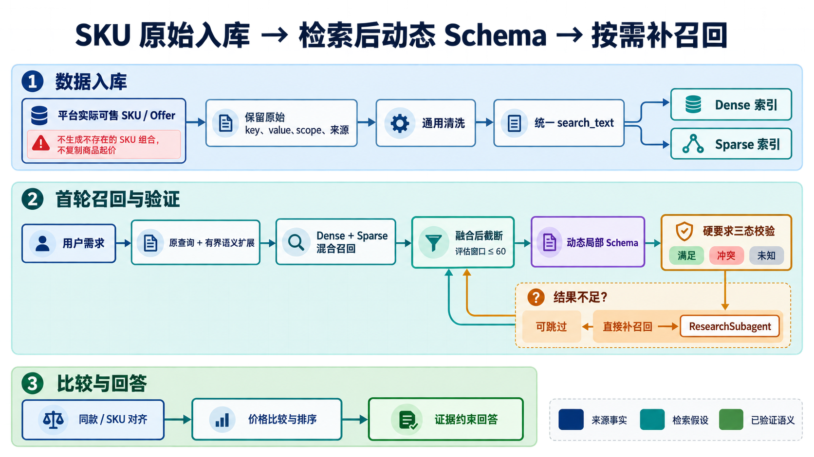
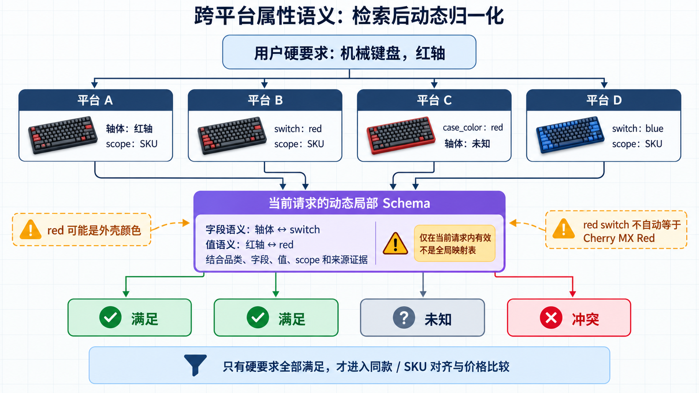
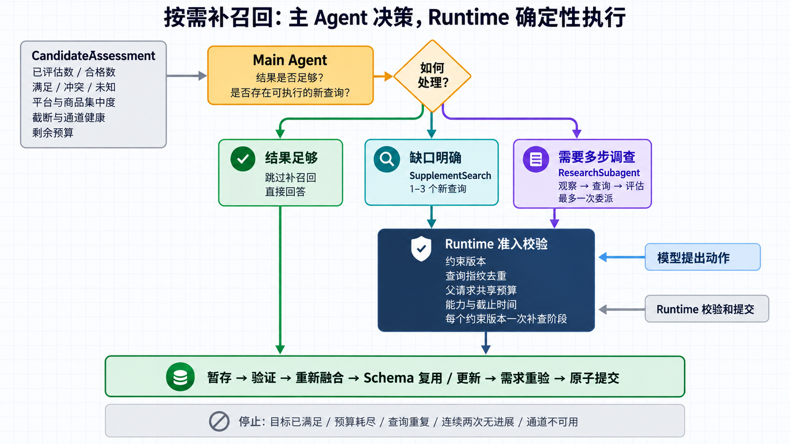
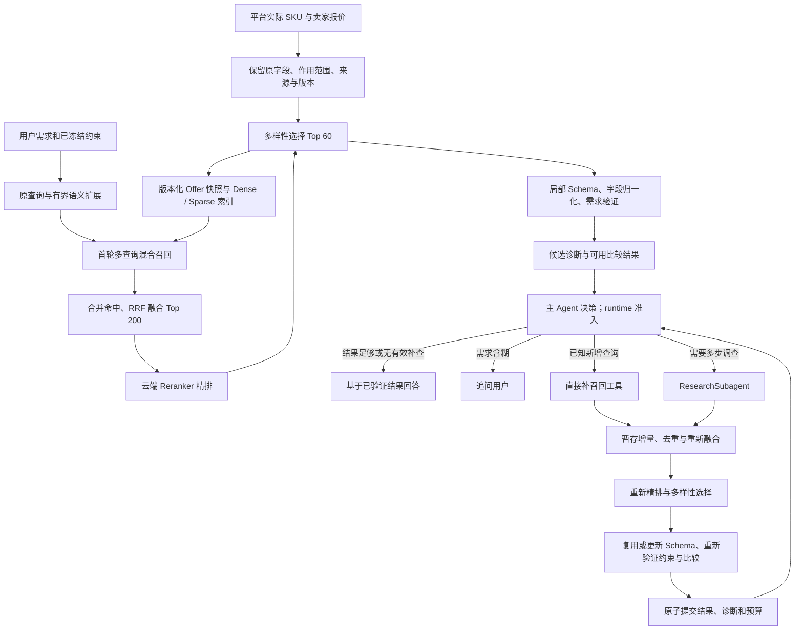

# SKU 原始数据入库、动态语义归一化与按需补召回改造方案

状态：设计完成，尚未实施。日期：2026-09-09。代码核对基线：`e5944ff`。

本文件供后续 Agent 实施；本次仅修改文档，不修改业务代码、配置、测试或数据库。文中的新增类型、方法、参数及流程均为目标设计，不表示当前已经实现。代码链接的行号以核对基线为准，实施时同时按符号定位。

## 展示图

下图用于快速理解方案；实施细节与边界以正文为准。第一张总览图对候选处理做了视觉简化，正文目标链路在 RRF 融合与动态 Schema 之间包含云端 Reranker 精排。







## 1. 目标、范围与方案优先级

目标是让不同平台的商品按实际可售 SKU／报价进入索引，不要求提前映射到统一商品 Schema；检索后再形成局部语义、验证用户要求，完成同款比较与展示。针对跨语言和异构属性，通过首轮查询扩展与可选补召回提高覆盖，效果由金标评测确认。

本方案确定以下规则：

1. **一条索引记录对应一个平台、卖家、实际可售 SKU 的 Offer。** 平台 SKU ID 不是跨平台商品身份。
2. 入库保留原字段名、原字段值、商品／SKU 作用范围与来源，只做通用清洗和技术字段校验。
3. Dense 与 Sparse 使用同一份确定性生成的检索文本；不在入库时调用 LLM 推导统一品类、属性角色或枚举值。
4. 首轮允许有界的多语言／别名查询扩展；生成的别名属于检索假设，不能直接当成商品事实。
5. 候选返回后生成动态局部 Schema，先评估已知结果；需要时补召回，再对合并结果复用或更新 Schema。
6. Schema 归一化在**语义约束校验、同款判断、SKU 对齐和排序之前**执行，不只是展示字段改名。
7. 补召回由主 Agent 按需提出，runtime 校验缺口、查询新颖性、能力、预算和版本；结果够用时可以跳过。
8. 不建设持续累积的全局品类、属性键、属性值映射表；缓存只能复用经过版本和证据校验的局部结果。
9. RRF 融合后的最多 200 条候选固定经过云端 Reranker 精排，再结合商品多样性选出最多 60 条进入动态 Schema；精排失败时完整回退到 RRF 顺序。

与其他方案的关系：

- 编排以[主 Agent + 按需 Subagent 收敛方案](subagent_only_architecture_design.md)为前置目标。本方案只在唯一 runtime 内扩展 RAG，新增 `supplement_search` 主动作，不另造检索编排模式。
- 原收敛方案“RAG 沿用现有设计”的范围限制，在执行本方案时被本文件明确扩展；其预算、状态所有权和恢复原则继续有效。
- [动态商品 Schema 方案](dynamic_product_schema_implementation_plan.md)中局部 Schema、字段证据与保守匹配原则继续使用。本文件补充原始 SKU 入库、语义查询、多轮候选一致性与检索后硬约束执行规则；重叠处以本文件为后续目标。
- 若编排收敛尚未完成，先完成该方案，再接入本方案的 Agent 动作。不把新 RAG 同时接入旧 Workflow、Supervisor 或 Specialist。

范围包含索引数据契约、离线索引脚本、检索适配器、云端 Reranker、局部 Schema、候选比较服务、主／Research 动作、预算与恢复、必要配置和评测。平台采集器只需遵守输入协议；本任务不承诺接入新的平台、浏览器爬虫或详情服务，也不引入新的向量库、NLI 服务或递归 Agent。本阶段先接云端文本 Reranker，不建设本地模型推理服务，也不做 Reranker 微调。

## 2. 当前代码与必须修复的差距

| 当前位置 | 已核对事实 | 改造要求 |
|---|---|---|
| [contracts.py:949](/Users/zsc/Projects/E.C.26-B/src/shijiajing_agent/contracts.py:949) `Offer` | 有 `source_product_id` 和三个已分角色的属性桶，缺少显式 `source_sku_id`、原始属性及其作用范围 | 增加原始来源契约，不要求输入方先判断 identity／variant |
| [index_products.py:81](/Users/zsc/Projects/E.C.26-B/src/shijiajing_agent/tools/index_products.py:81) `build_entity` | 入库调用 `TaxonomyNormalizer` | 替换为源数据校验、通用清洗和原始字段文本生成 |
| [index_products.py:39](/Users/zsc/Projects/E.C.26-B/src/shijiajing_agent/tools/index_products.py:39) `offer_to_entity` | Sparse 使用传入的 `search_text`，entity 却复制旧 `offer.search_text`；Dense 再读取 entity | 修复单一文本来源，防止 Dense 为空或 Dense／Sparse 不一致 |
| [normalization.py:49](/Users/zsc/Projects/E.C.26-B/src/shijiajing_agent/domain/normalization.py:49) `build_search_text` | 描述属性受 taxonomy 白名单影响 | 新字段不经全局 Schema 登记也能进入文本 |
| [retrieval.py:59](/Users/zsc/Projects/E.C.26-B/src/shijiajing_agent/services/retrieval.py:59) `search_once` | 每次先改写，再执行一个查询；usage 固定记一次检索和一次模型调用 | 分开准备查询与执行查询，逐项计量真实调用 |
| [filters.py:57](/Users/zsc/Projects/E.C.26-B/src/shijiajing_agent/domain/filters.py:57) `HardFilterBuilder` | 品类、显式品牌／型号可直接成为等值前置过滤 | 按索引字段是否具有共享表示决定能否下推；延迟执行的用户硬要求不能丢失 |
| [constraints.py:403](/Users/zsc/Projects/E.C.26-B/src/shijiajing_agent/domain/constraints.py:403) `_validate_taxonomy_attributes` | 用户属性在召回前仍须通过 taxonomy 校验；识别、意图与依赖装配也引用 taxonomy | 一并移除新请求对商品知识白名单的准入依赖，保留来源优先级与通用校验 |
| [milvus_retrieval.py:226](/Users/zsc/Projects/E.C.26-B/src/shijiajing_agent/adapters/milvus_retrieval.py:226) `_search_once` | Dense、Sparse、Image 顺序执行同步搜索；按插入顺序截断后再融合 | 保留各通道有序命中，融合后截断；实施有界并发 |
| [lexical.py:30](/Users/zsc/Projects/E.C.26-B/src/shijiajing_agent/adapters/lexical.py:30) | Milvus Sparse 是稳定哈希 token 的词频向量；本地路径才是 BM25 | 保留并准确标记算法；不把当前 Sparse 宣称为 BM25／SPLADE |
| [milvus_retrieval.py:172](/Users/zsc/Projects/E.C.26-B/src/shijiajing_agent/adapters/milvus_retrieval.py:172) `search` | 部分异常进入本地降级，但 `RetrievalUnavailableError` 会直接抛出 | 定义逐通道失败和整体故障语义，不能承诺所有异常均已有降级 |
| [comparison.py:81](/Users/zsc/Projects/E.C.26-B/src/shijiajing_agent/services/comparison.py:81) | 每次比较重新进入归一化、同款、SKU、排序 | 拆出可复用的评估／归一化上下文，增加独立的语义资格校验 |
| [dynamic_schema.py:49](/Users/zsc/Projects/E.C.26-B/src/shijiajing_agent/domain/dynamic_schema.py:49) | 证据读取只支持现有字段路径 | 原始属性必须贯通路径验证、模型输入、缓存、证据和序列化 |
| [config.py:156](/Users/zsc/Projects/E.C.26-B/src/shijiajing_agent/config.py:156) | 配置有 `matching_candidate_limit=60`，当前生产比较路径未落实该上限 | 将候选窗口上限落实到归一化和两两比较之前 |
| [retrieval_reranking.py:8](/Users/zsc/Projects/E.C.26-B/src/shijiajing_agent/domain/retrieval_reranking.py:8) | 规则重排器只接入工程评测，生产适配器没有执行配置中的 rerank | 新增云端 Reranker Port 和生产适配器；旧规则重排器只保留为显式基线，不冒充模型精排 |
| [policy.py:171](/Users/zsc/Projects/E.C.26-B/src/shijiajing_agent/agent_runtime/policy.py:171) `observation_for` | 摘要缺少开放属性诊断，`remaining_budget` 填入总预算 | 补充覆盖、未知、冲突、截断与真实剩余额度 |
| [runtime.py:562](/Users/zsc/Projects/E.C.26-B/src/shijiajing_agent/agent_runtime/runtime.py:562) | 普通检索覆盖上次候选；Research 合并重新比较整个并集 | 初次检索和增量补查分开；合并需暂存、验证、原子提交 |

当前有动态 Schema 主路径，不代表已完成上述原始数据入库与召回改造。当前图像向量 provider 默认不可用，也不应把文本改造的收益写成已支持完整多模态召回。

## 3. 目标链路



首轮候选可先完成局部归一化，用于发现属性缺口和产生有效补查线索。补查后的最终归一化复用兼容结果。这样不存在“必须等补召回结束才能有 Schema，但必须有 Schema 才知道是否补召回”的循环依赖。

检索、融合、归一化、校验和比较是应用工具内部的确定性调用顺序。主 Agent 决定是否调用工具和委派调查；它不自由装配内部校验步骤，不能省略资格校验直接回答。

## 4. 数据模型与来源契约

### 4.1 平台 SKU 与 Offer 身份

保留 `Offer` 作为索引与比较最小单位，增加以下字段，并同步 Milvus、JSONL、本地适配器和 API 序列化：

| 字段 | 目标语义 |
|---|---|
| `source_sku_id` | 平台实际可售规格标识，平台作用域内有效 |
| `source_offer_id` | 平台的卖家报价／listing 标识；来源没有则为空 |
| `record_kind` | `sku_offer` 或 `product_summary`；标记数据事实，不是执行模式 |
| `raw_category_path` | 原始类目名称／路径，不转换成全局类目 ID |
| `raw_attributes` | 有界的 `RawAttribute` 列表，保留重复字段名与作用范围 |
| `provenance` | `source_native/legacy_derived/unknown`，说明记录是否保留原生来源；单条属性可进一步标记 |
| `source_revision` | 同一来源记录的版本；与平台更新时间、内容哈希一起判定更新 |
| `source_content_hash` | 用于证据和归一化缓存失效的原始内容哈希 |
| `availability` | `available/unavailable/unknown`，只接受来源有依据的状态 |
| `price_basis` | `sku_listed/product_minimum/unknown`，防止商品页起价冒充某个 SKU 价格 |

`offer_id` 由稳定的来源身份派生：优先使用平台稳定报价 ID；否则使用平台、卖家／listing、商品 ID、SKU ID 的确定性组合。组合使用规范 JSON 编码后哈希等无歧义方法，满足主键长度上限，并保留组成字段以检查身份冲突；不能用未转义的分隔符拼接产生碰撞。相同 SKU 的不同卖家报价分别保留。平台声明某些标识全局唯一时，转换器需明确其作用域；不能把缺失卖家 ID 一律变成相同空字符串后合并。

同一身份的价格更新执行 upsert，不因价格改变生成新身份；历史价格是否另存沿用现有数据策略。跨平台是否同款仍由后续匹配决定，不能按 `source_sku_id` 相等、同名属性或局部 Schema ID 相等直接合并。

只有商品页概要、无法确定真实 SKU 组合的数据，保存为 `product_summary` 原始待处理记录，暂不进入可比 Offer 索引，保留为后续补数据线索。禁止把“颜色×容量×轴体”的全部笛卡尔积当成实际在售 SKU，也禁止把“¥99 起”复制成每个 SKU 的价格。

### 4.2 原始属性和证据定位

新增严格类型 `RawAttribute`，至少包含：

```text
attribute_id: 来源记录内稳定标识，限定为路径安全字符
raw_key: 平台原字段名，如“轴体”或“switch”
raw_value: 平台原值的可定位文本，如“红轴”或“red”
scope: sku | product | offer | unknown
source_locator: 原始 payload 中的位置，仅作追溯元数据
```

来源中的数值、布尔、数组可另保留有界 `source_value`，但必须规定确定性文本序列化；证据偏移始终针对保存后的原始 `raw_key/raw_value`，不能对清洗后的文本取偏移再指向原文。保留完整原文到 `source_payload_ref`，不把超大详情页直接塞进模型输入。

示意数据（仅用于协议和测试，并非真实商品）：

```json
{
  "offer_id": "platform_b:shop_7:item_21:sku_8",
  "platform": "platform_b",
  "source_product_id": "item_21",
  "source_sku_id": "sku_8",
  "shop_id": "shop_7",
  "record_kind": "sku_offer",
  "title": "K87 mechanical keyboard",
  "raw_attributes": [
    {"attribute_id": "a1", "raw_key": "switch", "raw_value": "red", "scope": "sku", "source_locator": "/skus/8/options/switch"},
    {"attribute_id": "a2", "raw_key": "color", "raw_value": "white", "scope": "sku", "source_locator": "/skus/8/options/color"}
  ],
  "price": 199,
  "currency": "CNY",
  "price_basis": "sku_listed",
  "availability": "available"
}
```

`EvidenceSpan.source_path` 新增白名单路径 `raw_attributes.<attribute_id>.raw_key`、`raw_attributes.<attribute_id>.raw_value` 及必要的 `raw_category_path` 路径。使用受控解析器读取，不执行来源提供的路径、不允许任意对象访问。`source_locator` 本身不是可执行证据路径。

字段和值的语义采纳需要同时看到 key、value、scope 和商品上下文。商品标题列出“红轴／青轴可选”不证明当前 SKU 是红轴；商品级字段可作为上下文，只有来源明确对所有变体成立，且无 SKU 级冲突时才可采纳为该 SKU 的属性。不能用其他 Offer 的证据证明当前 Offer。

现有 `identity_attributes/variant_attributes/descriptive_attributes` 在历史导入期间保留，但其“由旧 taxonomy 推导”的来源必须可识别。新输入不得为了兼容把所有未知字段塞进 `variant_attributes` 并当作已验证角色。源记录原生品牌、型号可以保留在现有字段；不得以这些字段被命名为 brand／model 为由认为值已跨平台统一。

### 4.3 检索与评估契约

优先扩展现有契约；以下逻辑类型可放入专用 `rag_contracts.py`，避免继续扩大根 `contracts.py`。公共 `Offer` 和 `EvidenceSpan` 保持唯一来源，不能复制出两套模型。

| 类型 | 必需字段／约束 |
|---|---|
| `SemanticRequirement` | `requirement_id`、用户原文引用、原字段／目标值、`eq/not_eq/in/range/contains` 操作、单位、硬／软、来源与锁定状态；映射既有 `SourcedValue`，保留否定和用户修正 |
| `PreparedQuery` | 查询 ID、实际执行文本、由 runtime 构建的安全过滤、需求版本、来源 `original/initial_expansion/supplement`、假设／证据引用、执行指纹 |
| `QueryPlan` | 原查询和有界 variants、未解决歧义、生成 usage；每个 variant 的需求关联，不允许修改冻结需求 |
| `ChannelResult` | 查询 ID、通道、按 rank 排列的命中、原始分数、状态 `success/empty/failed/unavailable`、截断信息、实际 usage 和索引身份 |
| `RetrievalBatchResult` | 有序通道结果、唯一 Offer 集、渠道健康、缓存／降级信息、实际与预留 usage；`retrieved_count` 不能命名成全库总匹配数 |
| `RerankDocument` | `offer_id`、由白名单字段构建的精简文本、内容哈希、已截断字段；不包含用户身份、完整来源 payload 或联系方式 |
| `RerankResult` | 输入候选集指纹、模型／指令／摘要版本、逐 Offer 分数与名次、调用状态、Token／延迟／费用、降级原因；不得把分数写成事实置信度 |
| `RequirementMatch` | Offer ID、需求 ID、`satisfied/conflict/unknown`、证据引用、采纳方式、原因；unknown 与不满足是不同结论 |
| `NormalizationContext` | 局部 Schema 内容哈希／版本、候选来源哈希、字段采纳与拒绝、归一化缓存引用；不含全局别名字典 |
| `CandidateAssessment` | 总命中／去重／选入窗口数量、逐需求三态计数、可比较组数、平台和商品集中度、未评估／截断数、缺口、候选查询假设 |
| `RetrievalSessionState` | 约束版本、索引 manifest、已执行查询与指纹、已提交命中、候选窗口、评估／Schema 版本、补查阶段状态、尝试和预算预留 |

`SemanticRequirement` 覆盖现有品牌、型号、颜色、开放属性及否定要求；它是执行需求的统一表示，不是另一个商品 Schema。用户已有明确需求但无法可靠转换时标记待澄清，不能悄悄降为偏好。旧字段与新需求不得分别维护、互相漂移：每次约束版本提交时由一个转换入口生成并验证。

## 5. 入库与索引设计

### 5.1 轻量预处理

平台输入转换只承担来源结构适配：识别真实 SKU 记录、报价、字段范围、更新时间、货币、价格基准和原文引用。允许维护有限的平台 API 字段适配器；不维护随品类增长的商品语义映射表。

通用处理限定为字符／空白清洗、HTML 转文本、类型与范围校验、重复输入检测、日期格式和来源明确的数值单位换算。原值另存，不能把简化文本覆盖原文。未声明的价格单位、币种、评分量表不猜测；缺失不是零。新数据不要求 taxonomy 文件存在。

检索文本由唯一 `build_raw_search_text(offer)` 生成，顺序固定：

```text
title: K87 mechanical keyboard
category: keyboards
sku.switch: red
sku.color: white
product.layout: 87 keys
brand: <来源明确提供时>
model: <来源明确提供时>
```

必须同时保留原字段名和原值；额外的 `sku/product` 标签只解释来源范围。未知字段也进入文本。按来源稳定顺序／attribute_id 排序和去重，避免平台字段排序变化造成无意义重建。标题和字段超限时按优先级做 UTF-8 安全截断，保留截断计数及完整来源引用；不能切断后伪造新的证据文本。

实施时统一定义并测试输入上限：建议原始属性最多 128 条、单条 key 最多 128 字符、value 最多 1024 字符、search_text 最多 16 KiB UTF-8；这是初始资源边界，Milvus 字段、Pydantic、模型输入裁剪必须匹配。超限原始内容进入可追溯来源文件，导入报告列出省略字段；不得静默丢失。检索质量评测包含关键字段被裁剪的样本。

### 5.2 向量与快照一致性

- entity 的 `search_text`、Dense embedding 输入、Sparse tokenizer 输入和本地 BM25 文档，全部来自同一个最终文本及其 `search_text_hash`。
- 索引回读必须恢复同一 `Offer` 的原始属性、scope、来源、身份和价格语义；不只验证条数。
- 保留当前 Dense + 哈希词频 Sparse 技术路径；向量 provider 必须通过中英文语义样本评测。更换 embedding 模型或归一化约定必须重建索引，不能混用向量空间。
- 不额外保存“红轴=red”一类模型推导字段到商品库。局部结果可缓存，不能回灌成来源事实。
- 将 embedding 和 upsert 都分批处理；当前“全部生成向量后再分批写库”的实现需要修改。每批验证维度、数量、有限数值，失败批可幂等重试。

每份发布索引和本地快照附带同一个 `IndexManifest`，包括：数据 schema 版本、snapshot ID、来源批次、内容摘要、文本生成版本、tokenizer／Sparse 版本、embedding 模型／维度／向量归一化约定、距离度量、collection 身份、构建时间和有效行数。在线检索 cache key 与会话都绑定该 manifest。

增量更新依据稳定身份与来源版本 upsert；删除／下架通过明确 tombstone 或已验证完整快照的差集处理。部分采集失败不能解释为其余商品全部下架。重复、身份冲突、过期更新、缺少真实 SKU 和价格基准的记录分别计数；不可比较记录不伪装成成功可比数据。

## 6. 需求、查询扩展与过滤

### 6.1 首轮查询准备

保留 `QueryRewritePort` 所承担的查询准备职责，升级返回 `QueryPlan` 并迁移 Fake、计数包装器、缓存与调用点，不再保留两套可选择的改写接口。一次准备模型调用产生至多 3 条查询，包含原始需求文本；先去重，再执行。

例如需求“红轴机械键盘”可生成：

```text
红轴机械键盘
red switch mechanical keyboard
机械键盘 switch red
```

查询必须携带品类／用途上下文，避免单独搜索 `red`。不得把“红轴”缩窄成 `Cherry MX Red`，也不得把用户指定的 `Cherry MX Red` 放宽后宣称满足。搜索表达允许包含更宽的探测词，但冻结需求始终完整保留，最终资格仍按原要求执行。

模型输出是查询建议，不是已证明等价关系。它不能修改价格上限、指定平台、否定条件或精确型号。runtime 可验证需求版本、关联 ID、结构、长度和安全过滤；跨语言含义是否完全等价不能靠字符串规则保证，因此保留原查询并在检索后重新验证商品事实。

查询生成失败或预算不足时执行有效原查询，记录无扩展原因；不能因改写失败放松约束，也不能为每个 variant 再调用一次 rewrite。`execute_prepared_query` 按已批准文本执行，Research 和直接补查共用此入口。

### 6.2 区分检索前过滤与检索后硬校验

| 条件 | 检索前 | 检索后 |
|---|---|---|
| 平台 ID、用户选择的精确 Offer／源 SKU ID | 作用域明确且索引存储一致时可下推 | 仍验证 ID 和来源 |
| 标价上下限、币种 | 来源为真实 SKU 标价、币种和单位一致时可下推；不能把预算默认解释为含运费到手价 | 核对价格基准与缺失费用；不同币种不直接聚合 |
| 用户要求到手价、条件优惠 | 无可靠统一计算语义时延后，不能用不等价的标价条件代替 | 按现有价格事实计算；费用／优惠条件未知时不能给出确定到手价 |
| 原始类目、品牌、型号 | 默认不按原文字面等值下推；用户说得明确不代表平台存储统一 | 动态归一化和硬要求校验；已知冲突不得进入合格组 |
| 轴体、颜色、容量等开放属性 | 不依赖尚不存在的全局字段／枚举过滤 | 对每条需求输出三态并执行资格门禁 |
| 评分门槛 | 只有索引已有统一且有依据的量表时可下推 | 缺失／不可比量表标记 unknown |
| “不要青轴”等否定条件 | 可进入有界检索提示，不能擅自依赖不完备的排除词硬删候选 | 必须结合属性语义判断，unknown 不能算满足明确硬要求 |

移出前置过滤不等于降低要求。每个硬要求都必须进入最终 `RequirementMatch`。未知候选可以留在调查池或作为“待核实”线索，但不进入已确认满足需求的推荐、不参与该组最低价计算。

未知品类可以携带用户提供的原始品类词执行检索，不因没有 `category_id` 被强制拒绝；用户连要买什么都未说明才需要澄清。同步调整意图契约、runtime 准入和追问逻辑中对旧 taxonomy ID 的依赖。

### 6.3 移除上游的隐式 Schema 准入

不能只替换 `HardFilterBuilder`：当前 `ConstraintMerger` 会在召回前检查属性是否被 taxonomy 注册，识别和意图模型也注入支持品类表。完成以下必要适配，使开放需求可以完整抵达 RAG：

- 在 `IntentPatch`、`RecognitionResult` 和 `ShoppingConstraints` 中贯通原始品类描述／`category_text`，保留源字段和值；`category_id` 仅作历史或明确来源 ID，不充当开放品类字符串的混合容器。
- `ConstraintMerger` 移除 `_validate_taxonomy_attributes` 和商品别名表转换，改用通用类型、范围、来源与冲突校验。完整保留用户修正、当轮显式要求、历史锁定值、图片推测的优先级，以及清除字段和切换商品的语义。
- `IntentModelPort`／`VisionModelPort`、对应 Ark Prompt 和服务移除必填 taxonomy 参数及 `TAXONOMY_SUMMARY` 支持列表，输出开放属性和来源置信度。只调整契约与输入范围，不更换模型供应商或新增视觉能力。
- `RuleIntentParser` 保留价格、平台、否定等通用语法规则；不能在 LLM 失败时以未命中商品词典为由清除未知品类／属性。无法理解的新需求保留原文并追问，不猜测结构。
- Facade、依赖协议、装配和 runtime 不再为了新请求加载 taxonomy；商品比较与约束合并构造参数同步清理，不通过注入空 taxonomy 对象掩盖旧依赖。
- 记忆路径仅做必要兼容：新开放品类偏好保存原描述和明确作用域，召回时无法确认作用域匹配就不自动应用；旧类目 ID 作为历史限定保留。清理依赖注入和商品白名单验证，保留既有记忆写入授权、用户确认、优先级及幂等规则，不把动态商品别名写成长期记忆。

这部分是打通 RAG 输入的依赖改造，不能顺带重做会话／记忆系统。测试需覆盖未知属性经过“意图→约束合并→首次检索→最终资格”后仍然存在，以及旧会话锁定要求不会被图片推测覆盖。

## 7. 多查询混合召回、融合与候选窗口

### 7.1 执行分层

`ProductRetrievalPort` 返回单查询各通道的有序命中和健康状态，应用层统一负责跨查询融合。不能让适配器先按联合上限丢掉 Sparse 命中，再把残余交给应用层。

查询并发建议最多 2；数据库调用再由共享 semaphore 限流，建议最多 4。当前同步 Milvus client 调用必须使用明确支持的异步接口，或在确认线程安全后交给受控线程执行；不能仅套 `asyncio.gather` 却继续阻塞事件循环。重试也受同一个额度和请求截止时间限制。

每个查询、每个有效通道取 TopK，默认沿用 100。按 Offer ID 在同一 rank list 内去重，保留最优名次和来源。Dense 和 Sparse 是文本基础通道；图像通道只在真实 provider、索引维度和输入都可用时执行，同一图片每阶段不随文本 variants 重复检索。

### 7.2 固定融合算法

本次生产固定使用“按通道取最佳查询名次，再按通道融合”的 RRF 变体，版本为 `best-query-channel-rrf-v1`：

```text
channel_score(c, offer) = max over unique queries q [1 / (k + rank(q, c, offer))]
missing hit = 0
score(offer) = sum over usable channels c [weight(c) * channel_score(c, offer)]
k = 60；usable channels 内权重等分，权重和为 1
```

`rank` 从 1 开始。成功执行但零命中的通道仍记为可用；失败／未装配的通道没有票。会话合并时使用全部已提交、版本有效的查询命中重新计算。失败状态单独保留，分数不代表检索完整性。

采用每通道最大值，使同一候选在大量重复别名查询中出现不会重复累加投票；查询指纹和数量限制仍需执行。本地 BM25 若替代失败的 Sparse，作为该查询的词法通道，不额外算一票；同一轮不得把全量本地返回与已成功 Sparse 当成两个独立证据来源。

所有通道结果收齐或超时后再融合并截断；分数相同按 `offer_id` 排序。原始相似度、命中通道和 query ID 作为调试信息保留，不做跨查询 min-max 后当作概率，不以未经校准的“0.61 分”等绝对阈值触发补查。

metadata 保留为安全过滤与候选辅助信息，不再把它视为独立召回通道参与该公式。现有价格／店铺等业务排序仍在最终比较层执行。离线规则 reranker 只作为明确标识的基线；生产候选精排使用下一节的云端模型。

### 7.3 云端 Reranker 精排

Reranker 是检索工具内部固定执行的一层，不是 Agent 动作或运行模式。主 Agent 和 Research 都只调用统一检索服务；只要 RRF 候选非空，服务就在多样性选择之前精排。云端调用必然增加网络往返、模型推理时间和费用，因此必须通过第 14 节的上线门槛；它的位置合理不等于默认收益一定大于成本。

第一版生产基线使用阿里云百炼 `qwen3-rerank`，同时离线评测 `qwen3.7-text-rerank`；供应商当前支持的文档数、Token 和请求格式以[百炼文本排序 API](https://help.aliyun.com/zh/model-studio/text-rerank-api)为准，并由适配器在启动与请求前校验。最终模型由本项目 SKU 金标、延迟和费用确定并固定装配，不能依据通用榜单直接宣称某个模型最好。

通过 `RerankerPort` 隔离供应商：

```text
rerank(query, documents, top_k, deadline)
→ offer_id + relevance_score + rank
→ model/version + usage + latency + truncation
```

第一版实现 `AliyunRerankerAdapter`。接口不得泄漏百炼特有响应到领域层；后续改成本地或其他云服务时新增适配器，不改检索、Schema 或 Agent 契约。`RERANKER_PROVIDER` 是部署依赖选择，不是请求级执行模式，Main Agent 无权切换供应商或跳过精排。

每个候选只精排一次，不对最多 3 条查询扩展分别调用模型。query 由原始用户需求与冻结的语义要求生成；平台、精确价格等可确定过滤条件继续由规则执行，不依赖相关性分数。document 只包含：

```text
title
raw_category_path
brand / model（来源明确时）
SKU 级 raw_key:raw_value
少量必要的 product / offer 级属性，并标明 scope
```

SKU 级字段优先于商品标题和商品级可选项。默认 query 最多 128 Token、单个 document 最多 384 Token；通过与模型 tokenizer 一致的计数器裁剪，不能按字符数猜测 Token。摘要构造顺序、字段优先级和截断方式固定版本。价格、评分、销量和店铺质量不进入相关性文本，避免精排提前替代最终业务排序；用户要求的型号、规格等语义条件必须保留。

`qwen3-rerank` 的 `instruct` 使用版本化、部署固定的英文任务说明，第一版含义为：“根据电商商品需求排序实际 SKU Offer 的语义相关性；区分 SKU 规格、商品级可选项和无关字段中的同形词”。指令不能包含单个品类的固定映射，也不由 Agent 临时改写。API 请求要求返回全部输入候选的分数（`top_n=document_count`），之后再做多样性选择；不能先让云端只返回 60 条，否则同一商品的大量 SKU 可能提前挤掉其他商品。

每个精排阶段最多输入当前 RRF 召回池的 200 条。优先在一次 API 请求中完成，适配器根据供应商的最大文档数、单文档长度和请求总 Token 约束动态收缩各文档摘要。若最小必要摘要仍无法装入一次请求，只能在同一模型版本的分批分数已通过批次一致性评测后分批并全局合并；否则本阶段完整回退 RRF，不能把不同批次内部名次直接拼成全局排名。

发送云端前执行字段白名单和敏感数据扫描：不发送 `owner_id/session_id/request_id`、完整 `source_payload_ref` 内容、卖家联系方式、访问凭证、内部证据路径或无关历史会话。使用随机请求跟踪 ID，日志不记录完整商品正文和 API Key。具体区域、数据保留和服务协议由部署环境确认；未满足项目数据要求时不能上线该供应商。

返回结果必须满足：所有 ID 来自本次候选且唯一、分数为有限数值、模型身份可记录、TopN 与输入对应。未知 ID、重复 ID、缺失候选、响应截断、解析错误或候选集版本变化均视为整次精排失败。不能保留一半云端顺序再拼接另一半 RRF 顺序。

成功时按模型分数降序，分数相同按 RRF 名次、再按 `offer_id` 稳定排序；随后执行第 7.4 节的商品多样性选择得到最多 60 条。分数只表示当前模型估计的 query—Offer 相关性，不是概率，不作为 `satisfied`、同款或价格可比的证据，也不设置未经金标校准的绝对分数门槛。

首轮融合后调用一次；只有补查成功改变有效候选集后，才对新的完整 Top 200 再调用一次，不能只精排增量再与旧名次直接拼接。约束修正产生新版本时重新构建 query 和 cache key。相同约束、候选集、模型与摘要版本可复用缓存。

云端超时、限流、网络、鉴权、配额、模型下线或响应非法时，保留完整 RRF 排名并继续多样性选择与动态 Schema。降级自动发生且写入 `RerankResult`、指标和最终诊断，不清空候选、不让主 Agent 重试供应商。重试最多一次并受请求截止时间和精排调用预算约束；鉴权与确定性请求错误不重试。连续故障触发短时熔断，熔断期间直接使用 RRF，并由运行监控告警。

### 7.4 有界候选池与多样性

区分三个集合，不能混用计数：

1. **命中池**：保存有界查询／通道返回的全部去重命中及引用，纯文本默认最多约 `6 × 2 × 100` 个命中槽位；额外图像通道有独立固定上限。字段 payload 有上限，模型不直接读取全池。
2. **召回池**：RRF 融合后的最多 200 条，作为云端精排输入并供缺口诊断。
3. **评估窗口**：按 Reranker 顺序（降级时按 RRF 顺序）结合多样性选出的最多 60 条，进入动态归一化、需求验证和同款两两比较。已有兼容归一化结果复用；未进入窗口的记录不伪装成已验证。

多样性使用来源事实分桶：平台、卖家／listing、`source_product_id`。先按当前排序对各商品桶轮转取最高候选，再按顺序回填剩余额度；当前排序优先采用 Reranker，降级时采用 RRF。每个桶内部保留最相关 SKU 优先，不能把同商品全部折成一条。缺少可靠商品 ID 时每条 Offer 独立成桶，不能把空 ID 聚成大桶。

平台覆盖是诊断信号，不强制每个平台占配额。用户明确要求多平台比较时，才将指定平台缺口作为补查目标。选择器必须确定性执行并记录被挤出数量；不根据尚未验证的 `red` 原值宣布某 SKU 已满足红轴要求。

首轮和补查后使用同一选择器。没有新查询线索但命中池仍有未评估的高相关记录时，可以在剩余模型预算内扩大／替换评估窗口；不应把窗口过小的问题一律解释成需要再次检索。复用 `inspect_evidence` 的有界候选评估能力，每次指定候选引用，保持主动作总数不再增加。

窗口内最多 60 条意味着最多 1770 对候选比较，不能让补查后的无界并集直接进入 Complete-Link。所有截断、未评估和窗口替换都写入评估摘要，不能声称已穷尽索引商品。

## 8. 动态 Schema、值语义与资格校验

### 8.1 归一化顺序

在现有 `canonicalize_offers` 上扩展上下文和增量复用，不重写第二套商品归一化引擎：

```text
原始 Offer 与冻结需求
→ 通用无语义基线
→ 当前窗口的局部概念／属性角色 proposal
→ 验证结构、来源证据和角色一致性
→ 按相同局部语义归一化各 Offer 的字段和值
→ 验证逐字段证据、范围和语义采纳条件
→ 逐需求 satisfied / conflict / unknown
→ 合格候选进入同款、SKU、价格比较和排序
```

Schema 的属性名别名与属性值等价是两个问题。现有 `DynamicAttributeProposal.aliases` 只解决字段名关联；不能因为接受了 `轴体/switch` 就自动接受任何包含 `red` 的值。需要在字段归一化／需求判定 proposal 中表达受上下文限制的值语义，至少包含目标概念、值、范围限定、原始证据和不确定原因。

模型负责开放语义理解；确定性代码验证同一来源、字段范围、结构、支持度、硬冲突、单位和采纳门槛。证据片段存在只证明模型引用了真实文本，并不独立证明中英文等价；不能将 `evidence_is_grounded=True` 当成完整语义正确性证明。现有置信度阈值只作为采纳规则，质量仍需外部标注样本验证。

### 8.2 红轴案例的明确结果

| 来源事实／用户要求 | 目标处理 |
|---|---|
| 用户要红轴；A 的当前 SKU 为 `轴体: 红轴` | 证据与范围有效时，可归入当前局部“轴体类型”的红轴概念 |
| 同一请求；B 的当前 SKU 为 `switch: red`，上下文为机械键盘 | 语义 proposal 可将其关联到红轴概念；通过采纳与需求校验后成为合格候选 |
| C 为 `case_color: red`，轴体没有信息 | 红色外壳不证明红轴，轴体要求为 unknown；不能进入确认红轴的最低价组 |
| D 为 `switch: blue` | 若语义证据已确认轴体为青轴，则与红轴要求冲突，排除 |
| 标题写“red/blue switch”，当前 SKU `switch: blue` | SKU 明确值优先；标题可选项不能覆盖冲突 |
| 用户指定 `Cherry MX Red`；商品只写 `red switch` | 只能证明更宽的轴体描述，不能证明厂商／系列；对应精确要求 unknown |
| 用户只要求一般红轴；某商品为 `Cherry MX Red` | 若窄概念属于该需求的关系通过验证，可以满足需求，但保留厂商／系列区别 |
| 两个商品都是红轴键盘 | 不因此认定同款；品牌、型号、布局和影响规格的其他属性继续参与判断 |

这种设计提升同时召回 A、B 的机会，但不保证任何 embedding／LLM 对所有新语言和平台写法都能召回。归一化只能处理已召回或已有来源提供的证据；首轮完全没有相关候选时，依赖需求侧查询假设或返回缺口，不能凭空推导平台有哪些属性。

### 8.3 批次、补查与缓存一致性

首轮评估窗口最多 60 条，与当前默认 Schema 批大小对齐；字段模型按当前 20 条批处理。每批共用已验证的窗口 Schema。若调整窗口大小超过现有契约的 100 条上限，必须先完成分窗和一致性测试，不能仅调大配置绕过契约。

60／20 是条数上限，不保证任意原始详情都能装入模型上下文。增加统一输入预算器，按供应商上下文、输出预留和父请求剩余 Token 动态缩小批次，优先提供与需求相关的 SKU 字段及必要上下文；省略字段记录引用和原因。证据路径仍指向完整保存的原始数据，未读字段不能标记已验证；单条仍超限时返回 unknown，不能突破预算或静默伪造完整评估。

补查合并后重新选择最多 60 条最终窗口：

1. Schema 的概念、属性角色和值语义没有变化时，复用旧 Offer 的合格归一化结果，仅处理新／变更记录。
2. 新字段或新概念需要扩展 Schema 时，在最终窗口建立新版本，检查已有字段含义和角色是否变化；受影响记录重新归一化，不受影响记录需有明确的兼容判定才能复用。
3. 发现同名不同义、角色冲突或不兼容批次时，不按键名强行合并。无法建立共同语义的候选分别比较，输出不可比原因。
4. 同款／SKU 签名绑定字段语义和约束版本。局部 Schema ID 或 canonical key 只是一种请求内引用，不能写成跨请求的全局 SPU 身份。

缓存键至少包含：来源身份和内容哈希、字段范围、索引／数据版本、模型与 Prompt、Schema 语义哈希、归一化器版本；需求判定缓存额外绑定约束版本／需求哈希。首次与补查共用一个请求级上下文。

缓存命中后仍验证证据能否从当前 Offer 定位、Schema 是否兼容以及约束版本；商品数据更新、字段 scope 改变、Prompt／模型更换都会触发相应失效。使用现有 TTL 和容量上限，不把局部 aliases 合并到长期全局映射中。未被采纳的模型猜测不能通过缓存变成已验证值。

### 8.4 比较与回答门禁

新增独立的需求资格校验层，不能依赖排序分数间接表达硬约束。只有所有硬要求为 satisfied、身份粒度明确、价格基准可比的记录进入确认比价结果。软偏好用于排序；硬冲突为 conflict；信息缺失或语义证据不足为 unknown。

`ComparisonService` 返回合格结果、待核实引用、排除原因和评估摘要。现有 SameItem／Complete-Link／SKU 规则继续使用，但输入必须是已完成语义校验的当前版本候选；缺少同款证据时保留独立商品，不能为了凑跨平台比较组放宽判定。

回答只引用已提交的组和证据。可说“本次检索并确认的红轴候选中，A 的标价最低”，不能宣称“全网最低”；有未评估候选、通道失败或费用未知时，简短说明实际边界。unknown 线索如需展示，单列“待核实”，不把其价格混入已确认组。

当前回答校验主要是证据字段、数字／平台规则及标题价格绑定，不是完整 NLI。本轮通过增加资格门禁与事实引用控制语义风险，不宣称已实现全面事实蕴含验证。

## 9. 按需补召回与 Agent 协作

### 9.1 主 Agent 看到什么

`DecisionObservation` 增加紧凑、严格类型化的 `retrieval_assessment`，内容包括：

- 请求目标：找一个合格商品、比较同款报价，或覆盖用户明确指定的平台；
- 每阶段查询数量、去重候选数、已评估数、合格数、可比较组数；
- 每条硬要求的 satisfied／conflict／unknown 数量及少量证据引用；
- 单平台／同商品集中度、未评估数、各层截断、通道健康、Reranker 模型／状态／降级原因与数据版本；
- 已尝试查询指纹摘要、候选补查假设、假设来自用户语义还是已有候选证据；
- 剩余查询、模型、Token、时间预算及已消费的补查阶段。

统计必须注明分母是命中池、召回池还是评估窗口。unknown 不得用低分替代；模型不能从“当前样本全部满足”推断所有未评估候选都满足。现有最多 10 条 evidence 摘要继续有界；聚合统计与按需读取引用避免把全量原始详情送给主模型。

### 9.2 三种执行轨迹，同一个 runtime

| 观察与决策 | 动作 | 示例 |
|---|---|---|
| 结果已满足本轮目标，或没有可执行的新查询 | 跳过补查，回答已验证结果／说明不足 | 已有足够红轴候选且语义证据完整 |
| 缺口明确，并已有具体的新查询 | `supplement_search` 直接执行已批准查询 | 首轮只有中文结果，尚未查过有上下文的英文 `red switch keyboard` |
| 需要先看证据、形成假设，再根据结果调整 | `delegate_research`，Research 进入有界观察—动作循环 | 型号别名与轴体描述同时不清楚，需要分步验证查询线索 |

这三项不做成配置枚举；不存在 `always/never/auto` 补查模式、独立 Research 开关或多套检索 engine。主 Agent 也可选择追问：用户需求本身不明确时，检索不能代替用户作决定。

新增 `SupplementSearchAction` 的最小参数：`gap_id`、1–3 个 query proposal、各自的假设／证据引用、原因码。约束、filter、父查询历史、索引版本、子预算由 runtime 注入，模型不能自行填写可信值。

本方案将主动作目录从七项扩为八项；同步修改 discriminated union、`ActionKind`、JSON Schema、`available_actions` 最大长度、Prompt、Fake 和动作解析测试。`inspect_evidence` 可有界读取未评估候选并请求评估，仍通过同一个规范化／资格服务。

为此扩展 `InspectEvidenceAction`：保留 `evidence_ids`，增加 `candidate_ids`，两者至少一项非空、合计最多 20 个当前请求引用；候选不必已有 EvidenceRecord。涉及未评估字段时预留模型额度，在最多 60 条窗口内替换候选并重新评估，返回更新后的诊断。动作可用性由“有证据或有可读取候选”派生，不能仍只检查 `state.evidence`。本动作不执行新检索，不消耗第二套查询额度。

### 9.3 补查准入与退出

runtime 对直接补查与 Research 执行相同基础校验：

1. 有当前版本首轮结果，存在明确未解决的检索／比较缺口；不使用“相似度低”作为唯一证据。
2. 有新查询假设或需要形成假设的具体调查目标，相关工具实际可用。
3. 当前约束版本的补查阶段尚未消耗，查询不重复、不越过安全过滤，不改写用户硬要求。
4. 父请求总预算、阶段预算和剩余截止时间足够，先预留再调用。
5. 只因平台结果不均衡不能强制补查；用户要求跨平台或现有集中度妨碍当前目标时才构成相关缺口。

第一版每个约束版本最多开启一次补查阶段，阶段选择直接工具或一次 Research 委派；两者共享同一额度，不能先直接查完 3 条再额外委派 3 条。阶段结束后不重复开启；用户改变约束可以建立新版本，但请求总用量不重置。

同一约束版本的初次 `search_and_compare` 也只启动一次；重复动作复用已提交结果，失败重试在原 attempt／预算内处理。初次结果为空仍算完成一次首轮，不能反复调用初次动作绕过补查准入和阶段上限。

建议开发默认值：首轮最多 3 条查询、补查最多 3 条新查询、全请求最多 6 次逻辑查询、Research 最多 1 次、连续 2 次无进展停止。主 Agent 可以少用或不用额度；这些是控制成本的起始值，不是经过真实质量评测得出的最佳值。

无进展指没有新增当前有效的 Offer、没有解决任何需求 unknown／冲突来源、没有形成可执行的新查询线索。仅修改 query ID、措辞或加入重复别名不算进展。每轮确定性计算新增事实和候选变化；即使一直有新但不合格的候选，也仍受查询／模型／时间硬上限约束。

停止条件包括：目标已满足、额度／时间耗尽、连续无进展、查询均重复、没有可用检索通道、用户改变约束或主动结束。结果为 partial 时携带未解决缺口，不能自动扩大到不受限的网络搜索。

### 9.4 Research 与 Verification 的职责

Research 复用现有 `SubagentTask/Result` 和进程内 `await` 通信。父任务冻结约束、候选引用、已有查询、缺口、manifest 和预算。子 Agent 可执行准备好的检索、读取证据和有界评估；每条 variant 不再立即对所有候选完整比较，原始检索结果先进入临时池，必要时评估以指导下一步。

Research 返回新增候选、通道 rank、查询历史、证据引用、调查结论、未解决问题和真实 usage。父 runtime 重新验证后决定提交，子 Agent 不能覆盖主状态、写长期记忆或宣布候选已最终合格。

Verification 继续只处理候选字段核验，是否可用取决于实际 `OfferDetailPort`。缺少该端口时不暴露核验动作；不能让 Research 假装通过详情 API 核实了价格或轴体。补召回不强制依赖 Verification。

## 10. 状态、预算、失败与恢复

### 10.1 分清逻辑调用与物理调用

保留现有父预算作为唯一总上限，新增细分计数而不额外获得额度：

| 计数 | 语义 |
|---|---|
| `retrieval_calls` | 一个唯一 PreparedQuery 的逻辑执行；父工具和子工具共用，总请求默认 6 |
| `db_search_attempts` | 实际各通道数据库调用，失败／重试都计入；文本默认物理上限 24，图像需同额度内预留 |
| `embedding_calls` | 实际向量服务请求；另记 embedding 输入条数和供应商可获得的 Token |
| `reranker_requests` | 实际云端精排请求，首轮最多一次、候选集变化后的补查最多一次；失败和重试均计入 |
| `reranked_documents` | 实际提交给 Reranker 的 query—Offer 对数，另记输入 Token、供应商费用与截断统计 |
| `model_calls` | 主／子决策、查询准备、Schema、字段归一化、回答等真实生成模型尝试；失败／修复也计入 |
| `tool_calls` | runtime／子 Agent 发起的业务工具动作，不把其内部每个数据库请求再次计成业务工具 |
| Token／时间 | 全请求实际已用、当前预留和剩余；无法取得准确 Token 时保守估算并标记，不填零冒充实测 |

完整缓存命中不增加数据库、embedding、模型物理计数，但当前请求首次接受该查询仍占一个逻辑查询槽位；重复动作／恢复复用已提交查询不重复扣逻辑额度。不能继续使用 `search_once` 固定返回 `model_calls=1` 的记账方法。

所有费用由实际调用边界唯一记录，服务结果携带汇总引用；父 runtime 只结算一次，不能父子重复累加。embedding 和 Reranker 不冒充文本生成 `model_calls`，各自的请求数、文档数、Token／成本单列，并受总体资源上限约束。

在并发调用前原子预留查询、数据库尝试、模型／Token 和时间额度。重试必须申请剩余额度，单次网络重试上限沿用现有设置；超时取消后仍可能发生的远端调用按已预留计费范围处理。子任务预算是父预算的子集，不能相加扩大总额度。

`remaining_budget` 使用可取零的独立快照类型，计算为“总上限－已消费－尚未结算预留”；不能复用要求 `ge=1` 的预算配置类型来表示耗尽后的剩余额度。

### 10.2 查询身份、去重与原子合并

查询指纹至少绑定：轻量标准化的实际文本、安全过滤、约束版本、图片哈希、manifest、检索算法版本。指纹处理保留型号标点和否定语义，不用粗暴删除所有标点的方法合并不同型号。可额外对重复语义 proposal 拒绝执行，但不能靠模型相似度替代确定性指纹。

合并采用以下提交顺序：

```text
保存 action / attempt / 预算预留
→ 调用查询或子 Agent
→ 暂存响应并验证来源、约束版本、manifest、预算和引用
→ 按 Offer 身份与来源版本合并；重新融合、云端精排和选择窗口
→ 复用／更新 Schema，重新验证需求与比较结果
→ 检查回答可用组和证据完整性
→ 以当前状态版本为前提，提交候选、证据、组、诊断、usage 和动作终态
```

不允许先把 Research 的候选或证据写入主状态，之后才发现 Schema 或版本不合法。校验失败时主结果保持原样，调用费用和失败尝试仍结算。发生并发用户修正时旧结果只能留作诊断，不能提交到新约束版本。

同一 Offer 的新旧来源版本冲突时，使用可信的单调版本／更新时间判断；不可比较的版本不凭到达顺序覆盖事实，标记冲突并保守处理。新价格不能与旧属性证据拼成一条未在来源中存在过的商品记录。

### 10.3 失败策略

| 故障 | 处理 |
|---|---|
| 查询扩展失败 | 保留原查询，按剩余预算执行；标记无扩展 |
| Dense／embedding 失败 | Sparse 独立运行；通道失败计数和预算保留，不能因异常直接跳过其余通道 |
| Sparse 失败 | 可用同 manifest 本地 BM25 替代；否则保留 Dense 并记录部分失败 |
| Milvus 整体不可用 | 只在配置且版本兼容的本地快照上降级；降级必须明确是本地词法能力 |
| 本地快照版本不同 | 不静默与当前索引结果混合；本轮拒绝该降级并报告版本不兼容 |
| 图像 provider 未装配 | 能力标记 unavailable，文本照常；不把未执行通道记成成功零命中 |
| 全通道失败 | `retrieval_unavailable`，保留已有有效结果；不能伪报为全库无商品 |
| 云端 Reranker 超时／限流／网络故障 | 整批放弃精排，使用完整 RRF 顺序继续；有限重试和费用照实记录 |
| 云端鉴权／配置错误 | 不重试；启动检查或运行监控精确报错，当前请求回退 RRF |
| Reranker 返回重复、缺失或未知 ID | 整批响应无效，不做部分拼接；回退 RRF 并记录协议错误 |
| Reranker 模型下线／版本漂移 | 熔断并回退 RRF；未通过固定金标前不自动切换到另一个模型 |
| Schema／字段模型失败 | 复用仍有效的已验证结果；其余降为通用基线和 unknown，不能绕过需求门禁 |
| Research 超时／部分成功 | 已完整返回且校验通过的增量可原子提交；只有半个响应或无可靠引用时不合并 |
| 补查无新增结果 | 保留首轮候选，返回已用额度和缺口，不清空结果、不无上限重试 |

语义模型失败时允许返回确定来源支持的独立商品和待核实说明，但不能给未满足硬要求的商品贴上合格标签。硬冲突不会被“失败降级”覆盖。

### 10.4 恢复语义

继续只由主 runtime checkpoint 保存规范状态。此次新增 RAG 状态导致结构变化，发布新 `agent-runtime-v2` namespace／快照版本，内含 `rag_state_version=1`；与原编排收敛方案中“无结构变化则保留 v1”的条件不冲突。

保存已提交查询指纹、manifest、Offer 内容哈希、Reranker 输入集指纹／模型／摘要版本／降级状态、Schema／证据引用、动作终态和预算预留。完成结果可复用；执行中崩溃的只读动作按剩余额度有限重跑，恢复不重置历史计数。已完成的子结果不能再次归并。

当前没有子 Agent 逐步骤 checkpoint，本任务也不新增该系统。未返回的子步骤用量不明时保守占用预留额度，并区分“实测消耗”和“未知预留”。旧版本活动会话按第 13 节排空／隔离处理，不伪装成新 RAG 的精确恢复。

## 11. 代码修改清单

以下文件为实施定位清单；新增文件名可随项目组织调整，但职责和唯一实现不能丢失。

| 文件／符号 | 修改内容 |
|---|---|
| [contracts.py:885](/Users/zsc/Projects/E.C.26-B/src/shijiajing_agent/contracts.py:885)、[contracts.py:949](/Users/zsc/Projects/E.C.26-B/src/shijiajing_agent/contracts.py:949) | 需求来源转换、Offer 原始属性与 SKU／价格粒度；保持公共契约唯一 |
| 新 `rag_contracts.py` | 查询、通道结果、需求判定、候选评估和 RAG 会话类型 |
| 新 `domain/raw_offer.py` | 通用来源校验、确定性身份、单一 raw search_text 和内容哈希 |
| [tools/index_products.py:39](/Users/zsc/Projects/E.C.26-B/src/shijiajing_agent/tools/index_products.py:39)、[tools/init_milvus.py:47](/Users/zsc/Projects/E.C.26-B/src/shijiajing_agent/tools/init_milvus.py:47) | 新入库、manifest、字段长度／JSON、分批向量和写入、dry-run 报告 |
| [adapters/local_retrieval.py:67](/Users/zsc/Projects/E.C.26-B/src/shijiajing_agent/adapters/local_retrieval.py:67)、[adapters/lexical.py:30](/Users/zsc/Projects/E.C.26-B/src/shijiajing_agent/adapters/lexical.py:30) | 同源文本、本地通道返回协议、版本匹配、词法算法身份 |
| [ports/retrieval.py:18](/Users/zsc/Projects/E.C.26-B/src/shijiajing_agent/ports/retrieval.py:18)、[adapters/milvus_retrieval.py:226](/Users/zsc/Projects/E.C.26-B/src/shijiajing_agent/adapters/milvus_retrieval.py:226) | 通道 rank 与健康状态、去除融合前联合截断、有界并发和逐通道降级 |
| [domain/retrieval_fusion.py:70](/Users/zsc/Projects/E.C.26-B/src/shijiajing_agent/domain/retrieval_fusion.py:70) | 实现固定融合公式；旧工具若保留只供明确标识的历史／离线评测 |
| 新 `ports/reranker.py` | 定义供应商无关的 `RerankerPort`、deadline、结果和健康检查契约 |
| 新 `adapters/aliyun_reranker.py` | 百炼鉴权、请求／响应映射、有限重试、错误分类和使用量采集；日志不落正文和密钥 |
| 新 `services/reranking.py` | 构建白名单摘要、Token 预算、结果校验、缓存、稳定排序和整批 RRF 回退 |
| 新 `domain/candidate_selection.py` | 商品桶多样性、窗口上限、去重版本和截断统计 |
| [ports/models.py:47](/Users/zsc/Projects/E.C.26-B/src/shijiajing_agent/ports/models.py:47)、[adapters/ark_models.py:541](/Users/zsc/Projects/E.C.26-B/src/shijiajing_agent/adapters/ark_models.py:541)、`prompts/query_rewrite.md` | QueryPlan 生成、严格解析、计量与缓存；原查询保留，variants 不再重复 rewrite |
| [domain/filters.py:57](/Users/zsc/Projects/E.C.26-B/src/shijiajing_agent/domain/filters.py:57) | 安全下推与延迟语义需求分离；Milvus、本地和最终资格一致 |
| 新 `domain/requirements.py` | 三态需求验证、硬约束资格门禁、否定／范围／单位语义 |
| [domain/dynamic_schema.py:49](/Users/zsc/Projects/E.C.26-B/src/shijiajing_agent/domain/dynamic_schema.py:49)、[domain/open_world_normalization.py:203](/Users/zsc/Projects/E.C.26-B/src/shijiajing_agent/domain/open_world_normalization.py:203) | raw key／value／scope 证据读取、值语义采纳、不可用时保守处理 |
| [domain/product_canonicalization.py:53](/Users/zsc/Projects/E.C.26-B/src/shijiajing_agent/domain/product_canonicalization.py:53) | 请求级上下文、批次共用 Schema、增量复用和兼容性失效 |
| `prompts/product_schema_induction.md` 及字段归一化 Prompt | 原始作用范围、值语义／上下位关系、unknown、不将来源文本当指令；同步模型 payload 构建 |
| [services/comparison.py:81](/Users/zsc/Projects/E.C.26-B/src/shijiajing_agent/services/comparison.py:81) | 归一化、资格、同款／SKU／排序明确分层；返回评估和排除原因 |
| [services/retrieval.py:59](/Users/zsc/Projects/E.C.26-B/src/shijiajing_agent/services/retrieval.py:59) | `prepare_queries`、`execute_prepared_query/batch`、首次检索与增量检索共用管道；融合后调用 Reranker，再做多样性选择；记录真实 usage |
| 新 `services/retrieval_assessment.py` | 将候选／需求／通道事实转成有界评估摘要，不在该服务偷偷调用 Agent |
| [agent_runtime/contracts.py:29](/Users/zsc/Projects/E.C.26-B/src/shijiajing_agent/agent_runtime/contracts.py:29)、[agent_runtime/contracts.py:434](/Users/zsc/Projects/E.C.26-B/src/shijiajing_agent/agent_runtime/contracts.py:434) | 第八个动作、评估观察、RAG 状态、Reranker 请求／文档／Token 用量、零剩余额度类型与计数 |
| [agent_runtime/policy.py:150](/Users/zsc/Projects/E.C.26-B/src/shijiajing_agent/agent_runtime/policy.py:150)、[agent_runtime/budget.py:20](/Users/zsc/Projects/E.C.26-B/src/shijiajing_agent/agent_runtime/budget.py:20) | 补查准入、阶段共享额度、物理计量和并发预留 |
| [agent_runtime/runtime.py:562](/Users/zsc/Projects/E.C.26-B/src/shijiajing_agent/agent_runtime/runtime.py:562)、[agent_runtime/runtime.py:769](/Users/zsc/Projects/E.C.26-B/src/shijiajing_agent/agent_runtime/runtime.py:769) | 首轮／补查动作、暂存验证后原子提交、约束修正和重复动作 |
| [agent_runtime/subagents/research.py:58](/Users/zsc/Projects/E.C.26-B/src/shijiajing_agent/agent_runtime/subagents/research.py:58) | 复用底层查询、不逐 variant 完整比较、父预算、无进展退出、结构化增量 |
| [agent_runtime/checkpoint.py:18](/Users/zsc/Projects/E.C.26-B/src/shijiajing_agent/agent_runtime/checkpoint.py:18) | 新快照身份、已提交查询／阶段／预留恢复；不增加独立子 checkpoint |
| `adapters/ark_agent_decision.py`、主／Research Prompt、`deps.py`、`config.py` | 动作 schema、装配、需求及查询服务依赖、云端 Reranker 客户端生命周期与配置清理 |
| [domain/evidence.py:51](/Users/zsc/Projects/E.C.26-B/src/shijiajing_agent/domain/evidence.py:51)、[services/answer.py:32](/Users/zsc/Projects/E.C.26-B/src/shijiajing_agent/services/answer.py:32) | 属性证据贯通、合格与待核实分离、回答只能引用已提交合格组 |
| `domain/same_item.py`、`domain/sku.py`、[domain/ranking.py:59](/Users/zsc/Projects/E.C.26-B/src/shijiajing_agent/domain/ranking.py:59) | 适配局部语义和资格结果；保留保守聚类、规格冲突与排序行为 |
| `services/intent.py`、契约／运行时准入及相关 Prompt | 无 taxonomy ID 但有明确品类原文时允许检索；开放属性、否定、精确型号不丢失 |
| [domain/constraints.py:93](/Users/zsc/Projects/E.C.26-B/src/shijiajing_agent/domain/constraints.py:93)、[services/recognition.py:22](/Users/zsc/Projects/E.C.26-B/src/shijiajing_agent/services/recognition.py:22)、`domain/intent_rules.py` | 移除商品白名单准入，开放原始品类／属性，保留约束来源优先级与识别复核 |
| [services/memory.py:21](/Users/zsc/Projects/E.C.26-B/src/shijiajing_agent/services/memory.py:21)、[domain/memory_policy.py:208](/Users/zsc/Projects/E.C.26-B/src/shijiajing_agent/domain/memory_policy.py:208)、`ports/dependencies.py` | 去除必填 taxonomy 与商品词典验证；开放描述作用域保守匹配，原授权／幂等不变 |
| `evals.py`、`evals_live.py`、`engineering_eval.py`、[eval_engineering.py:266](/Users/zsc/Projects/E.C.26-B/src/shijiajing_agent/eval_engineering.py:266) | Fake、usage 包装器、真实查询路径、新报告字段和金标场景；不绕过唯一 runtime |

原始证据改动必须同时覆盖 `EvidenceSpan` 长度／正则、source reader、模型输入、证据哈希、cache key、序列化和回读测试。不能只加一个 JSON 字段，留下模型仍看不到原属性的半成品。

## 12. 配置收敛

优先复用现有数值预算，新增项只控制规模，不选择架构或商品处理模式。建议初始值如下，配置均使用 `SHIJIAJING_` 前缀：

| 参数 | 默认／处理 |
|---|---|
| `RETRIEVAL_INITIAL_MAX_QUERIES` | 3，含原查询 |
| `RETRIEVAL_SUPPLEMENT_MAX_QUERIES` | 3，直接补查和 Research 共享 |
| `MAIN_AGENT_MAX_RETRIEVAL_CALLS` | 沿用 6，整个父请求逻辑总额度 |
| `RETRIEVAL_MAX_DB_SEARCH_ATTEMPTS` | 24，包含重试及可用图像通道 |
| `RETRIEVAL_QUERY_CONCURRENCY` | 2；数据库并发内部固定最多 4，不再暴露同义参数 |
| `RETRIEVAL_TOP_K_PER_CHANNEL` | 沿用 100 |
| `RETRIEVAL_UNION_LIMIT` | 沿用 200，明确表示融合后的召回池上限 |
| `MATCHING_CANDIDATE_LIMIT` | 沿用 60，真正用于归一化／比较窗口 |
| `RETRIEVAL_RRF_K` | 沿用 60 |
| `RERANKER_PROVIDER` | 生产目标固定为 `aliyun_bailian`；这是依赖标识，不是请求级模式 |
| `RERANKER_BASE_URL`、`RERANKER_API_KEY` | 生产必填外部配置；密钥只从秘密管理／环境读取，不进入日志和 checkpoint |
| `RERANKER_MODEL` | 第一版基线 `qwen3-rerank`，上线时显式配置并记录服务返回版本；不静默跟随 latest |
| `RERANKER_TIMEOUT_SECONDS` | 初始 5 秒，必须小于请求剩余截止时间 |
| `RERANKER_MAX_ATTEMPTS` | 2，只有瞬时网络／限流错误可使用第二次尝试 |
| `MAIN_AGENT_MAX_RERANKER_REQUESTS` | 初始 4，作为整个父请求的物理调用硬上限；约束版本变化不重置 |
| `RERANKER_MAX_DOCUMENTS` | 200，与 RRF 召回池上限一致 |
| `RERANKER_QUERY_MAX_TOKENS`、`RERANKER_DOCUMENT_MAX_TOKENS` | 初始 128／384，且服从供应商请求总 Token 上限 |
| `RERANKER_CACHE_TTL_SECONDS` | 初始 300；cache key 绑定模型、指令、摘要、约束和候选集版本 |
| Schema／字段批次、TTL、模型与 Token 预算 | 沿用现有设置并纳入全请求计量 |

每约束版本一次补查阶段、最多一次 Research、连续两次无进展退出，在第一版作为有版本的策略常量，不新增一组布尔开关。将来如确需调整先用评测确认，再决定是否需要对外配置。

移除生产 `RETRIEVAL_FUSION_STRATEGY` 选择器，生产固定本方案融合。删除现有未执行、语义含糊的 `RETRIEVAL_RERANK_ENABLED/LIMIT`，改为上述真实装配配置；不增加 `enabled` 开关。目标生产部署缺少 Reranker endpoint、model 或 key 时启动检查失败，开发／单测通过显式 Fake 依赖运行。运行中云端故障才按第 7.3 节回退 RRF，不能利用缺配置长期静默跳过精排。离线实验参数由评测工具显式接收。废弃变量需给出迁移诊断，并清理 `.env.example`、读取／验证逻辑和文档。

`TAXONOMY_PATH` 不再是新数据入库、检索和开放需求理解的必需依赖。清理这些路径上的 `TaxonomyNormalizer`、`category_names` 参数和隐式 allowlist；历史迁移工具可以显式读取旧文件，但不能作为新请求失败时自动回退的语义体系。不要借这次任务删除无关历史数据。

## 13. 数据、索引与会话迁移

1. **冻结迁移基线。** 保存代码版本、旧索引 manifest／字段、快照和配置身份；记录现有金标与历史报告，不能把旧报告重标为新实现。
2. **导出来源并验证 SKU。** 有原始平台数据的，按真实 SKU／报价转成新协议；只有旧归一化数据的，标记 `legacy_derived` 来源，不伪造已丢失的原文、SKU 或字段范围。缺关键来源的记录进入待补数据报告。
3. **生成新快照及 dry-run 报告。** 检查身份唯一、SKU 粒度、价格基准、缺失字段、原始作用范围、文本截断和可索引条数；确认 Dense／Sparse 将使用一致文本。
4. **创建新版本 collection。** 新字段及文本长度需重建 schema；使用新 collection 名构建，禁止默认通过 `--drop` 覆盖线上 collection。模型／维度变化同时重算全部受影响向量。
5. **离线和真实抽样验证。** 检查原始字段回读、数量、manifest、红轴跨语言样本、部分故障与费用语义；同时产出同版本本地快照。固定 RRF 基线，在同一候选集上评测云端 Reranker，不改变线上请求路径做未授权实验。
6. **准备云端依赖。** 在目标区域创建专用 endpoint／API Key 和最小权限，确认数据保留条款、配额与费用告警；固定模型和指令版本，验证 200 条摘要的 Token、P95 延迟、限流、熔断和 RRF 回退。密钥只通过部署秘密管理注入。
7. **排空旧活动请求后切换。** 一次切换应用版本、collection、本地快照与固定 Reranker 配置，清空／失效旧检索、精排及 Schema 缓存，新会话进入新 namespace。切换前的单个请求绑定旧完整 manifest，不在一次查询阶段跨版本混读。
8. **处理旧会话。** 已完成 Ledger 结果和历史证据保留只读；旧活动主 runtime／Supervisor 会话由旧进程排空或明确结束并要求新会话。新代码不凭缺省值补造查询历史与预算，再宣称恢复成功。
9. **保留可回滚产物。** 通过回滚整版应用及其匹配索引／快照恢复，隔离新旧活动会话；云端不可用时单次请求自动回退 RRF，版本回滚不依赖保留旧 RAG 执行模式。保留期后的旧索引删除是另行安排的运维动作，不属于默认改造步骤。

新代码只把 `record_kind=sku_offer`、身份有效的来源记录纳入可比 Offer 索引。`product_summary` 保存在原始待处理数据中作为后续补数据线索；不扩展出另一套商品概要检索引擎。可售／价格未知状态如实保留，是否可进入确认报价由最终资格规则决定。

## 14. 验证与评测

### 14.1 必须通过的行为矩阵

| 场景 | 断言 |
|---|---|
| 未登记品类与字段 | 不提供 taxonomy 仍可生成索引文本并检索，原 key／value／scope 完整回读 |
| 开放需求贯通 | 未登记品类／属性经过意图、识别修正、约束合并后不丢失；用户锁定优先级、清除字段和记忆授权保持有效 |
| 实际 SKU 拆分 | 只产生平台真实组合；不同卖家分别保留；商品起价不复制给 SKU |
| 身份／更新／删除 | 同 SKU 价格更新不新增身份；过期更新被拒绝；部分快照不触发全量删除 |
| Dense／Sparse 文本一致 | 捕获 embedding 与 tokenizer 输入，均等于回读 entity 的 `search_text`；覆盖旧 offer.search_text 为空与过期情况 |
| 首轮查询扩展 | 原查询保留，最多 3 条，variants 不再次 rewrite；生成失败仍能执行原查询 |
| 红轴中英文召回 | 固定语料下，中文和英文查询链路可把 `轴体:红轴`、`switch:red` 两条带入候选；实际模型能力另做 live 评测 |
| 红色外壳／青轴负例 | 不能因 red token 或向量相似而被标记为满足红轴需求 |
| Cherry 精确要求 | generic red 不自动满足 Cherry MX Red；轴体相似不产生同款关系 |
| 标题与 SKU 冲突 | 当前 SKU 为 blue 时，不因商品标题包含 red 变为合格 |
| 前置过滤 | 用户要求红轴仍为硬要求；原品牌／类目跨语言写法不被不安全等值过滤提前删除 |
| 费用／币种 | SKU 标价、商品起价、未知运费和不同币种不能混入同一确定到手最低价 |
| 融合顺序 | Sparse 独有的高排名候选不会因 Dense 先插入而在融合前丢失；重复 alias 不重复累加同通道投票 |
| Reranker 输入 | 每个 Offer 只出现一次；使用原始需求和冻结语义要求，不按查询扩展重复精排；只发送白名单商品摘要 |
| SKU／商品级语义 | `switch:red` 的当前 SKU 应优先于只在标题列出红轴选项的商品；`case_color:red`、`switch:blue` 等困难负例应降序 |
| 云端结果校验 | 重复、缺失、未知 Offer ID、非有限分数和候选版本漂移均整批拒绝，不产生部分排序 |
| 云端故障回退 | 超时、限流、网络失败、熔断时结果与确定性 RRF + 多样性基线一致，候选不会被清空 |
| 精排调用次数 | 首轮至多一次；补查未改变候选集不再调用，改变后对完整 Top 200 至多再调用一次；父子调用合并计量 |
| 云端输入安全 | 请求和日志不含用户／会话 ID、完整 payload、卖家联系方式、凭证或内部路径；API Key 不进入 checkpoint |
| Token 与截断 | 使用同模型 tokenizer；字段优先级稳定，所有 200 条适配总上限；无法安全全局排序时回退 RRF |
| 精排缓存 | 只有模型、指令、摘要、约束和候选集指纹全部一致才命中；商品或模型版本变化立即失效 |
| SKU 拥挤 | 同商品大量 SKU 不独占评估窗口；相关具体 SKU 保留；不同卖家报价不按全局 sku_key 去重 |
| 窗口限制 | 归一化和同款比较输入不超过上限；未评估数真实，按需读取有界且不重复处理兼容结果 |
| 模型输入超限 | 批次同时受条数和 Token 约束；未读取字段为 unknown，原始证据定位保持有效 |
| 可选补查 | 同一 runtime 覆盖零补查、直接补查、Research 多步补查三条轨迹；无需模式配置 |
| 补查阶段共享 | 直接查与 Research 不能各领取完整额度；重复 query、旧版本结果和无缺口动作被拒绝 |
| 增量合并 | 补查不覆盖首轮候选；无新增不清空；合法增量提交一次，非法增量不改主结果 |
| Schema／缓存复用 | 兼容旧字段复用；scope、来源内容、角色、需求／Prompt 改变触发相应失效 |
| 伪造证据／越界路径 | 其他 Offer 的证据、错误偏移、伪造 raw key 和路径越界被拒绝；来源文本中的指令不改变工具权限 |
| 跨批语义冲突 | canonical key 同名不同义不合并；Schema hash 相等以外还校验实际版本／证据 |
| 部分通道故障 | Dense 坏时 Sparse 仍查；本地 BM25 只用兼容快照；无图像能力不假报调用成功 |
| 全通道故障／空结果 | unavailable 与真实 empty 区分；回答不声称全库没有商品 |
| 归一化失败 | 未证实需求变 unknown，已验证组可保留；不能绕过资格校验输出确认推荐 |
| 预算并发／重试 | 预留防止超发，物理失败计入，父子不双记；观察中的剩余额度可到 0 |
| 恢复和用户修正 | 崩溃后预留不消失，已提交动作不重跑；新约束拒绝旧结果且不重置父预算 |
| 回答引用 | 只能引用已提交、当前版本且合格的组；unknown 线索价格不影响确认最低价 |

优先扩展现有 `tests/unit/test_retrieval_units.py`、`tests/contract/test_retrieval_adapters.py`、`tests/unit/test_retrieval_fusion.py`、`tests/unit/test_dynamic_product_schema.py`，新增 Reranker Port／云端适配器契约、摘要与 Token 预算、raw Offer、需求门禁、评估和补查预算测试。云端契约测试使用录制后脱敏的固定响应；真实 endpoint 只进入显式 integration／live 测试，离线测试不访问网络。主 runtime 测试按前置方案迁到 `tests/agent_runtime/` 后扩展；旧路径 `tests/multi_agent/test_main_agent_runtime.py` 仅用于迁移定位。

测试应证明真实边界：捕获实际 embedding 文本、数据库 filter、模型调用数与提交次数；不能只断言函数返回成功。Fake 模型可证明数据通路与防护行为，不能证明真实 embedding 已学会跨语言等价。

### 14.2 质量金标与报告

建立独立的 SKU 粒度样本，包含中文／英文异构键值、同形异义、上下位规格、未知品牌品类、否定要求、缺属性、多 SKU 拥挤、跨卖家报价和不完整来源。每个查询人工标注相关 Offer、满足硬要求的 Offer、同款／可比 SKU 关系和证据；标注必须来自商品原始事实，不能把模型输出当金标。

至少报告：

- RRF Top 200、RRF + 多样性 Top 60、Reranker + 多样性 Top 60 的 `Recall@K` 与 `nDCG@K`，按语言、平台、属性类型分层；分母为固定评测语料中的已标注相关 Offer。
- 对比 `qwen3-rerank` 与 `qwen3.7-text-rerank` 的红轴／外壳颜色、精确型号、SKU scope 等困难正负例；单独报告正确候选从 Top 60 被挤出的数量。
- 评估窗口内合格候选的 Precision／Recall，硬要求违规数；unknown 单独统计，不能当成正确负例掩盖缺失。
- 同款误合并率、SKU 错配率、错误最低价比较数，以及已采纳字段的证据有效率。
- 补查触发率、有效新增合格候选／新证据率、无进展退出率；按直接工具和 Research 轨迹拆分成本。
- 逻辑 query、各通道物理调用、模型／embedding／Reranker 请求与 Token、缓存命中、供应商费用、精排降级率、P50/P95 延迟、超时和 partial 比例。
- 被窗口截断的相关候选比例、同商品集中度，帮助区分“没召回”和“召回但没评估”。

可使用同一实现离线回放“只看首轮已记录结果”和“包含实际补查结果”计算增益，不为实验在生产增加运行模式。历史旧版本报告可作独立基线；不同语料、模型或索引版本不得直接比较成收益。

确定性必过项为行为矩阵全部通过、无超预算／重复提交、上述负例无错误资格与错误合并。Reranker 上线门槛至少要求：相关商品在 Top 200 内时，Top 60 的硬要求相关候选召回不低于 RRF + 多样性基线；主要排序指标有可复现改善；困难负例不恶化；云端 P95 延迟、费用和降级率满足产品预算。具体数值需要在冻结金标与请求 SLA 上确定，实施 Agent 必须报告数值、置信区间和样本规模；未跑真实服务标记“待测”，不能凭 Fake、厂商榜单或几个示例宣称上线质量达标。

## 15. 实施阶段、交付物与完成标准

| 阶段 | 交付物 | 退出条件 |
|---|---|---|
| P0：前置与基线 | 主／Subagent 唯一架构完成；保存当前相关测试和数据身份 | 后续无需维护旧 Workflow／Supervisor 接入 |
| P1：原始数据契约与索引 | RawAttribute／SKU Offer、单源文本、manifest、新索引脚本与输入报告 | 无 taxonomy 的原始 SKU 可 dry-run、入库和完整回读；不污染旧库 |
| P2：查询、召回与云端精排 | QueryPlan、安全下推、逐通道结果、固定融合、Reranker Port／百炼适配器、有界窗口与故障策略 | 跨语言 fixture、通道／融合／精排／回退／身份用例通过；实际 query、云端输入与 usage 可核对 |
| P3：语义校验与比较 | raw 证据、局部上下文、值语义、三态资格、缓存复用 | 红轴负例／Cherry／SKU 范围／未知处理通过，比较前门禁有效 |
| P4：主 Agent 与补查 | 第八个动作、诊断观察、Research 管道、共享阶段预算、原子合并 | 零／直接／多步轨迹、无进展与故障、恢复和用户修正全部有界 |
| P5：迁移与验收 | 新版本索引与快照、会话切换说明、质量报告、当前文档更新 | 本地检查通过；真实服务已测或明确列出未完成项，未达质量门槛不宣称生产验收完成 |

开发可分阶段提交，但最终交付必须贯通同一个数据和调用链；不保留只更新索引却仍按旧 category_id 过滤、只新增动作却不执行资格门禁等中间状态。

实现后执行项目现有检查：

```bash
uv run ruff check src tests examples
uv run ruff format --check src tests examples
uv run pyright
uv run pytest -q
```

先运行涉及模块的针对性测试，再完成以上检查；真实 Milvus／模型集成测试使用项目既有入口和真实配置，记录命令与结果。索引迁移必须先 dry-run，构建独立新产物；不能为通过测试删改线上数据或把未运行检查写成通过。

实施 Agent 最终交付应包含：

- 源码、契约、Prompt、配置示例和测试的完整变更；
- 来源输入样例、新旧 schema／manifest 说明、索引构建与会话切换步骤；
- `README.md`、`docs/contracts.md`、`docs/milvus_schema.md`、`docs/product_canonicalization.md`、`docs/architecture.md`、`docs/configuration.md`、`docs/evaluation.md` 中的当前实现说明；
- 测试报告、真实评测报告或明确的待测清单，以及仍影响准确率／成本的限制；
- 保留本设计的决策背景，另记实施版本和偏差，不将设计状态直接改成“生产验证完成”。

最终完成标准：真实 SKU 原始信息可直接进入新版索引；首轮能执行有界语义扩展；RRF Top 200 经已验证的云端 Reranker 精排和多样性选择进入 Top 60，云端失败可完整回退；补召回由主 Agent 按需选择且受确定性约束；动态局部 Schema 在比较前执行并验证硬要求；跨平台语义不依赖持续增长的映射表；预算、来源、版本、恢复和质量报告可审查。
