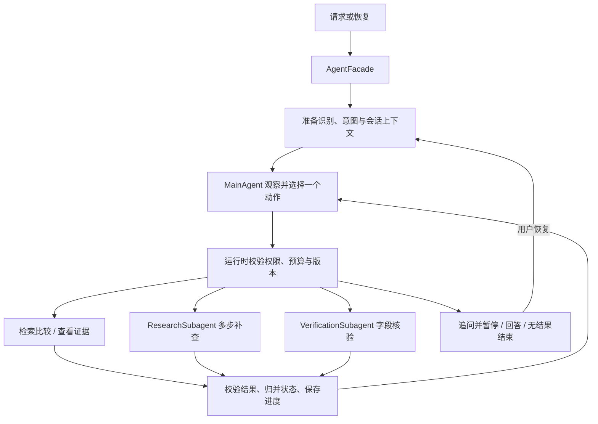

# 识价镜：收敛为主 Agent + 按需 Subagent 的修改方案

状态：设计完成，尚未实施。日期：2026-09-09。代码核对基线：`e5944ff`。

本方案落实本次决定：项目只保留“一个主 Agent + 按需子 Agent”这一种编排架构，删除其他执行模式及其运行时代码。本文件只描述后续改造，本次不修改源码、配置、测试和数据。

本方案取代[此前设计](/Users/zsc/Projects/E.C.26-B/docs/plans/main_agent_on_demand_subagents_design.md:369)中保留 Workflow、单 Agent 模式、三引擎对照和配置切换回滚的要求。此前关于商品约束、证据和状态所有权的要求继续有效。

## 1. 最终决定

1. `AgentFacade` 始终进入现有 `MainAgentRuntime`，生产代码只有一个执行入口和一个主 Agent 决策循环实现。
2. 保留 `MainAgent`、`ResearchSubagent`、`VerificationSubagent`；子 Agent 由主 Agent 按任务需要委派。
3. 删除 `EXECUTION_MODE`，也不新增 `sub`、`auto`、`legacy` 等替代模式字段。`main` 这个类名/角色名继续使用，但不再是可选择的运行模式。
4. 删除 Supervisor、任务 DAG Planner、Specialist 调度体系及其 shadow/replan 开关。失败处理留在唯一 runtime 内，不再回退到另一套引擎。
5. 删除 Research/Verification 的人工启用开关，通过实际装配能力决定哪些委派动作可以使用。
6. 普通请求允许零次委派；复杂请求可以发生委派。两者是同一架构中不同的执行轨迹，不构成两种模式，也不为了“用了 subagent”强制委派。

本次范围限定在 Agent 编排及删除旧编排所必需的调用点迁移。商品检索、动态 Schema、SPU/SKU、模型供应商、存储选型和外部服务层沿用现有设计。

后续 RAG 改造另见 [SKU 原始数据与按需补召回方案](sku_offer_rag_on_demand_retrieval_design.md)。执行该后续方案时，再扩展本文件的业务范围和动作目录（新增 `supplement_search`）；唯一主／子 Agent 架构、能力装配与状态所有权保持本文件的约束。

## 2. 唯一执行链路



识别、意图理解、记忆和回答继续由现有 `services/` 提供。检索工具内部的固定业务步骤保留；这些步骤属于工具实现，不是可以切换的 Workflow 引擎。主 Agent 继续提出严格类型化动作，runtime 负责执行。

保留当前七类主动作：`search_and_compare`、`inspect_evidence`、`delegate_research`、`delegate_verification`、`ask_user`、`answer`、`finish_no_results`。定义位置：[agent_runtime/contracts.py:29](/Users/zsc/Projects/E.C.26-B/src/shijiajing_agent/agent_runtime/contracts.py:29)。

## 3. 主 Agent 与子 Agent 的职责

| 角色 | 职责 | 可使用的业务工具 | 输出归属 |
|---|---|---|---|
| MainAgent | 维护购物目标，决定检索、补查、核验、追问或结束 | 检索比较、证据读取、两种委派动作 | runtime 校验后更新主状态，统一回复用户 |
| ResearchSubagent | 针对已有检索缺口执行多步调查 | `search_once`、`inspect_evidence`、`compare_candidates` | 返回候选、证据引用、调查结果和未解决问题 |
| VerificationSubagent | 核验当前候选的具体争议字段 | `inspect_evidence`、`get_offer_details`、`compare_candidates` | 返回逐字段证据及可比性建议 |

子 Agent 接收冻结的购物约束、明确目标、有限候选/证据引用和子预算；不获得完整会话、长期记忆库或主状态写权限。子 Agent 的建议由父 runtime 重新校验，不能覆盖明确的型号、规格、价格等硬冲突。保持当前单层父子关系，同时最多执行一个子任务，不增加递归委派或新的并发调度器。

委派仍采用“主 Agent 提议 + `DelegationPolicy` 准入”：必须有明确缺口、可能补充证据的能力、可用预算，以及尚未完成的有效任务。用户意图缺失时优先追问；工具故障按现有失败策略处理。

例如，“索尼 XM5，2000 元以内，黑色”可以检索一次后回答；同一架构处理多个有依据的型号别名、首轮候选不足等问题时，可以调用 Research。确定性规则已经判定两个商品容量不同，就直接拆分；只有详情能够澄清缺失字段时才调用 Verification。

### 能力装配规则

| 依赖状态 | 装配结果与行为 |
|---|---|
| 主决策模型与检索依赖有效 | 必须装配 MainAgent 和 ResearchSubagent |
| 未单独指定子模型 | 沿用现有 `subagent_model_effective`，继承主 Agent 模型 |
| 装配了 `OfferDetailPort` | 装配 VerificationSubagent，并允许满足准入条件的核验委派 |
| 没有 `OfferDetailPort` | 保留 Research；动作目录不暴露 Verification，争议无法补证时返回证据不足 |
| 必需的决策端口未装配 | 启动时精确报错，不能静默退化成另一种架构 |

当前生产装配尚未提供 `OfferDetailPort`，所以改造完成后的实际初始组合为 Main + Research。Verification 实现保留，接入真实详情端口后自然获得该能力；本次不新增详情采集系统。

只从实际装配的对象派生一份内部能力集合，供动作目录和准入校验共同使用，不建立可配置模式表或通用插件注册框架。当前参考：[runtime.py:145](/Users/zsc/Projects/E.C.26-B/src/shijiajing_agent/agent_runtime/runtime.py:145)、[policy.py:33](/Users/zsc/Projects/E.C.26-B/src/shijiajing_agent/agent_runtime/policy.py:33)。

## 4. 删除与修改清单

### 4.1 入口、装配与配置

| 当前位置 | 计划修改 |
|---|---|
| [facade.py:88](/Users/zsc/Projects/E.C.26-B/src/shijiajing_agent/facade.py:88) | 保留 `run/start/resume` 和公共响应契约；删除 `_is_main_mode`、`_supervisor` 和引擎分支，直接调用唯一 runtime；统一恢复前的 checkpoint 检查 |
| [facade.py:60](/Users/zsc/Projects/E.C.26-B/src/shijiajing_agent/facade.py:60) | 从 `AgentDependencies` 删除 `supervisor_planner`；将主决策、Research 决策设为必需依赖，Verification 依赖仍按详情能力装配 |
| [deps.py:101](/Users/zsc/Projects/E.C.26-B/src/shijiajing_agent/deps.py:101) | 删除 ArkSupervisorPlanner 装配和模式判断；始终装配主模型、Research 模型，详情能力有效时装配 Verification |
| [runtime.py:161](/Users/zsc/Projects/E.C.26-B/src/shijiajing_agent/runtime.py:161) | 资源生命周期照旧，移除旧 Planner 字段转发，传递唯一 runtime 的必需依赖 |
| [agent_runtime/runtime.py:89](/Users/zsc/Projects/E.C.26-B/src/shijiajing_agent/agent_runtime/runtime.py:89) | 保留现有实现，删除模式判断和启用布尔值；能力由依赖派生，不为改名重写 runtime |
| [ports/dependencies.py:36](/Users/zsc/Projects/E.C.26-B/src/shijiajing_agent/ports/dependencies.py:36) | 删除 `SupervisorPlannerPort`、对应字段和旧契约 import；更新共享依赖协议 |
| [config.py:97](/Users/zsc/Projects/E.C.26-B/src/shijiajing_agent/config.py:97) | 删除下列旧配置的字段、默认值、解析及有效组合校验；主模型变为生产必填 |

移除的环境变量（均有 `SHIJIAJING_` 前缀）：

```text
EXECUTION_MODE
RESEARCH_SUBAGENT_ENABLED
VERIFICATION_SUBAGENT_ENABLED
SUPERVISOR_MODEL
SUPERVISOR_PLANNER_MODE
SUPERVISOR_PLANNER_TIMEOUT_SECONDS
SUPERVISOR_PLANNER_MAX_REPAIRS
SUPERVISOR_PLANNER_MAX_TOKENS
MAX_AGENT_TASKS
MAX_SUPERVISOR_REPLANS
AGENT_TASK_TIMEOUT_SECONDS
```

保留 `MAIN_AGENT_MODEL`、可选 `SUBAGENT_MODEL`，以及主/子 Agent 的预算、时间和调用次数限制。这些限制控制同一执行链路的资源消耗，不用于选择架构。普通模型超时/重试、HITL、Memory 等配置继续沿用。

对于仍携带上述废弃变量的环境，配置加载器只保留一个有限的“已移除配置”检查，返回应删除的变量名。它不解析旧模式、不映射旧值、不运行兼容引擎。`.env.example` 和启动文档同步清理，并补齐唯一架构必填的主模型配置。

### 4.2 删除旧编排实现

迁移仍需保留的行为测试与调用点后，删除：

| 删除对象 | 范围 |
|---|---|
| `src/shijiajing_agent/multi_agent/` | Supervisor、Planner、planner catalog/materializer/contracts/shadow、dispatcher、registry、capabilities、旧 checkpoint、五个 Specialist、旧状态与契约转导出 |
| `src/shijiajing_agent/state.py` | `SupervisorState`、旧任务结果 reducer；引用清空后删除文件 |
| `src/shijiajing_agent/adapters/ark_supervisor_planner.py` | 旧模型 Planner 适配器 |
| `src/shijiajing_agent/prompts/supervisor_create_plan.md`、`supervisor_revise_plan.md` | 旧规划 Prompt |
| `src/shijiajing_agent/tools/run_planner_shadow.py` | 旧 Planner shadow 工具 |
| `pyproject.toml` 的 `shijiajing-planner-shadow` | 对应 CLI 入口 |

根 `contracts.py` 必须按符号引用清理，不能整段删除：`ExecutionPlan`、`ExecutionPlanPatch`、`AgentTaskV2/AgentResultV2`、旧 task input/output、`TaskRecord`、`SupervisorBudgetUsage`、规划与 handoff 契约，在旧调用点迁移完后删除。`CanonicalUnderstanding` 虽位于旧契约附近，但新 runtime 仍在使用，必须保留；公共请求/响应、商品、记忆、中断、事件和状态枚举也按实际引用保留。

可核对位置：[contracts.py:422](/Users/zsc/Projects/E.C.26-B/src/shijiajing_agent/contracts.py:422)、[contracts.py:786](/Users/zsc/Projects/E.C.26-B/src/shijiajing_agent/contracts.py:786)。旧 Planner 专属事件、错误和指标随调用点清理；历史事件数据不删除。

LangGraph 的 checkpoint 适配器仍被唯一 runtime 使用，因此保留相关运行依赖。删除 DAG dispatcher 不等于删除 LangGraph 持久化能力。

### 4.3 保留业务能力，迁移必要行为

现有 `services/`、`domain/`、`ports/agent_decision.py`、`adapters/ark_agent_decision.py`、主/子 Prompt 继续使用。删除 Specialist 前，用旧测试确认以下行为在唯一 runtime 下得到覆盖：

- 显式价格排序、店铺偏好、硬约束和证据要求；
- 无品类时追问，图片识别低置信度复核，用户修正与跨轮约束；
- 同款复核复用候选，记忆确认只提交一次；
- 暂停/恢复、重复请求、完成结果复用、失败标记与有限重试。

只迁移缺失的业务行为，不搬运旧任务 DAG、task-result 容器或 Planner。检查的是行为等价，不能以“新旧都成功返回”代替字段、证据和副作用验证。

## 5. 状态与失败处理的收敛

唯一状态模型沿用 `MainRuntimeState`、`RuntimeSessionSnapshot`、`ActionRecord` 和 `SubagentTask/Result`。主 runtime 是规范状态的唯一写入者。约束和证据版本校验、父子预算累加、重复动作限制、记忆授权继续在该 runtime 内执行。

主模型非法动作或调用失败时，按已有有限修正/终止机制处理；已有有效结果可形成受约束回答，必要时追问或报告失败。子 Agent 超时、无进展或证据不足时返回结构化终态，由主 Agent 决定下一步。所有这些路径都在同一 runtime 中结束，不重新启动完整 Workflow。

恢复语义需明确区分：当前 checkpoint 协议提供主请求/会话状态读写，虽定义了 `subagent_namespace`，但没有独立子循环快照读写接口。此次不新增一套子 Agent checkpoint 系统，也不宣称可以逐步恢复子循环。已提交的子结果必须复用；中途崩溃的未提交只读子任务可在剩余预算内有限重跑，需记录尝试并防止恢复后重置已知用量或重复提交结果。

子任务启动前在主 checkpoint 记录尝试和预算预留，完成后按实际 usage 结算。崩溃导致用量不明时，按预留额度保守限制后续预算；报告区分实测用量与预算预留，不把未知调用当作零成本。剩余预算不足就结束，不能以恢复为由反复重启子任务。

参考：[agent_runtime/checkpoint.py:18](/Users/zsc/Projects/E.C.26-B/src/shijiajing_agent/agent_runtime/checkpoint.py:18)。

### 旧状态的处理

- 保留现有 `agent-runtime-v1` namespace；数据结构不变时不为架构收敛随意修改版本。若必要字段变化，单独定义该 runtime 自身的序列化迁移。
- 旧 Supervisor/DAG checkpoint 不转换成主 Agent 状态。后续切换前停止接收旧版本新请求，让旧进程处理完活动请求及可完成的中断；剩余旧中断明确结束或要求重新发起新会话。
- 新版本只恢复主 runtime namespace。无法找到匹配状态的旧恢复请求必须明确失败，不能伪装成恢复成功或隐式重跑请求。
- 已完成请求的 Ledger 结果、长期记忆、商品数据和历史事件保留；不自动删库，也不改写历史报告为新架构结果。
- 新旧版本不共同写入同一活动会话。若需回滚，回滚整个发布版本，并隔离该版本的活动会话；不在新代码内保留旧引擎开关。

## 6. 容易漏掉的调用点

这些修改仅用于断开旧编排依赖并保持现有工具可用，不扩展 Agent 之外的系统设计。

| 调用点 | 收敛方案 |
|---|---|
| [release_gate.py:102](/Users/zsc/Projects/E.C.26-B/src/shijiajing_agent/release_gate.py:102) 与 `tools/release_check.py` | 删除 `planner_shadow_report` 参数、`--planner-shadow-report` 和专属报告校验；保留现有质量、延迟、外部证据等其他门禁 |
| [tools/preflight.py:25](/Users/zsc/Projects/E.C.26-B/src/shijiajing_agent/tools/preflight.py:25) | 检查唯一 runtime 的主决策/Research 依赖及 checkpoint；修改旧 checkpoint 检查名并同步对应断言，不引入新的模式检查 |
| [tools/reconstruct_turn.py:93](/Users/zsc/Projects/E.C.26-B/src/shijiajing_agent/tools/reconstruct_turn.py:93) | 去除只识别 `agent_name == supervisor` 的新事件假设；新运行按主 runtime 的父子 action/task 关系还原，历史事件仍可只读展示 |
| [engineering_eval.py:209](/Users/zsc/Projects/E.C.26-B/src/shijiajing_agent/engineering_eval.py:209) | 将旧子图“最后非空结果覆盖”的汇合检查改为父子任务结果、证据和约束版本检查 |
| [engineering_eval.py:230](/Users/zsc/Projects/E.C.26-B/src/shijiajing_agent/engineering_eval.py:230) | 中断评测从固定旧 graph 节点名改为恢复后的业务状态和副作用次数 |
| `evals.py`、`evals_live.py`、`tools/run_eval.py` 和样例 | Fake、计数包装器、请求入口均接入唯一 runtime；包装依赖时保留必需的主/子决策端口，不绕开真实决策路径 |
| `deploy/phase2/verify.ps1` 等验证脚本 | 检查依赖的测试路径、检查名、CLI 参数和报告格式；仅更新受上述删除影响的引用 |

当前主 runtime 的 `ActionRecord` 持久化和既有 Event Store 的逐动作事件覆盖不能直接视为相同能力。实施时将保留的父子动作/终态事件接到现有记录接口，验证还原工具能识别新事件；无需更换日志或监控平台。

## 7. 测试与评测的唯一口径

### 测试迁移

1. 将 `tests/multi_agent/test_main_agent_runtime.py` 和其依赖夹具迁到 `tests/agent_runtime/`，默认注入 Main + Research 的 Fake 决策端口，不再设置 execution mode 或子 Agent 开关。
2. 将 `test_supervisor.py` 中价格排序、店铺偏好、澄清/识别/同款/记忆确认、恢复和幂等测试改为通过唯一 `AgentFacade` 验证。只有被删除的 Planner/DAG 行为测试直接移除。
3. 删除旧 Planner 专属测试：`test_ark_supervisor_planner.py`、`test_supervisor_planner_safety.py`、`test_planner_shadow_cli.py`；`test_multi_agent_contracts.py` 中属于旧 DAG 的断言删除，公共约束断言迁移后保留。
4. 更新 `test_deps.py`、`test_runtime.py`、`test_config_engineering.py`、`test_release_gate.py`、`test_preflight.py`、`test_reconstruct_turn.py`、工程评测和示例测试中的装配与报告断言。

### 必须通过的行为矩阵

| 场景 | 验收结果 |
|---|---|
| 普通比价，工具结果足够 | Research 能力已装配，但本轮零委派，正常回答 |
| 多步查询可以补齐缺口 | Research 确实经历至少两步“观察—动作”，父 runtime 验证新增候选和证据后归并 |
| 没有详情端口 | 核验动作不暴露；伪造核验动作也被拒绝；普通检索和 Research 正常工作 |
| 有详情端口，存在可补证字段 | Verification 返回来源可验证的字段；不能覆盖已知硬冲突 |
| 子结果越权或版本过期 | 不修改主状态、用户硬约束或长期记忆 |
| 缺少主模型或 Research 决策端口 | 精确启动错误，不自动获得另一执行路径 |
| 主/子模型失败、预算耗尽或无进展 | 有界结束，保留已验证结果和明确失败/降级原因 |
| 同一请求重放、重复 resume | 不重复已完成动作和记忆提交，不重复归并子结果 |
| 子任务执行途中崩溃 | 结果未提交时仅有限重跑只读任务；预算不重置，已提交结果不重跑 |
| 旧 Workflow 恢复请求 | 明确无法恢复，要求新会话；不加载旧执行引擎 |
| 仍传废弃配置/CLI 参数 | 精确报错并指出已删除项；无别名映射或隐藏兼容模式 |

### 评测调整

删除三引擎 A/B/C 运行方式，统一执行同一个 runtime，按“简单零委派、复杂检索、专项核验、恢复与异常”分组报告。保留任务完成率、硬约束违规率、证据完整率、简单任务委派率、复杂任务新增证据率、父子模型调用数/Token、P50/P95 延迟。

报告记录 commit、固定 engine version、模型/Prompt、数据/索引、能力集合、预算和实际委派轨迹；engine version 是产物身份，不是运行选择器。旧 `multi_agent` 数据集若包含旧子图/节点语义，应发布新的 Agent 运行样本版本，保留历史文件及来源；缺少新样本时指标标为待测，不能直接改标签冒充新执行结果。

可使用已保存的历史报告作版本对照，不在当前生产代码保留其他引擎来做实验。真实模型效果仍需真实数据运行，Fake 测试只证明功能和边界。

## 8. 实施顺序

| 阶段 | 交付物 | 退出条件 |
|---|---|---|
| P1：迁移行为与夹具 | 唯一 runtime 的行为测试；必需主/子 Fake 依赖；旧行为映射清单 | 关键业务、HITL、幂等和恢复行为在现有主 runtime 路径验证，差异已定位 |
| P2：切断模式选择 | Facade 唯一入口、Main + Research 必需装配、能力派生、配置删除 | 不传模式即可运行；简单/复杂场景走同一入口，缺依赖正确失败 |
| P3：删除旧代码与引用 | 删除清单、契约清理、CLI/发布检查/评测迁移 | 活跃源码没有旧引擎、Planner 或转导出依赖，删除后可导入和运行 |
| P4：文档与整体验收 | 当前架构说明、配置示例、单架构评测说明、迁移记录 | 行为矩阵和项目现有检查通过，当前文档不再要求选择编排模式 |

这些是一个改造任务内的实施批次，中间提交可以过渡，最终交付不保留双引擎。P1 的行为验证可使用当前 `main_with_subagents` 入口完成，P2 随即删除该选项。

文档同步范围：`README.md`、`docs/architecture.md`、`docs/multi_agent.md`、`docs/configuration.md`、`docs/contracts.md`、`docs/evaluation.md`、相关运维/故障排查及 `docs/interview/` 中的当前架构叙述。`docs/multi_agent.md` 可保留文件路径，内容统一解释主子 Agent。旧多模式方案在实施时移入历史归档并注明被本方案取代，历史内容不当作当前使用说明。

## 9. 完成标准

- 生产、CLI、示例和实时评测共用一个 `AgentFacade → MainAgentRuntime` 路径。
- 无可选择的 `workflow/main/main_with_subagents`，无 Supervisor Planner 和 shadow/replan 执行逻辑。
- 无 Research/Verification 启用开关；Research 是必需能力，Verification 由详情依赖派生。
- 子 Agent 按需调用，普通任务零委派也符合唯一架构；各项预算和约束校验有效。
- 旧编排源码和专属 CLI 已删除，公共契约、业务算法、存储和 LangGraph checkpoint 正常使用。
- 测试保留重要业务行为，评测真实经过新主子决策链，不依赖旧 DAG 样本或空报告判成功。
- 引用扫描中，旧模式名仅允许出现在迁移说明、历史文档/历史数据、废弃配置诊断及对应拒绝测试中，不能出现在运行路由或兼容分支中。
- 执行项目现有 Ruff、格式、Pyright 和离线 Pytest 检查；外部服务相关检查按实际资源执行并记录，未运行项不宣称通过。

本次方案产物仅为本文件。后续实施以以上单一架构和删除清单为准，不继续维护旧模式。
